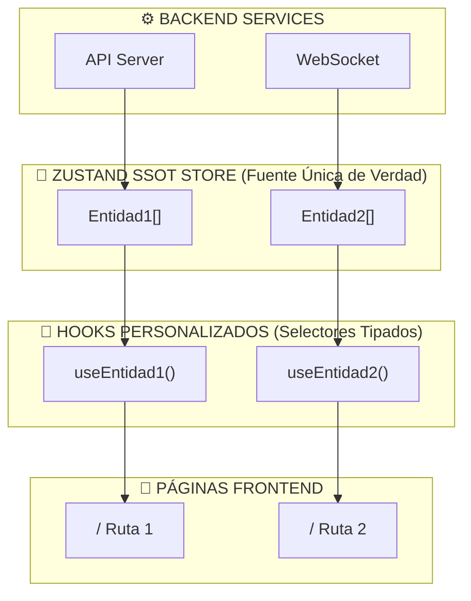

# FRONTEND_OMNI_SSOT_MAP: Mapeo Omni-SSOT de Funcionalidades Dinámicas

**Directiva:** TIER-0 ARCHITECTURE OVERRIDE  
**Proyecto:** [Nombre del Proyecto]  
**Fecha:** [Fecha Actual]  
**Estado:** ANÁLISIS MICROSCÓPICO COMPLETADO  

---

## TABLA DE CONTENIDOS

1. [Resumen Ejecutivo](#resumen-ejecutivo)
2. [Inventario de Entidades Dinámicas](#inventario-de-entidades-dinámicas)
3. [Omni-Diagrama Mermaid End-to-End](#omni-diagrama-mermaid-end-to-end)
4. [SOP de Interconexión Avanzada](#sop-de-interconexión-avanzada)
5. [Plan de Despliegue](#plan-de-despliegue)
6. [Mapeo Página-por-Página](#mapeo-página-por-página)

---

## RESUMEN EJECUTIVO

### Núcleo SSOT

El **Single Source of Truth (SSOT)** del frontend está estructurado en torno a **[Store Centralizado, ej: Zustand store]** que mantiene el estado canónico de:

- [Entidad 1]
- [Entidad 2]
- [Entidad 3]

### Expansión Requerida

Las **[N] páginas del frontend** deben consumir este SSOT mediante:

1. **Selectores tipados** (`.select()`)
2. **Hooks personalizados** que derivan datos del store
3. **Renderizado condicional** basado en identificadores clave
4. **WebSocket subscriptions** inyectadas dinámicamente
5. **Arrays dinámicos** (`.map()`, `.filter()`) sin fetch redundante

### Principio de Eficiencia Absoluta

> **REGLA:** Nada se desecha. Todo se hilvana. Cada página existente se refactoriza para leer del SSOT, eliminando fetches ciegos y redundantes.

---

## INVENTARIO DE ENTIDADES DINÁMICAS

### 1. [NOMBRE DE ENTIDAD 1]

**Entidad Canónica:** `[Tipo/Interfaz]`

```typescript
// Insertar interfaz aquí
```

**Páginas que Consumen:**
- `/ruta-1` - Propósito
- `/ruta-2` - Propósito

**Patrón SSOT:**
```typescript
// Insertar ejemplo de hook/selector aquí
```

---

## OMNI-DIAGRAMA MERMAID END-TO-END



---

## SOP DE INTERCONEXIÓN AVANZADA

### Problema 1: [Describir Problema de Rendimiento/Arquitectura]

**Escenario:** [Descripción del escenario]

**Solución SSOT:**

```typescript
// Insertar código de solución
```

---

## PLAN DE DESPLIEGUE

### Fase 1: Refactorización de Páginas de Lectura

**Objetivo:** Conectar todas las páginas de **solo lectura** al SSOT sin mutations.

**Páginas Prioritarias:**
1. `/ruta-1`
2. `/ruta-2`

---

## MAPEO PÁGINA-POR-PÁGINA ([N] Páginas)

### Categoría: [NOMBRE CATEGORÍA]

| Ruta | Archivo | Propósito | SSOT Hooks | Mutations | WebSocket |
|------|---------|----------|-----------|-----------|-----------|
| `/ruta` | `page.tsx` | Propósito | `useHook()` | `mutation()` | `useStream()` |

---

**Sello:** Ω-TIER-0-ARCHITECTURE-OVERRIDE-[FECHA]  
**Validación:** ✅ Análisis microscópico completado  
