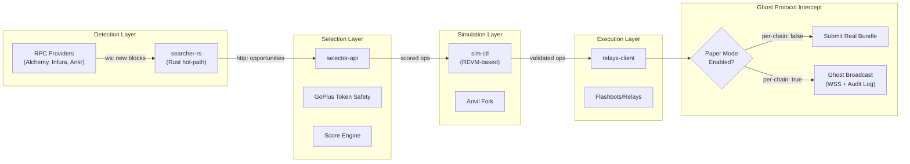

# ADR-001: Paper Mode Architecture

| Field | Value |
|-------|-------|
| **Status** | Accepted |
| **Date** | 2026-04-15 |
| **Author** | ArbitrageX Architecture Team |
| **Deciders** | Technical Lead, Risk Officer, Operator |
| **Milestone** | S9 (live trading) |

## Context

ArbitrageX v2 is a DeFi MEV arbitrage platform designed to identify and execute atomic arbitrage opportunities across decentralized exchanges. The platform operates in a high-risk domain where a single bug in the execution pipeline can result in permanent loss of capital through:

- Reverted transactions with wasted gas fees
- Sandwich attacks or front-running by competing MEV bots
- Smart contract vulnerabilities in DEX adapters
- Race conditions in the opportunity-to-execution pipeline

During the development and validation phases (S1 through S8), the platform must demonstrate:

1. **Strategic correctness**: The detection and scoring algorithms identify genuinely profitable opportunities
2. **Operational stability**: All 21 containers start, communicate, and recover correctly
3. **Risk management efficacy**: Kill-switches, circuit breakers, and anomaly detectors fire when expected
4. **E2E pipeline integrity**: Opportunities flow from blockchain detection through simulation to execution decision

Operating with real capital during this validation period would introduce unnecessary and unacceptable financial risk. The question is not *whether* to protect capital during development, but *how* to simulate the entire pipeline without real transactions while maintaining full observability.

## Decision

We will implement **Ghost Protocol** (`paper-shadow` feature) as the primary simulation architecture. Ghost Protocol is a per-chain, runtime-configurable mode that intercepts the execution layer at the final step and replaces real transaction submission with a simulated broadcast that records what *would* have happened.

### Architecture

### Key Mechanisms

1. **Per-chain granularity**: Paper mode is configured per chain ID via Redis keys (`arbx:papermode:<chain_id>`) with a legacy fallback key (`arbx:papermode`). Each chain can be independently toggled between paper and live mode.

2. **Safe-side aggregation**: The config endpoint reports `paper_mode: true` if **any** chain is in paper mode. This ensures the UI never misrepresents the system as fully live when one chain is still paper.

3. **REVM simulation**: `sim-ctl` runs a local Anvil fork of mainnet state. Every opportunity is simulated against this fork to verify:
   - Exact gas consumption
   - Expected output amounts
   - Revert conditions
   - Slippage impact

4. **Ghost broadcast**: Instead of submitting to Flashbots, the relays-client emits a WebSocket event (`opportunity_ghost_executed`) with the full bundle details, which is recorded in PostgreSQL `audit_log` and displayed in the operator dashboard.

5. **Profit tracking**: Ghost executions record hypothetical profit/loss. The "honest display" policy (ADR-004 companion) requires the UI to clearly mark these as simulated, not real.

## Consequences

### Positive

- **Zero capital at risk**: No real ETH is spent on gas, no real tokens are swapped, no real funds are exposed to MEV risk during the entire validation period.
- **Full pipeline testing**: Every component from RPC to relay selection is exercised under production-like load.
- **Metrics fidelity**: Prometheus metrics (`arbx_opportunity_total`, `arbx_execution_total`) capture the same events in paper mode as in live mode, enabling performance baseline establishment.
- **Gradual graduation**: Individual chains can graduate from paper to live independently, starting with the lowest-risk chain (Ethereum mainnet has highest volume but highest gas; L2s may graduate first based on strategy).

### Negative

- **Simulation fidelity gap**: REVM simulation cannot perfectly replicate mempool dynamics, relay competition, or chain reorgs. Some edge cases (e.g., JIT liquidity sniping) behave differently in simulation vs. mainnet.
- **No real profit/loss validation**: The scoring engine's profit estimates are unvalidated against actual on-chain results until S9.
- **Operator psychology**: Extended paper mode may create complacency. The S9 milestone is explicitly defined to prevent indefinite paper operation.

### Neutral

- **Additional Redis keyspace**: One key per enabled chain plus legacy key. Negligible overhead.
- **Config endpoint complexity**: The per-chain aggregation logic adds ~50 lines to the config handler.

## Milestone S9: Live Trading Transition

The transition from paper to live mode is gated by milestone S9, which requires:

| Gate | Criterion | Verification |
|------|-----------|--------------|
| G-SIM-1 | 30 consecutive days of >99.9% simulation success rate | `recon` timeseries |
| G-SIM-2 | Revert rate <0.1% across all strategies | `arbx_execution_total{status="reverted"}` |
| G-SIM-3 | All circuit breakers tested and verified | Manual test log |
| G-SIM-4 | Kill-switch auto-trip validated | `audit_log` review |
| G-SIM-5 | Operator sign-off on readiness report | `/api/v1/readiness` |
| G-SIM-6 | Risk officer approval of live capital allocation | `docs/governance/` |

## Related

- ADR-002: Kill-Switch Fail-Closed Design
- ADR-004: Grafana RED Observability
- `docs/superpowers/specs/2026-04-20-sprint4-simulation-design.md`
- `docs/superpowers/specs/2026-04-20-sprint5-execution-design.md`
- `docs/superpowers/plans/2026-05-04-real-profit-signal.md`
