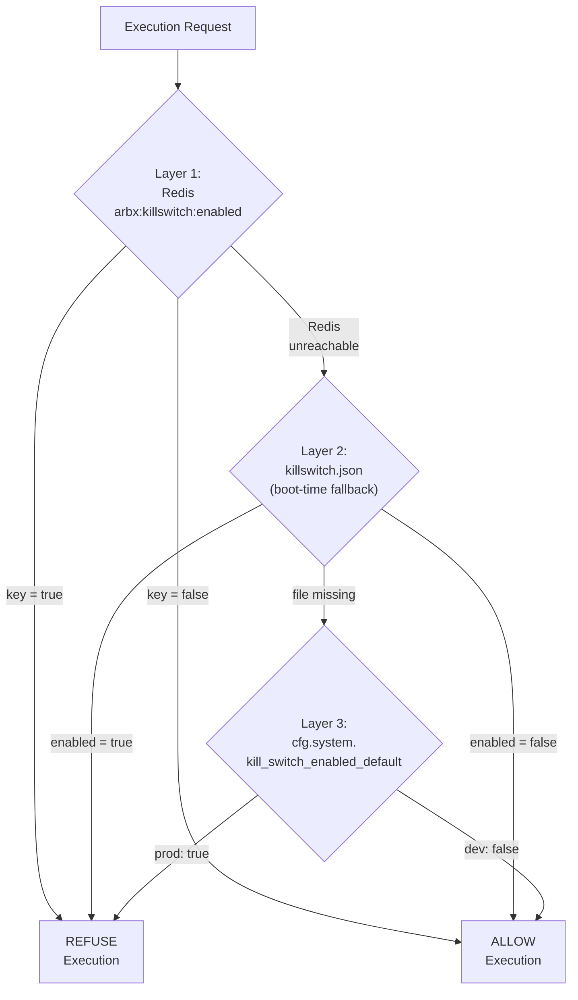
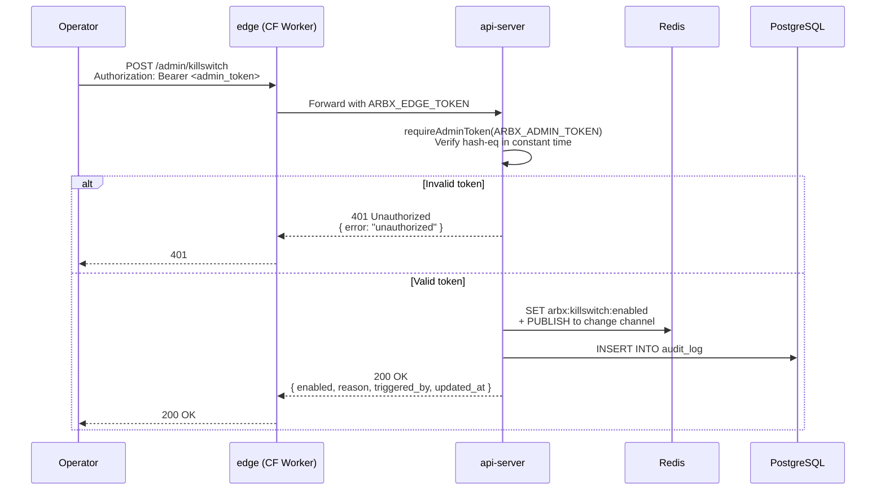

# ADR-002: Kill-Switch Fail-Closed Design

| Field | Value |
|-------|-------|
| **Status** | Accepted |
| **Date** | 2026-04-10 |
| **Author** | ArbitrageX Architecture Team |
| **Deciders** | Technical Lead, Risk Officer, Operator |
| **Updated** | 2026-05-10 (audit B10) |

## Context

ArbitrageX v2 operates in adversarial conditions on Ethereum mainnet and L2s. The platform processes MEV arbitrage opportunities in a pipeline that can, under certain conditions, cause financial loss:

- **High revert rates**: A strategy bug or chain condition change can cause transactions to revert, burning gas with no return.
- **Relay degradation**: If Flashbots or other relays experience degraded service, bundle inclusion rates drop while gas costs remain.
- **Anomalous market conditions**: Flash crashes, oracle manipulation, or DEX pool imbalances can make normally profitable strategies unprofitable.
- **Smart contract risk**: A compromised DEX adapter or token contract can drain funds.
- **Operator error**: Manual configuration changes can inadvertently enable unsafe execution parameters.

The platform needs an emergency stop mechanism that:
1. Halts all execution immediately when triggered
2. Can be activated by both automated systems and authorized humans
3. Records every state change with full audit context
4. Fails safe (closed) by default — any ambiguity results in stopped execution
5. Cannot be bypassed by restarting services or clearing local state

## Decision

We will implement a **global kill-switch** with a three-layer resolution hierarchy, fail-closed default, and mandatory audit logging.

### Three-Layer Resolution



### Layer Details

| Layer | Source | Scope | Mutable at Runtime |
|-------|--------|-------|-------------------|
| 1 | Redis key `arbx:killswitch:enabled` | Canonical, cluster-wide | Yes — via `POST /admin/killswitch` |
| 2 | `killswitch.json` at repo root | Boot-time fallback, per-host | No — read once at startup |
| 3 | `cfg.system.kill_switch_enabled_default` | Config default | No — requires config reload |

### Request Body Schema

The kill-switch toggle endpoint accepts a validated request body:

```typescript
interface KillSwitchRequest {
  enabled: boolean;        // true = ARM, false = DISARM
  reason?: string;         // max 500 chars, required for human toggles
  triggered_by?: string;   // max 200 chars, defaults to x-arbx-actor header
}
```

### Audit Logging

Every toggle is persisted to PostgreSQL `audit_log` with:

| Field | Description |
|-------|-------------|
| `action` | `killswitch.armed` or `killswitch.disabled` |
| `actor` | Human operator ID or service name (e.g., `recon:anomaly_detector`) |
| `target_kind` | `killswitch` |
| `target_id` | `global` |
| `before_state` | Previous kill-switch state (JSON) |
| `after_state` | New state including `reason` |
| `ip_address` | Source IP of the request |
| `trace_id` | Distributed trace ID for cross-service correlation |

### Authentication



## Consequences

### Positive

- **Immediate execution halt**: When armed, all execution services refuse to submit bundles within the Redis pub/sub propagation window (< 100ms).
- **Non-repudiable audit trail**: Every toggle is recorded with actor, IP, timestamp, and before/after state. The `audit_log` table is append-only with row-level security.
- **Automated trip**: The `recon` service monitors `arbx_execution_total{status="reverted"}` and auto-trips the kill-switch when revert rate exceeds `anomaly_revert_rate_pct` (default: 5%).
- **Fail-closed by default**: In production, `kill_switch_enabled_default = true`, meaning a fresh deployment with no Redis and no `killswitch.json` starts in the armed state. The operator must explicitly disarm after verifying system health.
- **Rate-limited admin endpoint**: `/admin/killswitch` is behind `express-rate-limit` at 30 req/min/IP, preventing brute-force token guessing.

### Negative

- **Single point of coordination**: Redis is required for runtime toggles. If Redis is down, services fall back to Layer 2/3, which may not reflect the most recent operator action.
- **Human dependency**: Disarming requires a human with the admin token. Automated recovery from auto-trip requires operator review.
- **Latency overhead**: Every execution request checks Redis. This adds ~1-2ms latency, acceptable for the safety guarantee.

### Neutral

- **Redis pub/sub**: Kill-switch changes are broadcast via Redis pub/sub to all subscribers, ensuring sub-100ms propagation across the cluster.
- **Health check integration**: The `/status` endpoint includes the current kill-switch state, so external monitors can alert when the switch is armed.

## Operational States

| State | `enabled` | Behavior | Indicator |
|-------|-----------|----------|-----------|
| **Disarmed** | `false` | Normal execution flow | Grafana panel: green |
| **Armed** | `true` | All executions refused | Grafana panel: red; Slack alert sent |
| **Auto-tripped** | `true` | Armed by `recon` anomaly detector | Actor field shows service name; reason shows threshold breach |
| **Post-incident** | `true` | Armed pending operator review | Requires manual disarm with incident ID in reason |

## Related

- ADR-001: Paper Mode Architecture
- ADR-003: Vault Secrets Management
- `docs/runbooks/killswitch-activated.md`
- `docs/runbooks/kill-switch-activation.md` (this runbook)
- `docs/governance/RISK_POLICY.md`
