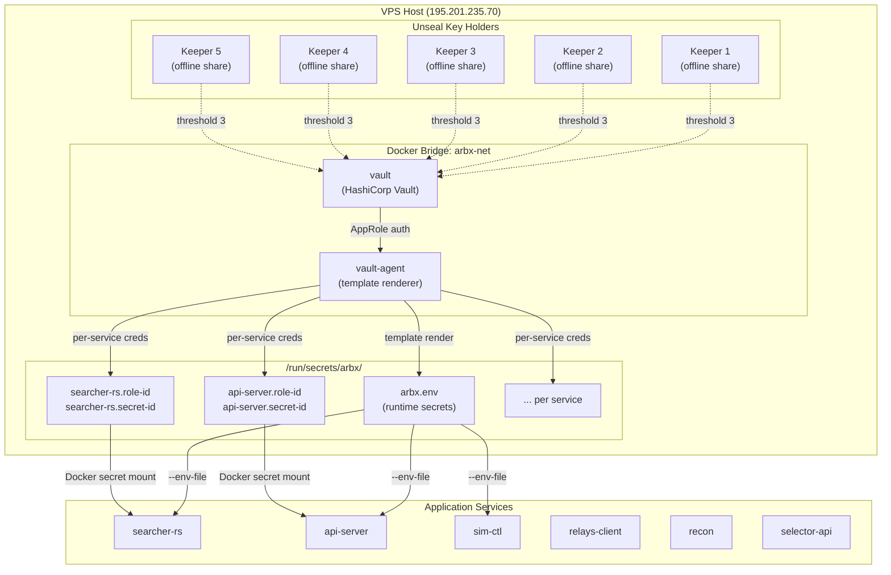
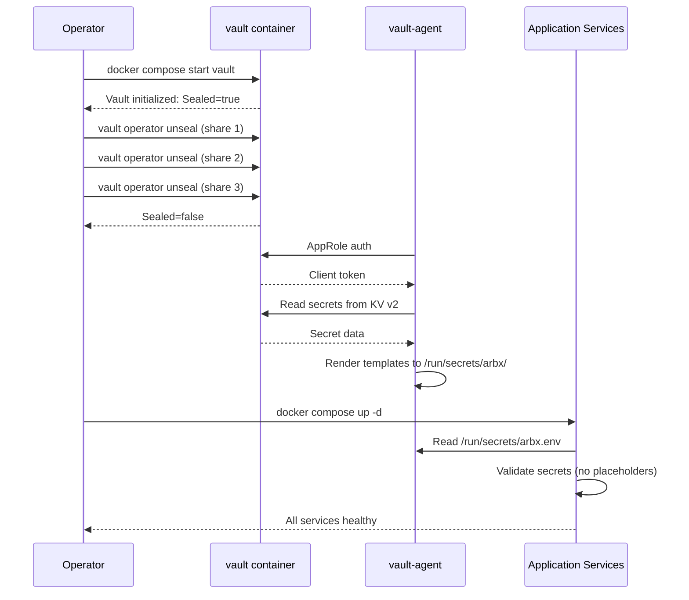

# ADR-003: Vault Secrets Management

| Field | Value |
|-------|-------|
| **Status** | Accepted |
| **Date** | 2026-04-12 |
| **Author** | ArbitrageX Architecture Team |
| **Deciders** | Technical Lead, Security Officer, Operator |
| **Updated** | 2026-05-10 (audit M12) |

## Context

ArbitrageX v2 manages multiple classes of secrets that must be protected at rest and in transit:

| Secret Class | Examples | Compromise Impact |
|-------------|----------|-------------------|
| **T0 — Critical** | `FLASHBOTS_SIGNER_KEY`, `ARBX_ADMIN_TOKEN`, root seed phrase | Immediate fund loss or total system takeover |
| **T1 — High** | `DATABASE_URL`, `REDIS_URL`, `JWT_SECRET`, `ARBX_EDGE_TOKEN` | Data breach, unauthorized access, audit log tampering |
| **T2 — Medium** | RPC API keys, GoPlus API key, Tenderly credentials | Service degradation, rate limit exhaustion |
| **T3 — Low** | Grafana admin password, Slack webhook URL | Information disclosure, alert channel spam |

### Threat Model

1. **VPS compromise**: The production host (195.201.235.70) is a single VPS. Physical access is controlled by the provider; logical access must be hardened.
2. **Container escape**: A compromised service container could read environment variables or mounted files from other containers.
3. **Credential leakage in logs**: Secrets must never appear in application logs, Docker logs, or crash dumps.
4. **Rotation requirement**: After any personnel change or suspected breach, all T0/T1 secrets must be rotatable within 15 minutes.
5. **Bootstrap paradox**: The system that stores secrets must itself be secured, creating a chicken-and-egg problem at first boot.

## Decision

We will use **HashiCorp Vault** with the integrated file storage backend, TLS termination, and Shamir's Secret Sharing for unseal operations.

### Architecture

### Vault Configuration

| Parameter | Value | Rationale |
|-----------|-------|-----------|
| **Storage backend** | Integrated file (`/vault/file`) | No external dependency; survives single-node restart |
| **Unseal mechanism** | Shamir's Secret Sharing | No single point of failure; collusion-resistant |
| **Total shares** | 5 | Distributed across 5 individuals/offline locations |
| **Threshold** | 3 | Requires majority; prevents unilateral unseal by one compromised keeper |
| **TLS** | Enabled with self-signed or Let's Encrypt cert | Prevents plaintext secret transit on the Docker network |
| **Auth method** | AppRole | Machine authentication without human intervention post-unseal |
| **Secret engine** | KV v2 | Versioned secrets with full audit history |

### Boot Sequence

### Secret Classification & Vault Paths

| Tier | Path Pattern | Access Pattern | Rotation SLA |
|------|-------------|----------------|-------------|
| T0 | `arbx/data/t0/flashbots_signer_key` | vault-agent only, never exposed to containers | 15 min |
| T0 | `arbx/data/t0/admin_token` | vault-agent → api-server env | 15 min |
| T1 | `arbx/data/t1/database_url` | vault-agent → all service env | 30 min |
| T1 | `arbx/data/t1/jwt_secret` | vault-agent → api-server + edge | 30 min |
| T2 | `arbx/data/t2/rpc_alchemy` | vault-agent → searcher-rs | 1 hour |
| T2 | `arbx/data/t2/tenderly_api_key` | vault-agent → sim-ctl | 1 hour |
| T3 | `arbx/data/t3/grafana_password` | vault-agent → grafana | 24 hours |

## Consequences

### Positive

- **No secrets in source control**: All credentials are externalized. The `.env.example` file contains only placeholder values like `REPLACE_ME`.
- **No secrets in container layers**: `docker history` on any image reveals no credential values. Secrets are mounted at runtime via bind mounts.
- **Audit trail**: Vault's audit device logs every secret read, write, and authentication attempt to `/vault/logs/audit.log`.
- **Dynamic credentials**: Vault can issue short-lived database credentials via the PostgreSQL secrets engine (future enhancement).
- **Emergency sealing**: A single `vault operator seal` command immediately revokes all active tokens, forcing a 3-of-5 unseal to restart. This is the nuclear option for suspected compromise.

### Negative

- **Bootstrap complexity**: Vault must be initialized and unsealed before any service can start. This adds ~5-10 minutes to disaster recovery.
- **Operational burden**: 3 of 5 key holders must be available for any unseal event. This is intentional but creates coordination overhead.
- **Single-node Vault**: Running Vault as a single container is not highly available. A host failure requires restoring from backup + full unseal ceremony.
- **Secret sprawl risk**: If operators bypass Vault and set env vars directly on containers, the security model breaks.

### Neutral

- **Vault resource footprint**: Vault requires ~256MB RAM and negligible CPU. It is not in the hot path of execution.
- **vault-agent sidecar**: The current design uses a separate vault-agent container that renders secrets to a shared volume. Services read from this volume; they never authenticate to Vault directly.

## Disaster Recovery

### Scenario A — Vault Restart (Intentional or OOM)

1. Vault container restarts in sealed state.
2. Three key holders run `vault operator unseal` with their shares.
3. vault-agent automatically re-authenticates and re-renders secrets.
4. Services that were waiting on secret files proceed to start.

### Scenario B — Host Failure (VPS Lost)

1. Provision new VPS with same Docker Compose stack.
2. Restore Vault file backend from latest encrypted backup (`age`-encrypted tarball).
3. Unseal with 3 of 5 shares.
4. If no backup exists: rotate **all** secrets (emergency flow in `rotate-secrets.md`).
5. Restart all services.

### Scenario C — Complete Key Loss

If all 5 unseal shares are lost, Vault data is **permanently unrecoverable**. Mitigation:
- Shares are distributed across 5 distinct physical/offline locations.
- At least 2 shares are in hardware security modules (HSM) or bank safe deposit boxes.
- Shares are generated with `vault operator init -key-shares=5 -key-threshold=3` and the output is split immediately.

## Related

- ADR-002: Kill-Switch Fail-Closed Design
- `docs/runbooks/vault-sealed.md`
- `docs/runbooks/vault-unseal.md` (this runbook)
- `docs/runbooks/rotate-secrets.md`
- `docs/operations/SECRETS_POLICY.md`
- `docs/operations/VAULT_SETUP.md`
