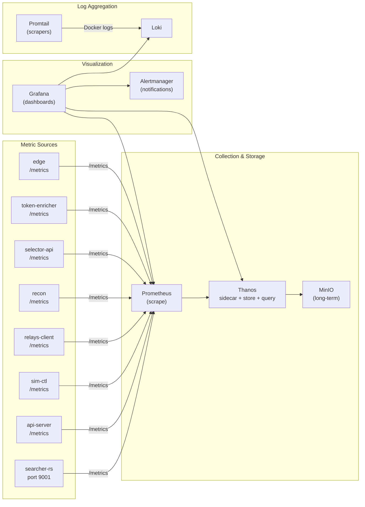

# ADR-004: Grafana RED Observability

| Field | Value |
|-------|-------|
| **Status** | Accepted |
| **Date** | 2026-04-18 |
| **Author** | ArbitrageX Architecture Team |
| **Deciders** | Technical Lead, Operator |
| **Updated** | 2026-05-10 (dashboard provisioning finalization) |

## Context

ArbitrageX v2 is a 21-container distributed system executing MEV arbitrage strategies. The operator must answer three questions continuously:

1. **Is the platform working?** — Are all services healthy, is the pipeline flowing, are opportunities being detected?
2. **Is the platform safe?** — Are risk thresholds within bounds, is the kill-switch armed, are there anomalies?
3. **Is the platform profitable?** — Are simulations succeeding, are strategies performing, what is the P&L?

Before this ADR, observability was fragmented: each service exposed its own metrics format, there was no unified dashboard, and the operator relied on `docker compose logs` for debugging. This was inadequate for:

- **Real-time decision making**: In paper mode, the operator needs to see opportunity flow and simulation results within seconds, not minutes.
- **Incident response**: When the kill-switch fires, the operator needs immediate visibility into what triggered it.
- **Performance tuning**: Strategy scoring weights and relay selection need data-driven calibration.
- **Doctrinal maturity tracking**: The platform targets 100% doctrinal maturity; progress must be measurable.

## Decision

We will implement a unified observability stack based on **Prometheus + Grafana** with RED (Rate, Errors, Duration) metrics for every service, plus business-specific panels for the arbitrage domain.

### Stack Architecture



### RED Metrics (Every Service)

| Metric | Type | Description | Example |
|--------|------|-------------|---------|
| **Rate** | Counter | Requests per second | `arbx_http_requests_total{service="api-server"}` |
| **Errors** | Counter | Failed requests | `arbx_http_errors_total{service="api-server",status=~"5.."}` |
| **Duration** | Histogram | Request latency | `arbx_http_request_duration_seconds{service="api-server"}` |

### Business Metrics (Arbitrage Domain)

| Metric | Type | Description | Panel |
|--------|------|-------------|-------|
| `arbx_opportunity_total{status="detected"}` | Counter | Opportunities detected by searcher-rs | Opportunity Flow |
| `arbx_opportunity_total{status="filtered"}` | Counter | Opportunities filtered out by selector | Filter Rate |
| `arbx_execution_total{status="simulated"}` | Counter | Simulations completed by sim-ctl | Simulation Rate |
| `arbx_execution_total{status="reverted"}` | Counter | Simulations that reverted | Revert Rate |
| `arbx_execution_total{status="submitted"}` | Counter | Bundles submitted to relays | Submission Rate |
| `arbx_execution_total{status="included"}` | Counter | Bundles included on-chain | Inclusion Rate |
| `arbx_pnl_eth` | Gauge | Cumulative P&L in ETH | P&L Tracker |
| `arbx_kill_switch_enabled` | Gauge | 1 = armed, 0 = disarmed | Kill-Switch State |
| `arbx_circuit_breaker_state` | Gauge | 0 = closed, 1 = half-open, 2 = open | Circuit Breaker States |
| `arbx_readiness_score` | Gauge | 0-17 readiness checklist score | Doctrinal Maturity |

### Dashboard Provisioning

Grafana dashboards are provisioned via Docker volume mounts from `monitoring/grafana/provisioning/`. This ensures:

- **Version control**: Dashboard JSON is in Git; changes require PR review.
- **Immutability**: Runtime dashboard edits are lost on container restart, preventing drift.
- **Reproducibility**: A fresh deployment shows the same dashboards as production.

```yaml
# monitoring/grafana/provisioning/dashboards/arbx.yml
apiVersion: 1
providers:
  - name: "arbitragex"
    orgId: 1
    folder: "ArbitrageX"
    type: file
    disableDeletion: false
    updateIntervalSeconds: 10
    options:
      path: /etc/grafana/provisioning/dashboards/json
```

### Refresh Configuration

| Parameter | Value | Rationale |
|-----------|-------|-----------|
| Dashboard auto-refresh | 5 seconds | Paper mode requires near-real-time visibility |
| Prometheus scrape interval | 15 seconds | Balance between freshness and resource usage |
| Thanos compaction | 2 hours | Long-term storage efficiency |
| Loki retention | 7 days | Sufficient for incident investigation |
| Alertmanager group_interval | 5 minutes | Prevent flapping alerts from spamming |
| Grafana session timeout | 8 hours | Operator workday alignment |

### Alert Rules

```yaml
# monitoring/alerts.rules.yml
- alert: KillSwitchActivated
  expr: arbx_kill_switch_enabled == 1
  for: 0s
  severity: warning
  summary: "Kill switch is ON — all executions blocked"

- alert: HighRevertRate
  expr: |
    rate(arbx_execution_total{status="reverted"}[5m])
    / rate(arbx_execution_total{status="simulated"}[5m]) > 0.05
  for: 1m
  severity: critical
  summary: "Revert rate exceeds 5% — auto-trip may fire"

- alert: NoOpportunitiesDetected
  expr: |
    rate(arbx_opportunity_total{status="detected"}[10m]) == 0
  for: 5m
  severity: warning
  summary: "No opportunities detected in 10m — check RPC"

- alert: ServiceDown
  expr: up{job=~"api-server|searcher-rs|sim-ctl"} == 0
  for: 1m
  severity: critical
  summary: "Service {{ $labels.job }} is down"
```

## Consequences

### Positive

- **Single pane of glass**: The operator opens one URL and sees the health of all 21 containers, the pipeline flow, and the kill-switch state.
- **Data-driven tuning**: Strategy scoring weights can be adjusted based on actual simulation success rates visible in the dashboard.
- **Fast incident response**: Alerts route to Slack within seconds of anomaly detection. The operator can correlate metrics with logs via Grafana's Loki integration.
- **Historical analysis**: Thanos enables querying months of metrics, supporting long-term strategy performance analysis.
- **Doctrinal maturity visibility**: The readiness score panel shows the current maturity percentage (target: 100%).

### Negative

- **Resource overhead**: The observability stack (Prometheus + Grafana + Loki + Thanos + Alertmanager + MinIO + Promtail) is 7 of the 21 containers — ~33% of the deployment footprint.
- **Storage growth**: Long-term metric storage via Thanos + MinIO grows at ~500MB/day for the current metric cardinality. This requires periodic compaction and retention policies.
- **Alert fatigue**: Without careful tuning, automated alerts can overwhelm the operator. Every alert must have a documented runbook (see `docs/runbooks/`).

### Neutral

- **Grafana anonymous access**: Disabled. All dashboard access requires the admin password, which is sourced from Vault (`GF_SECURITY_ADMIN_PASSWORD__FILE`).
- **No public Grafana exposure**: Grafana binds to `127.0.0.1:3000` only. Access is via Cloudflare Tunnel + edge worker auth.
- **Provisioning-only dashboards**: The operator can create temporary dashboards for debugging, but they will not persist across restarts. Permanent dashboards must be added to `monitoring/grafana/provisioning/dashboards/json/`.

## Dashboard Layout

```
┌─────────────────────────────────────────────────────────┐
│  ARBITRAGEX v2 — PLATFORM OVERVIEW    [auto-refresh: 5s] │
├─────────────────────────────────────────────────────────┤
│  Kill-Switch: [GREEN] DISARMED    Maturity: 88% (14/17)  │
├─────────────┬─────────────┬─────────────┬───────────────┤
│  RED: Rate  │  RED: Errors│ RED: Duration│  Service Health│
│  [graph]    │  [graph]    │  [graph]     │  [table]       │
├─────────────┴─────────────┴─────────────┴───────────────┤
│  OPPORTUNITY PIPELINE                                    │
│  Detected → Filtered → Simulated → Submitted → Included │
│  [counter] [counter]   [counter]   [counter]   [counter] │
├─────────────────────────────────────────────────────────┤
│  SIMULATION HEALTH          │  REVERT RATE TREND         │
│  [gauge: 99.2%]             │  [graph: 5min]             │
├─────────────────────────────────────────────────────────┤
│  P&L TRACKER (Paper)        │  CIRCUIT BREAKER STATES    │
│  [ETH: +2.34]               │  [all green/closed]        │
├─────────────────────────────────────────────────────────┤
│  RECENT EXECUTIONS          │  RECENT ALERTS             │
│  [table: last 20]           │  [table: last 10]          │
└─────────────────────────────────────────────────────────┘
```

## Related

- ADR-001: Paper Mode Architecture
- ADR-002: Kill-Switch Fail-Closed Design
- `docs/runbooks/killswitch-activated.md`
- `docs/operations/THANOS_SETUP.md`
- `monitoring/grafana/provisioning/dashboards/`
