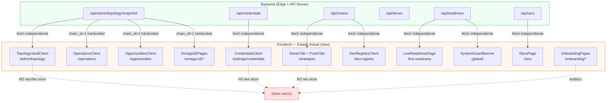

# FRONTEND SSOT PLAN — arbitragex-v2

> **Clasificación:** ARCHITECTURE_TIER_0_GLOBAL_AUDIT  
> **Doctrina:** No-Destructiva · Preservar código existente · Inyectar lógica dinámica  
> **Autor:** Manus AI — Auditoría ejecutada el 2026-05-24  
> **Inventario auditado:** 37 páginas (EXPECTED_PAGE_COUNT según `lib/apex/page_inventory.ts`), 1 hook de readiness, 1 store Zustand, 90+ componentes y utilidades

---

## 1. MAPA DE FRAGMENTACIÓN (DIAGNÓSTICO)

### 1.1 Resumen ejecutivo

La auditoría página por página revela **cuatro patrones de fragmentación** que impiden que el Readiness Pipeline fluya de extremo a extremo. Ninguno de estos patrones implica código incorrecto; todos son oportunidades de interconexión mediante inyección de estado global.

| Patrón | Páginas afectadas | Impacto |
|---|---|---|
| **F-1 Fetch redundante de cadenas** | `DexesTab`, `PoolsTab`, `DexRegistryClient`, `StrategiesClient`, `ChainsAdminClient` | Cada componente llama `/api/chains` de forma independiente; si la topología cambia, los selectores de cadena no se sincronizan automáticamente |
| **F-2 Silo de topología** | `CredentialsClient`, `rpcs/page`, `omega-s5/core`, `omega-s5/adapters`, `omega-s5/factory`, `omega-s5/wallets`, `apex/allocator` | Estas páginas usan `chain_id` hardcodeado (1) o lo obtienen de variables de entorno; no reaccionan al snapshot activo de Topology Vault |
| **F-3 Readiness Pipeline interrumpido** | `live-readiness/page`, `SystemGuardBanner`, `TopologyVaultClient` | `useSystemReadiness` evalúa sólo el paso 1 (topología) de forma real; los pasos 2 (credentials), 3 (markets) y 4 (engines) retornan `false` hardcodeado, por lo que el stepper nunca avanza aunque las credenciales estén validadas |
| **F-4 Onboarding desconectado** | `onboarding/1-init` a `onboarding/5-production` | Las 5 páginas de onboarding son estáticas; no leen el store ni el snapshot de topología para pre-rellenar campos ni para marcar pasos completados |

### 1.2 Tabla de páginas: estado de integración SSOT

| Ruta | Categoría | Fetch propio | Usa store | Usa readiness | Silo detectado |
|---|---|---|---|---|---|
| `/admin/topology` | admin | ✓ (snapshot + mutations) | ✗ | ✓ (stepper) | — escribe al store pero aún no llama `setTopologyReady` |
| `/settings/credentials` | admin | ✓ (`/api/credentials`) | ✗ | ✓ (stepper) | F-2, F-3: RPC category aún presente; no llama `setCredentialStatus` |
| `/admin/chains` | admin | ✓ (`/api/admin/chains`) | ✗ | ✗ | F-1: cadenas propias, no derivadas de topología |
| `/live-readiness` | operations | ✓ (`/api/readiness`) | ✗ | ✓ (stepper + verifier) | F-3: pasos 2-4 hardcodeados |
| `/strategies` | operations | ✗ (SSR) | ✗ | ✗ | F-1 (tabs) |
| `/strategies` → `DexesTab` | tab | ✓ (`/api/dexes?chain_id=`) | ✗ | ✗ | F-1, F-2 |
| `/strategies` → `PoolsTab` | tab | ✓ (`/api/dexes?chain_id=`) | ✗ | ✗ | F-1, F-2 |
| `/strategies` → `CapitalRiskTab` | tab | ✗ (props) | ✗ | ✗ | F-2 (chain_id fijo) |
| `/strategies` → `SimulationTab` | tab | ✗ (props) | ✗ | ✗ | F-2 |
| `/dex-registry` | operations | ✓ (`/api/v1/dexes`) | ✗ | ✗ | F-1 (`useChains()` independiente) |
| `/opportunities` | operations | ✓ (stream WSS) | ✗ | ✗ | F-2 (chain_id fijo=1) |
| `/operations` | operations | ✓ (poll 30s) | ✗ | ✗ | F-2 (chain_id=1 hardcodeado) |
| `/recon` | operations | ✓ (poll) | ✗ | ✗ | F-2 |
| `/status` | operations | ✓ (poll) | ✗ | ✗ | — |
| `/rpcs` | operations | ✓ (`/api/rpcs`) | ✗ | ✗ | F-2: muestra `chain_id` sin filtrar por topología activa |
| `/wallets` | operations | ✓ (`/api/v1/wallets`) | ✗ | ✗ | — |
| `/chains` | operations | SSR | ✗ | ✗ | F-1 |
| `/config` | operations | SSR | ✗ | ✗ | — |
| `/config/trading` | operations | SSR | ✗ | ✗ | F-2 |
| `/omega-s5/core` | omega-s5 | ✓ | ✗ | ✗ | F-2 |
| `/omega-s5/adapters` | omega-s5 | ✓ | ✗ | ✗ | F-2 |
| `/omega-s5/crucible` | omega-s5 | ✓ | ✗ | ✗ | F-2 |
| `/omega-s5/drift` | omega-s5 | ✓ | ✗ | ✗ | F-2 |
| `/omega-s5/factory` | omega-s5 | ✓ | ✗ | ✗ | F-2 |
| `/omega-s5/operator` | omega-s5 | ✓ | ✗ | ✗ | F-2 |
| `/omega-s5/wallets` | omega-s5 | ✓ | ✗ | ✗ | F-2 |
| `/omega-s5/registry` | omega-s5 | SSR | ✗ | ✗ | F-2 |
| `/omega-s5/registry/[entity]` | omega-s5 | ✓ | ✗ | ✗ | F-2 |
| `/apex/allocator` | apex | WSS | ✗ | ✗ | F-2 (CHAIN_NAMES hardcodeado) |
| `/onboarding/1-init` a `5-production` | onboarding | ✗ | ✗ | ✗ | F-4 |
| `SystemGuardBanner` | componente global | ✓ (poll 15s) | ✗ | ✓ (parcial) | F-3 |
| `ReadinessStepper` | componente | ✗ (recibe props) | ✗ | ✓ | F-3 |

### 1.3 Puntos de ruptura del Readiness Pipeline

El pipeline de preparación tiene **cuatro pasos** definidos en `useSystemReadiness.ts`, pero sólo el primero está conectado al backend de forma real:

```
Paso 1 — Topology Vault   → REAL: consulta /api/admin/topology/snapshot cada 20s
Paso 2 — Credentials      → HARDCODED false (nunca avanza)
Paso 3 — Markets/DEXes    → HARDCODED false (nunca avanza)
Paso 4 — Engines          → HARDCODED false (nunca avanza)
```

El `store/useSystemStore.ts` ya existe con la lógica de `computeCredentialsReady`, pero ningún componente lo escribe todavía. La cadena está rota en el eslabón entre el evento de mutación exitosa y la actualización del store.

---

## 2. DIAGRAMA DE FLUJO END-TO-END (MERMAID)

### 2.1 Estado Actual — Páginas aisladas



### 2.2 Estado Objetivo — Entrelazamiento mediante Global Store

```mermaid
graph TD
    subgraph BACKEND["Backend (Edge + API Server)"]
        B1["/api/admin/topology/snapshot"]
        B2["/api/credentials"]
        B3["/api/chains (derivado de topología)"]
        B4["/api/dexes?chain_id="]
        B5["/api/readiness"]
        REDIS["Redis pub/sub<br/>arbx:topology:updated"]
    end

    subgraph STORE["useSystemStore (Zustand · localStorage)"]
        S1["topology.activeChains[]<br/>topology.isReady<br/>topology.versionId"]
        S2["credentials.entries{}<br/>credentials.isReady"]
        S3["markets.isReady"]
        S4["engines.isReady<br/>engines.enabledStrategies[]"]
    end

    subgraph READINESS["useSystemReadiness (hook reactivo)"]
        R1["Paso 1: topology.isReady"]
        R2["Paso 2: credentials.isReady"]
        R3["Paso 3: markets.isReady"]
        R4["Paso 4: engines.isReady"]
    end

    subgraph FRONTEND_OBJETIVO["Frontend — Estado Objetivo (interconectado)"]
        P1["TopologyVaultClient<br/>→ setTopologyReady() tras mutación"]
        P2["CredentialsClient<br/>→ itera activeChains.map()<br/>→ setCredentialStatus() tras test"]
        P3["DexesTab + PoolsTab<br/>→ lee activeChains[0].chainId"]
        P4["DexRegistryClient<br/>→ filtra por activeChains"]
        P5["LiveReadinessPage<br/>→ ReadinessStepper real (4/4)"]
        P6["SystemGuardBanner<br/>→ bloquea LIVE hasta allReady"]
        P7["OperationsClient<br/>→ chain_id dinámico"]
        P8["OpportunitiesClient<br/>→ chain_id dinámico"]
        P9["OmegaS5Pages<br/>→ chain_id desde store"]
        P10["OnboardingPages<br/>→ pre-rellena desde store"]
    end

    B1 -->|"poll 20s + evento Redis"| S1
    REDIS -->|"emitSystemReadinessRefresh()"| S1
    B2 -->|"POST test → resultado"| S2
    B4 -->|"chain_id desde store"| P3
    B5 -->|"verifier backend"| R1

    S1 --> R1
    S2 --> R2
    S3 --> R3
    S4 --> R4

    R1 --> P5
    R2 --> P5
    R3 --> P5
    R4 --> P5
    R1 --> P6
    R2 --> P6
    R3 --> P6
    R4 --> P6

    S1 -->|"activeChains.map()"| P2
    S1 -->|"activeChains[0].chainId"| P3
    S1 -->|"activeChains"| P4
    S1 -->|"chainId dinámico"| P7
    S1 -->|"chainId dinámico"| P8
    S1 -->|"chainId dinámico"| P9
    S1 -->|"pre-rellena pasos"| P10

    P1 -->|"setTopologyReady()"| S1
    P2 -->|"setCredentialStatus()"| S2

    style STORE fill:#eff6ff,stroke:#3b82f6,color:#1e3a8a
    style READINESS fill:#f0fdf4,stroke:#16a34a,color:#14532d
    style BACKEND fill:#fafafa,stroke:#6b7280
    style FRONTEND_OBJETIVO fill:#fdf4ff,stroke:#a855f7
```



---

## 3. SOP — STANDARD OPERATING PROCEDURE PARA REFACTORIZACIÓN

### Principio rector

> **No se elimina ningún componente existente.** La refactorización consiste en inyectar llamadas al store en los puntos de mutación exitosa y en sustituir valores hardcodeados por lecturas reactivas del store. El código de presentación permanece intacto.

### 3.1 Patrón de inyección en componentes mutantes (escritura al store)

Cualquier componente que realice una mutación exitosa debe llamar a la acción correspondiente del store inmediatamente después del `toast.success`. El patrón es el siguiente:

```typescript
// ANTES (TopologyVaultClient.tsx — línea ~206)
toast.success("Topology Vault actualizado", { ... });
emitSystemReadinessRefresh();
await readiness.refresh();

// DESPUÉS — añadir sólo estas dos líneas:
import { useSystemStore } from "@/store/useSystemStore";
const { setTopologyReady } = useSystemStore();

// En applyMutation(), tras toast.success:
const chains = (data.topology.rpc_http_1 ?? []).map((p) => ({
  chainId: data.topology!.chain_id,
  name: `Chain ${data.topology!.chain_id}`,
  rpcHttpHost: p.host,
  rpcWsHost: (data.topology!.rpc_ws_1?.[0]?.host) ?? "",
  versionId: data.version_id ?? 0,
  validatedAt: new Date().toISOString(),
}));
setTopologyReady(chains, data.version_id ?? 0, data.topology.updated_at);
```

### 3.2 Patrón de inyección en componentes lectores (lectura del store)

Los componentes que usan `chain_id` hardcodeado deben sustituirlo por una lectura reactiva. La regla es: **si el store tiene cadenas activas, usar la primera; si no, usar el fallback doctrinal (1)**.

```typescript
// ANTES (DexesTab.tsx, PoolsTab.tsx, OperationsClient.tsx)
const [selectedChainId, setSelectedChainId] = useState<number>(1);

// DESPUÉS — añadir al inicio del componente:
import { useSystemStore, rehydrateSystemStore } from "@/store/useSystemStore";

useEffect(() => { rehydrateSystemStore(); }, []);
const activeChains = useSystemStore((s) => s.topology.activeChains);
const defaultChainId = activeChains[0]?.chainId ?? 1;
const [selectedChainId, setSelectedChainId] = useState<number>(defaultChainId);

// Sincronizar si el store cambia (topología hot-swap):
useEffect(() => {
  if (activeChains.length > 0) setSelectedChainId(activeChains[0].chainId);
}, [activeChains]);
```

### 3.3 Patrón de renderizado dinámico en Credentials

El caso más importante es `CredentialsClient`. La categoría `rpc` del catálogo estático debe transformarse en un renderizado dinámico basado en `activeChains`. El código existente del `CredentialCard` no cambia; sólo se sustituye la fuente del array de credenciales:

```typescript
// ANTES: CATEGORIES tiene una entrada rpc estática con scope "chain:1"
const CATEGORIES: CategorySpec[] = [
  { id: "rpc", creds: [{ scope: "chain:1", ... }] },
  ...
];

// DESPUÉS: generar la categoría rpc dinámicamente desde el store
import { useSystemStore, rehydrateSystemStore } from "@/store/useSystemStore";

export function CredentialsClient({ initialSnapshot, edgeUrl }: Props) {
  useEffect(() => { rehydrateSystemStore(); }, []);
  const activeChains = useSystemStore((s) => s.topology.activeChains);
  const setCredentialStatus = useSystemStore((s) => s.setCredentialStatus);

  // Generar entradas RPC dinámicas por cada cadena activa
  const dynamicRpcCategory: CategorySpec = {
    id: "rpc",
    label: "Hot-path RPC",
    description: `Proveedores RPC/WSS para ${activeChains.length} cadena(s) activa(s) según Topology Vault.`,
    creds: activeChains.flatMap((chain) => [
      {
        provider: "rpc_http",
        scope: `chain:${chain.chainId}`,
        display_name: `RPC HTTP — ${chain.name} (chain ${chain.chainId})`,
        description: `CSV de name=https-url. Host activo: ${chain.rpcHttpHost}`,
        secret_label: "Provider CSV",
        secret_placeholder: `publicnode=https://ethereum-rpc.publicnode.com`,
        secret_kind: "text" as const,
      },
      {
        provider: "rpc_ws",
        scope: `chain:${chain.chainId}`,
        display_name: `RPC WebSocket — ${chain.name} (chain ${chain.chainId})`,
        description: `CSV de name=wss-url. Host activo: ${chain.rpcWsHost}`,
        secret_label: "WS Provider CSV",
        secret_placeholder: `publicnode=wss://ethereum-rpc.publicnode.com`,
        secret_kind: "text" as const,
      },
    ]),
  };

  // Reemplazar la categoría rpc estática, preservar el resto
  const DYNAMIC_CATEGORIES = activeChains.length > 0
    ? [dynamicRpcCategory, ...CATEGORIES.filter((c) => c.id !== "rpc")]
    : CATEGORIES; // fallback: mostrar la categoría estática si no hay topología

  // Después de cada test/save exitoso, actualizar el store:
  // setCredentialStatus(provider, scope, status, validatedAt);
  ...
}
```

### 3.4 Patrón de hidratación SSR-safe

Todos los componentes cliente que lean el store deben llamar `rehydrateSystemStore()` en su primer `useEffect`. Esto es obligatorio en Next.js 16 App Router para evitar errores de hidratación:

```typescript
import { rehydrateSystemStore } from "@/store/useSystemStore";

export function MiComponente() {
  useEffect(() => {
    rehydrateSystemStore(); // idempotente: sólo actúa la primera vez
  }, []);
  ...
}
```

### 3.5 Patrón de conexión de `useSystemReadiness` al store

El hook `useSystemReadiness.ts` debe leer los pasos 2-4 del store en lugar de retornar `false` hardcodeado:

```typescript
// ANTES (hooks/useSystemReadiness.ts — líneas ~131-188)
const isCredentialsReady = false; // TODO
const isMarketsReady = false;     // TODO
const isEnginesReady = false;     // TODO

// DESPUÉS — leer del store (añadir al inicio del hook):
import { useSystemStore, rehydrateSystemStore } from "@/store/useSystemStore";

export function useSystemReadiness() {
  useEffect(() => { rehydrateSystemStore(); }, []);
  const storeCredentials = useSystemStore((s) => s.credentials.isReady);
  const storeMarkets     = useSystemStore((s) => s.markets.isReady);
  const storeEngines     = useSystemStore((s) => s.engines.isReady);

  // ... resto del hook sin cambios ...
  const isCredentialsReady = storeCredentials;
  const isMarketsReady     = storeMarkets;
  const isEnginesReady     = storeEngines;
  // ...
}
```

---

## 4. PLAN DE IMPLEMENTACIÓN POR FASES (ACTION PLAN)

### Fase 1 — Fundación del Store (COMPLETADA ✓)

**Archivos creados:** `frontend/store/useSystemStore.ts`  
**Descripción:** Store Zustand con persistencia en `localStorage`, hidratación SSR-safe (`skipHydration: true`), y las cuatro secciones del pipeline (topology, credentials, markets, engines). La función `computeCredentialsReady` evalúa si todas las cadenas activas tienen `rpc_http` y `rpc_ws` con estado `valid`.  
**Estado:** Desplegado en el VPS. Ningún componente lo consume todavía.

### Fase 2 — Conectar Topology Vault al Store (PRIORIDAD ALTA)

**Archivos a tocar:** `frontend/app/admin/topology/TopologyVaultClient.tsx`  
**Cambio:** Añadir `import { useSystemStore } from "@/store/useSystemStore"` y llamar `setTopologyReady(chains, versionId, updatedAt)` inmediatamente después del `toast.success` en `applyMutation()`. También llamar `clearTopology()` si el snapshot retorna `source: "empty_vault"`.  
**Resultado esperado:** Tras guardar una topología, el store persiste `activeChains` en `localStorage`. Al navegar a `/settings/credentials`, la categoría RPC ya muestra las cadenas reales.

### Fase 3 — Conectar Credentials al Store (PRIORIDAD ALTA)

**Archivos a tocar:** `frontend/app/settings/credentials/CredentialsClient.tsx`  
**Cambio:** Implementar `dynamicRpcCategory` según el SOP §3.3. Añadir llamada a `setCredentialStatus()` en el callback de éxito del test y del save. Mantener el fallback estático cuando `activeChains.length === 0`.  
**Resultado esperado:** La categoría RPC muestra un par de inputs por cada cadena activa. Cuando ambos tests pasan, `credentials.isReady` se vuelve `true` en el store.

### Fase 4 — Conectar `useSystemReadiness` al Store (PRIORIDAD ALTA)

**Archivos a tocar:** `frontend/hooks/useSystemReadiness.ts`  
**Cambio:** Leer `credentials.isReady`, `markets.isReady` y `engines.isReady` del store en lugar de retornar `false` hardcodeado. Añadir `rehydrateSystemStore()` en el `useEffect` inicial.  
**Resultado esperado:** El `ReadinessStepper` en `/admin/topology`, `/settings/credentials` y `/live-readiness` avanza visualmente hasta el paso completado. El guardrail LIVE en `SystemGuardBanner` sólo se desbloquea cuando `allReady === true`.

### Fase 5 — Chain_id dinámico en Strategies y DEX Registry (PRIORIDAD MEDIA)

**Archivos a tocar:** `frontend/app/strategies/tabs/DexesTab.tsx`, `frontend/app/strategies/tabs/PoolsTab.tsx`, `frontend/app/dex-registry/DexRegistryClient.tsx`  
**Cambio:** Aplicar el patrón §3.2. El selector de cadena se pre-rellena con `activeChains[0].chainId`. Si hay múltiples cadenas activas, el selector muestra todas las opciones derivadas del store en lugar del catálogo estático de `/api/chains`.  
**Resultado esperado:** Al cambiar la topología activa, los tabs de DEXes y Pools reflejan la cadena correcta sin recargar la página.

### Fase 6 — Chain_id dinámico en Operations, Opportunities y RPCs (PRIORIDAD MEDIA)

**Archivos a tocar:** `frontend/app/operations/OperationsClient.tsx`, `frontend/app/opportunities/OpportunitiesClient.tsx`, `frontend/app/rpcs/page.tsx`  
**Cambio:** Sustituir `chain_id: 1` hardcodeado por `activeChains[0]?.chainId ?? 1`. En `rpcs/page.tsx`, filtrar la tabla para mostrar primero los RPCs correspondientes a las cadenas activas.  
**Resultado esperado:** Las métricas de operaciones y las oportunidades detectadas se muestran para la cadena correcta sin configuración adicional.

### Fase 7 — Omega-S5 y Apex: chain_id desde store (PRIORIDAD MEDIA)

**Archivos a tocar:** `frontend/app/omega-s5/core/page.tsx`, `frontend/app/omega-s5/adapters/page.tsx`, `frontend/app/omega-s5/factory/page.tsx`, `frontend/app/omega-s5/wallets/page.tsx`, `frontend/app/apex/allocator/AllocatorClient.tsx`  
**Cambio:** Las páginas SSR pasan `chainId` como prop desde `activeChains[0]?.chainId ?? 1`. `AllocatorClient` sustituye `CHAIN_NAMES` hardcodeado por un mapa derivado de `activeChains`.  
**Resultado esperado:** El panel Omega-S5 y el allocator Apex reflejan la cadena activa sin configuración manual.

### Fase 8 — Onboarding conectado al store (PRIORIDAD BAJA)

**Archivos a tocar:** `frontend/app/onboarding/1-init/page.tsx` a `5-production/page.tsx`  
**Cambio:** Cada paso lee el store para marcar visualmente los pasos ya completados. El paso 1 (init) muestra un badge verde si `topology.isReady`. El paso 2 (connect) muestra el estado de credentials. Los campos de texto se pre-rellenan con los valores del store cuando existen.  
**Resultado esperado:** El operador que ya completó la topología ve el onboarding con los pasos anteriores marcados, sin tener que re-introducir información.

### Fase 9 — Markets y Engines: cerrar el pipeline (PRIORIDAD BAJA)

**Archivos a tocar:** `frontend/hooks/useSystemReadiness.ts`, nuevos endpoints de backend  
**Descripción:** Los pasos 3 (markets) y 4 (engines) requieren que el backend exponga endpoints de verificación. Una vez disponibles, `setMarketsReady()` y `setEnginesReady()` se llaman desde los componentes correspondientes (`DexesTab` y `StrategiesClient`).  
**Resultado esperado:** El pipeline completo de 4 pasos funciona de extremo a extremo. El botón "Activate live mode" en `/live-readiness` se desbloquea sólo cuando los 4 pasos son verdes.

---

## Resumen de archivos por fase

| Fase | Archivos | Prioridad | Esfuerzo estimado |
|---|---|---|---|
| 1 (COMPLETADA) | `store/useSystemStore.ts` | — | — |
| 2 | `TopologyVaultClient.tsx` | Alta | ~20 líneas |
| 3 | `CredentialsClient.tsx` | Alta | ~40 líneas |
| 4 | `useSystemReadiness.ts` | Alta | ~15 líneas |
| 5 | `DexesTab.tsx`, `PoolsTab.tsx`, `DexRegistryClient.tsx` | Media | ~30 líneas |
| 6 | `OperationsClient.tsx`, `OpportunitiesClient.tsx`, `rpcs/page.tsx` | Media | ~20 líneas |
| 7 | 5 páginas Omega-S5 + `AllocatorClient.tsx` | Media | ~30 líneas |
| 8 | 5 páginas Onboarding | Baja | ~50 líneas |
| 9 | `useSystemReadiness.ts` + backend | Baja | depende de backend |

**Total de líneas de código nuevo estimado: ~205 líneas** sobre una base de ~12.000 líneas existentes. Ninguna línea existente se elimina.

---

*Documento generado por auditoría automatizada. Última actualización: 2026-05-24.*
