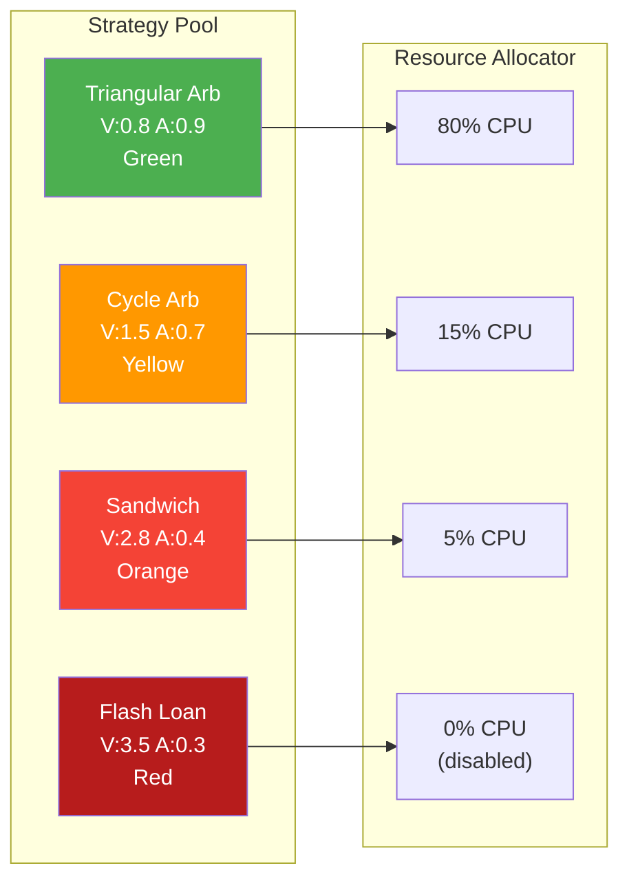
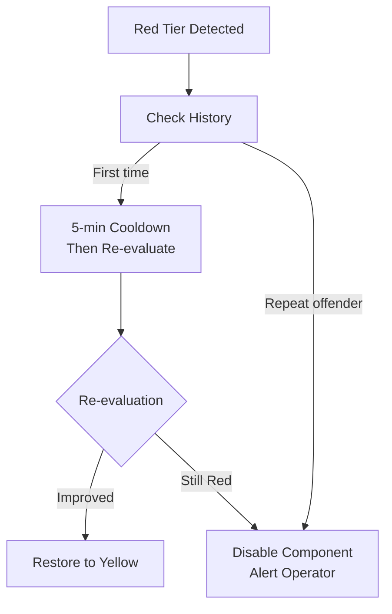

# Doctrine: Bi-Eje Scoreboard

The Bi-Eje Scoreboard is ArbitrageX v2's performance governance mechanism. It continuously evaluates every component along two axes — **velocity** and **accuracy** — and dynamically adjusts resource allocation to maintain optimal system throughput.

---

## The Two Axes

| Axis | Measures | Target | Penalty for Breach |
|------|----------|--------|--------------------|
| **Velocidad** (Speed) | End-to-end latency: detection → simulation | < 100ms | Deprioritization |
| **Exactitud** (Accuracy) | Simulation result fidelity vs. prediction | < 5% variance | Strategy cooldown |

Every container, every strategy, and every RPC endpoint carries a Bi-Eje score. The scoreboard updates every 15 seconds based on sliding window metrics.

---

## Score Calculation

### Velocity Score (V)

```
V = actual_latency_ms / target_latency_ms

V ≤ 1.0   → Green (full allocation)
V ≤ 2.0   → Yellow (reduced allocation, 80%)
V ≤ 3.0   → Orange (deprioritized, 50%)
V > 3.0   → Red (excluded from rotation)
```

### Accuracy Score (A)

```
A = |actual_result - predicted_result| / predicted_result

A ≤ 0.05  → Green (full trust)
A ≤ 0.10  → Yellow (reduced trust, wider slippage buffer)
A ≤ 0.20  → Orange (mandatory re-simulation)
A > 0.20  → Red (strategy disabled, manual review)
```

### Combined Score

```
Bi-Eje Score = min(V_score, A_score)
```

The combined score uses the minimum of the two axes, ensuring that a component is never rated higher than its worst-performing axis.

---

## Scoreboard Implementation

The scoreboard is implemented in `ax-strategy-eval/src/scoreboard.rs`:

```rust
pub struct BiEjeScoreboard {
    entries: DashMap<String, ScoreEntry>,
    window_size: Duration,
}

#[derive(Clone, Debug)]
pub struct ScoreEntry {
    pub component_id: String,
    pub velocity_score: f64,      // 0.0 (worst) to 1.0 (best)
    pub accuracy_score: f64,      // 0.0 (worst) to 1.0 (best)
    pub combined_score: f64,      // min(velocity, accuracy)
    pub tier: Tier,
    pub last_updated: Instant,
}

pub enum Tier {
    Green,   // Full allocation
    Yellow,  // Reduced allocation
    Orange,  // Deprioritized
    Red,     // Excluded
}
```

---

## Scoreboard in Action

### Strategy Evaluation



### RPC Endpoint Rotation

The scoreboard also governs RPC endpoint selection:

| Endpoint | Latency (ms) | Block Drift | V Score | A Score | Tier |
|----------|-------------|-------------|---------|---------|------|
| Alchemy Primary | 38 | 0 | 0.38 | 1.0 | Green |
| Infura Fallback | 52 | 0 | 0.52 | 1.0 | Green |
| Ankr Fallback | 180 | 2 | 1.80 | 0.67 | Yellow |
| Custom Node | 450 | 5 | 4.50 | 0.40 | Red |

The RPC router routes 60% of traffic to Alchemy, 35% to Infura, and 5% to Ankr. The custom node is excluded.

---

## Scoreboard Metrics

Prometheus exposes scoreboard data:

```promql
# Average velocity score by component type
avg by (component_type) (ax_bieje_velocity_score)

# Components in Red tier
sum by (component_type) (ax_bieje_tier{tier="red"})

# Strategy accuracy over time
avg by (strategy) (ax_bieje_accuracy_score)
```

---

## Recovery

When a component enters the Red tier, the scoreboard triggers automatic recovery:



---

## Why Bi-Eje?

MEV systems face an inherent tension: speed and accuracy pull in opposite directions. Faster execution often means less validation; more thorough simulation means higher latency. The Bi-Eje Scoreboard makes this trade-off explicit and data-driven, preventing the system from optimizing one axis at the expense of the other.

| Without Bi-Eje | With Bi-Eje |
|---------------|-------------|
| Fast but inaccurate strategies dominate | Balanced optimization |
| Slow accurate strategies starved | Fair resource allocation |
| RPC degradation unnoticed | Automatic deprioritization |
| Silent accuracy drift | Explicit accuracy monitoring |
| Operator surprises | Predictable performance |
