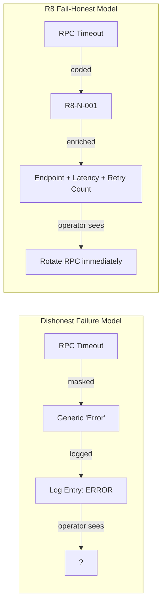

# Doctrine: R8 Fail-Honest

R8 Fail-Honest is the error handling philosophy of ArbitrageX v2. It dictates that every failure must be **reported honestly**, **coded precisely**, and **recoverable transparently**. The name "R8" refers to the systematic 8-category error taxonomy, and "Fail-Honest" describes the refusal to hide, mask, or approximate errors.

---

## The Principle

> *A system that lies about its failures is more dangerous than a system that fails openly.*

In high-frequency MEV systems, failures are inevitable: RPC timeouts, transaction reverts, stale state. The Fail-Honest doctrine requires that every failure be surfaced with maximum fidelity so operators can make informed decisions.



---

## The 8 Categories

The R8 taxonomy divides all errors into eight categories, each assigned a letter code:

| Code | Category | Scope | Example |
|------|----------|-------|---------|
| `E` | Execution | On-chain transaction failures | Revert, slippage exceeded |
| `N` | Network | RPC and connectivity | Timeout, rate limit |
| `S` | Strategy | Strategy logic errors | Panic, invalid config |
| `M` | Simulation | Ghost Protocol / REVM | Fork failure, cache miss |
| `Y` | System | Infrastructure | Database down, OOM |
| `I` | Input | Request validation | Bad parameter, missing field |
| `C` | Security | Auth/authorization | Invalid key, rate limit |
| `R` | Recovery | Post-failure state | Rollback needed, data inconsistency |

Every error code follows the format `R8-[CATEGORY]-[SEQUENCE]`. For example: `R8-N-001` = Network error #1.

---

## Honest Error Enrichment

Every error in ArbitrageX v2 carries a complete context envelope:

```json
{
  "error": {
    "code": "R8-N-001",
    "category": "Network",
    "severity": "High",
    "message": "RPC endpoint timeout after 5000ms",
    "context": {
      "endpoint": "https://eth-mainnet.g.alchemy.com/v2/...",
      "timeout_ms": 5000,
      "attempt": 3,
      "elapsed_ms": 5234,
      "fallback_available": true,
      "fallback_endpoint": "https://mainnet.infura.io/v3/..."
    },
    "stack": [
      "ax_rpc_router::call at src/router.rs:142",
      "ax_strategy_eval::fetch_state at src/eval.rs:89"
    ],
    "recovery": {
      "auto": true,
      "action": "Switched to fallback endpoint",
      "retry_after_ms": 0
    },
    "request_id": "req-uuid-5678",
    "timestamp": "2024-01-15T09:23:47Z"
  }
}
```

### Required Fields

| Field | Purpose | Always Present |
|-------|---------|---------------|
| `code` | Unique error identifier | Yes |
| `category` | Taxonomy category | Yes |
| `severity` | Low / Medium / High / Critical | Yes |
| `message` | Human-readable description | Yes |
| `context` | Error-specific parameters | Yes |
| `recovery` | Automated recovery status | Yes |
| `request_id` | Correlation ID for tracing | Yes |
| `timestamp` | ISO 8601 event time | Yes |

---

## Transparency Levels

The Fail-Honest doctrine operates at three transparency levels:

### Level 1: Log Honesty

Every error is logged with full context at the appropriate severity:

```rust
tracing::error!(
    code = %error.code,
    category = %error.category,
    severity = %error.severity,
    endpoint = %context.endpoint,
    elapsed_ms = context.elapsed_ms,
    "RPC timeout — rotated to fallback"
);
```

### Level 2: Metric Honesty

Errors are exposed as Prometheus metrics for dashboard visibility:

```
ax_errors_total{code="R8-N-001", category="Network", severity="High"} 14
ax_errors_total{code="R8-E-001", category="Execution", severity="High"} 3
```

### Level 3: API Honesty

API clients receive structured error responses with recovery guidance:

```bash
curl http://localhost:3000/api/v1/opportunities/invalid-id
```

```json
{
  "error": {
    "code": "R8-I-001",
    "message": "Invalid opportunity ID format",
    "details": {
      "provided": "invalid-id",
      "expected": "ax-opp-[a-f0-9]{8}",
      "example": "ax-opp-7f3a9e2d"
    },
    "recovery": { "auto": false, "action": "Provide a valid opportunity ID" }
  }
}
```

---

## Fail-Honest vs. Fail-Safe

| Aspect | Fail-Safe | Fail-Honest (ArbitrageX) |
|--------|-----------|--------------------------|
| **Goal** | Hide failures from users | Expose failures for action |
| **Error messages** | Vague, generic | Precise, actionable |
| **Recovery** | Automatic, opaque | Automatic + documented |
| **Monitoring** | Minimal | Comprehensive metrics per error |
| **Debugging** | Difficult | Request-ID traceable |
| **Trust** | Degrades over time | Improves over time |

Fail-Honest does not preclude graceful degradation. The system still auto-recovers where possible — but it reports every recovery action with full transparency.
