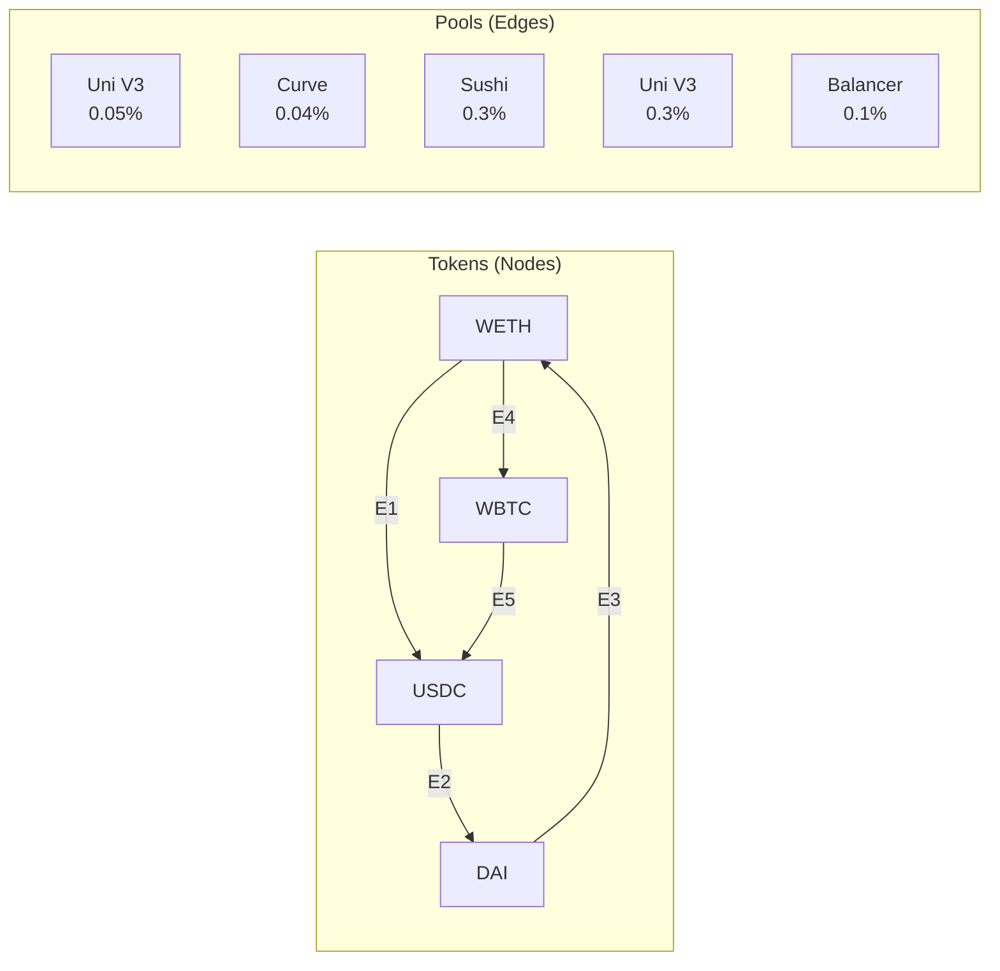
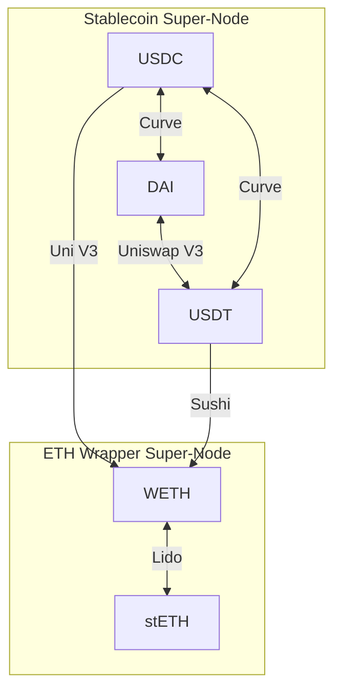

# Topological Yield

Topological Yield is the strategy routing model used by ArbitrageX v2 to discover and evaluate multi-hop arbitrage paths. It represents the DeFi liquidity landscape as a directed acyclic graph (DAG) with DEX pools as edges and token reserves as super-nodes.

---

## The DAG Model

In the Topological Yield model, the DeFi ecosystem is a graph:

| Graph Element | DeFi Equivalent |
|--------------|----------------|
| **Node** | Token contract (WETH, USDC, DAI, etc.) |
| **Edge** | Liquidity pool (DEX pair) |
| **Edge Weight** | Swap output amount for given input |
| **Path** | Multi-hop arbitrage route |
| **Cycle** | Arbitrage opportunity (start and end at same token) |



A triangular arbitrage cycle: **WETH → USDC → DAI → WETH**.

---

## Super-Nodes

A **super-node** is a logical grouping of pools that share a common token pair or protocol family. Super-nodes reduce graph complexity and enable efficient pathfinding.

| Super-Node Type | Contains | Example |
|----------------|----------|---------|
| **Stablecoin Hub** | USDC, USDT, DAI pools | All Curve stable pools |
| **ETH Wrapper Hub** | WETH, stETH, rETH pools | All LSD liquidity |
| **Protocol Cluster** | All pools on a single DEX | All Uniswap V3 pools |



---

## Cycle Detection

The Topological Yield engine detects profitable cycles using a modified Bellman-Ford algorithm:

```rust
// crates/ax-strategy-eval/src/graph/cycles.rs
pub fn find_arbitrage_cycles(
    graph: &PoolGraph,
    start_token: Token,
    max_hops: usize,
) -> Vec<ArbitrageCycle> {
    let mut cycles = Vec::new();

    for depth in 2..=max_hops {
        let paths = graph.find_cycles(start_token, depth);
        for path in paths {
            let output = simulate_path(&path, input_amount);
            if output > input_amount {
                cycles.push(ArbitrageCycle {
                    path,
                    input: input_amount,
                    output,
                    profit: output - input_amount,
                });
            }
        }
    }

    cycles.sort_by(|a, b| b.profit.cmp(&a.profit));
    cycles
}
```

| Parameter | Value | Description |
|-----------|-------|-------------|
| `max_hops` | 4 | Maximum pool hops per cycle |
| `min_profit_bps` | 10 | Minimum profit in basis points |
| `timeout_ms` | 50 | Cycle detection timeout per evaluation |
| `cache_ttl_ms` | 500 | Pool state cache lifetime |

---

## Why DAG and Not Full Graph?

The DeFi pool graph is technically cyclic (arbitrage is a cycle). However, the Topological Yield engine treats it as a **temporarily directed acyclic graph** at each block:

```
1. At each new block, snapshot all pool states
2. Assign directionality based on price ratios
3. Run cycle detection on the directed snapshot
4. Discard the DAG after evaluation
```

This approach ensures that:
- Cycles are detected against a consistent state snapshot
- No stale pool data creates false opportunities
- The evaluation is deterministic for a given block

---

## Yield Calculation

For each detected cycle, the engine calculates:

```
Gross Profit = Output Amount - Input Amount
Net Profit = Gross Profit - Gas Cost - DEX Fees
Confidence = min(pool_liquidity_ratio, price_stability_score)
```

Only cycles with positive net profit and confidence above the strategy threshold are forwarded to the Ghost Protocol.
