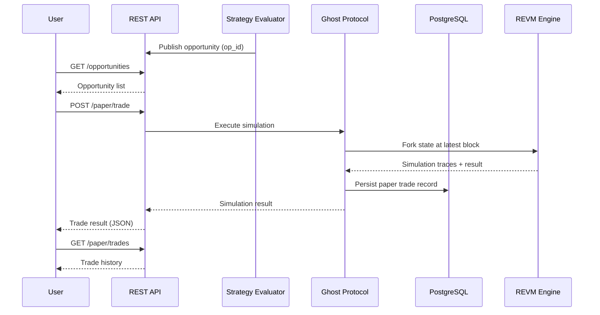

# Tutorial: Your First Paper Trade

This tutorial guides you through executing and interpreting your first paper trade on ArbitrageX v2. You will observe a live opportunity in the WebSocket stream, understand how the Ghost Protocol simulates execution, and read the resulting paper P&L.

**Estimated time:** 10 minutes  
**Prerequisite:** [Tutorial 1: Getting Started](01-getting-started.md) — all 21 containers running

---

## What You Will Accomplish

- Subscribe to the opportunity WebSocket stream
- Identify a paper-mode opportunity in the feed
- Submit the opportunity to the Ghost Protocol for simulation
- Read the simulation result and understand the output fields
- Verify the paper trade appears in the dashboard

---

## Step 1: Confirm Paper Mode is Active

Before executing any trade, confirm the system is in Paper mode. No real transactions will be broadcast to the blockchain while Paper mode is enabled.

```bash
curl http://localhost:3000/api/v1/mode
```

Expected response:

```json
{
  "mode": "paper",
  "ghost_protocol": true,
  "live_execution": false,
  "capital_at_risk": "0.00 USD",
  "simulation_engine": "revm",
  "paper_balance": "100000.00 USD"
}
```

The `paper_balance` field shows the virtual balance allocated for simulation. This is not real capital. Default paper allocation is 100,000 USD.

---

## Step 2: Subscribe to the Opportunity Stream

ArbitrageX v2 publishes detected opportunities over WebSocket. Connect using `websocat` or any WebSocket client:

```bash
# Install websocat if not already available
cargo install websocat

# Connect to the opportunity stream
websocat ws://localhost:8080/ws/opportunities
```

Alternatively, use `curl` for a quick one-shot poll of recent opportunities:

```bash
curl http://localhost:3000/api/v1/opportunities?limit=5
```

### Understanding Opportunity Objects

Each opportunity in the stream contains the following fields:

```json
{
  "op_id": "ax-opp-7f3a9e2d",
  "timestamp": "2024-01-15T09:23:47.123Z",
  "strategy": "triangular_arb_v2",
  "chain": "ethereum",
  "paper_mode": true,
  "pools": [
    { "dex": "uniswap_v3", "address": "0x8ad599c3...", "token_in": "WETH", "token_out": "USDC", "fee": 0.0005 },
    { "dex": "sushiswap", "address": "0xc3d03e4b...", "token_in": "USDC", "token_out": "DAI", "fee": 0.003 },
    { "dex": "curve", "address": "0xbEbc4478...", "token_in": "DAI", "token_out": "WETH", "fee": 0.0004 }
  ],
  "input_amount": "1.500000000000000000",
  "expected_output": "1.523000000000000000",
  "expected_profit_usd": "45.67",
  "gas_estimate": 285000,
  "gas_cost_usd": "12.34",
  "net_profit_usd": "33.33",
  "confidence": 0.94,
  "ttl_ms": 4500
}
```

| Field | Description | Example |
|-------|-------------|---------|
| `op_id` | Unique opportunity identifier | `ax-opp-7f3a9e2d` |
| `timestamp` | Detection timestamp (ISO 8601) | `2024-01-15T09:23:47.123Z` |
| `strategy` | Strategy that detected the opportunity | `triangular_arb_v2` |
| `chain` | Target blockchain | `ethereum` |
| `paper_mode` | Whether this is a paper simulation | `true` |
| `pools` | DEX liquidity pools in the route | Array of pool objects |
| `input_amount` | Amount of input token (wei) | `1.5 WETH` |
| `expected_output` | Expected output (wei) | `1.523 WETH` |
| `expected_profit_usd` | Gross profit before gas | `$45.67` |
| `gas_estimate` | Estimated gas units | `285000` |
| `gas_cost_usd` | Estimated gas cost | `$12.34` |
| `net_profit_usd` | Net profit after gas | `$33.33` |
| `confidence` | Model confidence score (0–1) | `0.94` |
| `ttl_ms` | Time-to-live in milliseconds | `4500` |

---

## Step 3: Execute a Paper Trade

Submit an opportunity to the Ghost Protocol simulation endpoint:

```bash
curl -X POST http://localhost:3000/api/v1/paper/trade \
  -H "Content-Type: application/json" \
  -d '{
    "op_id": "ax-opp-7f3a9e2d",
    "input_amount": "1.500000000000000000",
    "max_slippage_bps": 50,
    "priority_fee_gwei": 2.5
  }'
```

The Ghost Protocol executes the trade through REVM (a Rust EVM implementation) using a forked state of the current blockchain head. No transaction is broadcast.

### Request Parameters

| Parameter | Type | Required | Description |
|-----------|------|----------|-------------|
| `op_id` | string | Yes | The opportunity ID from the stream |
| `input_amount` | string | Yes | Amount to trade (in wei, as decimal string) |
| `max_slippage_bps` | integer | No | Max slippage in basis points (default: 50) |
| `priority_fee_gwei` | number | No | Priority fee for gas estimation (default: 2.0) |

---

## Step 4: Read the Simulation Result

The Ghost Protocol returns a detailed simulation result:

```json
{
  "paper_trade_id": "ax-paper-tx-a1b2c3d4",
  "op_id": "ax-opp-7f3a9e2d",
  "status": "success",
  "timestamp": "2024-01-15T09:23:48.891Z",
  "simulation": {
    "engine": "revm",
    "fork_block": 18945231,
    "execution_time_ms": 12,
    "traces": 3
  },
  "input": {
    "token": "WETH",
    "amount": "1.500000000000000000"
  },
  "output": {
    "token": "WETH",
    "amount": "1.521400000000000000"
  },
  "profit": {
    "gross_wei": "21400000000000000",
    "gross_usd": "44.73",
    "gas_cost_usd": "12.18",
    "net_usd": "32.55"
  },
  "execution": {
    "route": ["uniswap_v3", "sushiswap", "curve"],
    "actual_slippage_bps": 12,
    "gas_used": 278432,
    "effective_gas_price_gwei": 18.5,
    "revert_reason": null
  },
  "vs_expected": {
    "output_delta_bps": -10,
    "profit_delta_bps": -23,
    "within_tolerance": true
  }
}
```

### Key Result Fields

| Field | Description |
|-------|-------------|
| `status` | `success`, `reverted`, `expired`, or `rejected` |
| `simulation.execution_time_ms` | How long REVM took to simulate |
| `profit.net_usd` | Final paper profit after all costs |
| `execution.actual_slippage_bps` | Slippage experienced vs. estimated |
| `execution.revert_reason` | If reverted, the revert cause |
| `vs_expected.profit_delta_bps` | Difference from pre-trade estimate |
| `vs_expected.within_tolerance` | Whether result fell within tolerance bands |

---

## Step 5: View in the Dashboard

Open the dashboard at `http://localhost:3000/trades` and locate your paper trade by ID (`ax-paper-tx-a1b2c3d4`).

The trades page displays:

| Column | Meaning |
|--------|---------|
| Trade ID | Clickable link to full trace view |
| Time | Human-readable execution timestamp |
| Strategy | Which strategy found the opportunity |
| Input | Token and amount entered |
| Output | Token and amount received |
| Net P&L | Final profit after costs (green = profit) |
| Status | Badge: `Success`, `Reverted`, `Expired` |
| Block | Simulated block number (paper) |

Click any trade row to open the **Trace View**, which shows step-by-step EVM execution traces for each hop in the route.

---

## Step 6: Query Paper Trade History

Retrieve your paper trade history via the API:

```bash
curl http://localhost:3000/api/v1/paper/trades?limit=10
```

Or filter by date range:

```bash
curl "http://localhost:3000/api/v1/paper/trades?from=2024-01-15T00:00:00Z&to=2024-01-15T23:59:59Z"
```

Paper trades are persisted to PostgreSQL and remain available across restarts.

---

## Summary of the Paper Trade Flow



---

## What You Learned

- Paper mode ensures zero capital risk by routing all execution through the Ghost Protocol
- Opportunities contain full route details with profit estimates before execution
- The Ghost Protocol uses REVM with forked state for accurate simulation
- Simulation results include detailed breakdowns of profit, gas, slippage, and variance from estimates
- All paper trades are persisted and queryable via API and dashboard

When you are ready to transition to live execution, consult the [Deploy to VPS](../how-to/deploy-to-vps.md) how-to guide and ensure `AX_MODE=live` is set with proper wallet custody configured.
