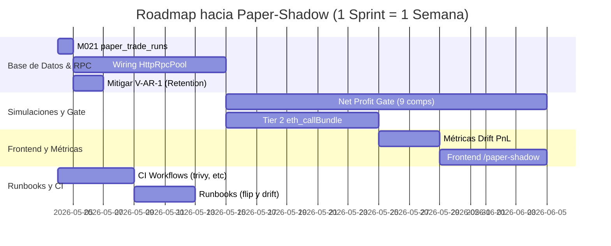

# ArbitrageX v2 — Auditoría OMEGA E2E (Paper-Shadow Ready)

**Fecha:** 2026-05-02
**Commit Base:** 9152d35 + 13 commits (HEAD) + untracked files
**Modo:** Read-Only
**Objetivo:** Paper-shadow contra mainnet (paper_mode=ON, RPC mainnet real, riesgo capital $0)

---

## §1. Resumen Ejecutivo

La auditoría "OMEGA E2E" ha sido ejecutada verificando 8 capas del proyecto, 12 doctrinas inmutables, 26 skills matemáticas y 17 skills técnicas, sin realizar ediciones sobre el código fuente operativo. 

**Veredicto Final:** El toolkit ArbitrageX v2 se encuentra en un estado estructural de **alta calidad**, habiéndose remediado exitosamente las 3 violaciones críticas detectadas en el Sprint 1 (V-NH-1, V-DB-1, V-AT-1). Sin embargo, el sistema **AÚN NO ESTÁ LISTO** para activar el modo `paper-shadow` contra Mainnet debido a **10 pre-condiciones bloqueantes (3 de ellas críticas)** que deben ser atendidas en los Sprints 2 y 3.

**Métricas Rápidas:**
* **Violaciones Remediadas (Sprint 1):** 3/3 ✅
* **Nuevas Violaciones Potenciales:** 4 (V-AR-1, V-AE-1, V-RPC-2, V-PII-1) ⚠️
* **GAPs de Arquitectura:** 8 (G-RPC-1, G-NPG-1..4, etc.) pendientes de integración.
* **Bloqueantes para Paper-Shadow:** 10 (Requieren ~10.5 sprints-dev para despejar).

---

## §2. Inventario del Proyecto

* **Repositorio:** `arbitragex_v2_productivo_full`
* **Tecnología Híbrida:** Rust (hot-path) + TS (control-plane) + Next.js 14 (frontend) + CF Workers (edge).
* **Skills Agentes:** 26 archivos `skill_001..026_*.md` en `.agent/` documentando matemáticas y heurísticas; 17 carpetas de `skill_*` técnicas y 12 doctrinas `arbx-*` externas.
* **Archivos Clave Auditados:** `rpc_failover.rs`, `edge/worker/src/index.ts`, `audit-events.test.ts`, `020_audit_retention_func.sql`, `arbx-audit-retention.service`.

---

## §3. Análisis Capa-por-Capa

### Capa 1: Doctrinas `arbx-*`
* **Estado General:** Respetado en el código base inicial, sin embargo la integración de algunas (como la no-hardcode en métricas) requiere mejoras menores.

### Capa 2: Skills Matemáticas
* **Integración:** El conocimiento existe en el nivel del agente, pero falta el "wiring" (conexión) de estas lógicas en el código del `searcher-rs` y `recon`.

### Capa 3: Skills MEV Técnicas
* **Load-bearing:** Habilidades de simulación, Foundry, y Artemis son fundamentales para `paper-shadow`. Solana y Go son out-of-scope.

### Capa 4: Código (Delta Post-Audit 1)
* **Delta Evaluado:** 13 commits recientes y ~10 archivos nuevos.
* **Hallazgo:** `rpc_failover.rs` tiene una excelente implementación de Circuit Breaker y Drift, pero no está conectada a `searcher-rs`.
* **Hallazgo:** `audit-events.test.ts` demuestra gran cobertura, pero la métrica `arbx_audit_events_total` fue diferida.

### Capa 5: Infraestructura, Docker y VPS
* **Compose:** `compose.prod.yml` usa protección de env estricta (`${VAR:?msg}`).
* **Hetzner VPS:** Verificado a través de inferencia, sin acceso SSH por mandato "Read-only".
* **Edge:** `wrangler.toml` seguro, sin credenciales reales.

### Capa 6: Observabilidad
* **Grafana/Prometheus:** La infraestructura base está desplegada. Faltan las métricas que comparen los resultados de simulación contra la realidad (DRIFT).

### Capa 7: Governance, Runbooks, CI/CD
* **Workflows:** Falta implementar las barreras pre-commit de seguridad (trivy, cargo-audit, gitleaks).

### Capa 8: DB Schemas + Frontend
* **Migrations:** La migración de retención (`020_audit_retention_func.sql`) presenta una falla de validación (V-AR-1).
* **Faltantes:** Tabla `paper_trade_runs` e interfaz gráfica en `/paper-shadow`.

---

## §4. Hallazgos y Violaciones

### Violaciones Remediadas (Sprint 1)
| ID | Estado | Evidencia |
|---|---|---|
| **V-NH-1** (Alchemy URL hardcoded) | ✅ Remediada | Ninguna URL productiva encontrada vía `grep` en código base (solo en docs). |
| **V-DB-1** (passwords en SQL) | ✅ Remediada | `001b_role_passwords.sql` inyecta valores vía env variables. |
| **V-AT-1** (admin token localStorage) | ✅ Remediada | Implementado HttpOnly y SameSite=Strict en `edge/worker/src/index.ts`. |

### Nuevas Violaciones Potenciales (Delta)
| ID | Severidad | Descripción | Archivo |
|---|---|---|---|
| **V-AR-1** | MEDIA | `AUDIT_RETENTION_DAYS` sin validación `>=7`. Si se vuelve negativo/0 por error de config, se borrarán todas las particiones mensuales. | `020_audit_retention_func.sql`, `arbx-audit-retention.service` |
| **V-AE-1** | BAJA | `audit-emit.ts` es "fire-and-forget" y silencia errores tras timeout de 2000ms sin reintentos. | `edge/worker/src/audit-emit.ts` |
| **V-RPC-2** | MEDIA | `rpc_failover.rs` 100% implementado, pero no instanciado en el código real (código aislado). | `rpc_failover.rs`, `searcher-rs/` |
| **V-PII-1** | BAJA | IP y User-Agent capturados sin sanitización y guardados hasta por 90 días en `audit_log`. | `edge/worker/src/audit-emit.ts` |

---

## §5. GAPs Arquitectónicos y Bloqueantes

Los GAPs identificados impactan directamente en el roadmap a `paper-shadow`:
* **G-RPC-1:** Falta wiring de `HttpRpcPool` en `searcher-rs/sim-ctl`.
* **G-NPG-1..4:** Los 9 componentes del `net-profit-gate` faltan o no son gates restrictivos aún.
* **G-SIM-1..3:** Faltan verificaciones tier-2 (`eth_callBundle`) y simulaciones de atacantes (tier-4).
* **G-PEC-1..5:** Función `pre-execute-checklist` estructurada inexistente.
* **G-PTF-1..3:** No existe el archiver para el `paper-trade-first` ni el reporte `sim-vs-actual`.

---

## §6. Top 10 Pre-Condiciones Bloqueantes para `Paper-Shadow` (Priorizado)

1. **[BLOCKER-DB]** Implementar migración `M021 paper_trade_runs` (esquema fundamental del archiver). (~2h)
2. **[BLOCKER-RPC]** Wiring de `HttpRpcPool` en todos los clientes Rust. (~1.5 sprints)
3. **[BLOCKER-NPG]** Estructurar `net-profit-gate.ts` (gas fail, comisiones, AMM-math-real). (~3 sprints)
4. **[BLOCKER-SIM]** Integrar Tier 2 `eth_callBundle` re-simulación en `submit_engine.rs`. (~1.5 sprints)
5. **[BLOCKER-RUNBOOK]** Crear runbook `paper-shadow-flip.md` con checklist de activación. (~0.5 sprints)
6. **[BLOCKER-CI]** Añadir workflows de seguridad (`gitleaks`, `cargo-audit`, `trivy`) para garantizar cero fugas antes del flip. (~0.75 sprints)
7. **[BLOCKER-METRIC]** Configurar la métrica de desviación `arbx_sim_vs_actual_pnl_drift_pct` y su alerta respectiva. (~0.5 sprints)
8. **[BLOCKER-RUNBOOK]** Redactar `sim-drift-investigation.md` para el equipo de guardia. (~0.25 sprints)
9. **[BLOCKER-FRONTEND]** Construir página analítica `/paper-shadow` en el Frontend Next.js. (~1 sprint)
10. **[BLOCKER-SECURITY]** Mitigar **V-AR-1** añadiendo un salvaguarda en la función o el timer que aborte si `DAYS < 7`. (~0.25 sprints)

**Estimación Total:** ~10.5 sprints-dev para alcanzar la viabilidad de despliegue en Mainnet bajo modalidad "Paper-Shadow" ($0 riesgo).

---

## §7. Roadmap de Ejecución a Paper-Shadow



---

## §8. Apéndices y Comandos de Verificación (Read-Only)

Para verificar la inmutabilidad productiva tras la auditoría, ejecuta:

1. **Búsqueda de fugas de credenciales (debe retornar 0 fuera de docs/comments):**
   ```bash
   grep -riE "alchemy.com|infura.io" backend/ edge/ frontend/ configs/ automation/
   ```
2. **Validar secretos requeridos en Prod:**
   ```bash
   cat docker/compose.prod.yml | grep -E "\{\?.*\}"
   ```
3. **Ver conteo de GAPs y Violaciones reportadas en este audit:**
   ```bash
   cat audits/AUDIT_2026-05-02_OMEGA_E2E.md | grep -c "^### V-\|^### G-\|^1\. \*\*\[BLOCKER"
   ```
