# FE-01 · Censo 0→N de la DApp + Mapa de Relaciones — DESIGN 2026-09-07

> **WO:** FE-01 · kind: design · agente: frontend-architect (Gang Omniscience)
> **Claim de archivos:** `frontend/app/**`, `frontend/components/app-sidebar.tsx`, `frontend/components/PageBreadcrumb.tsx`, `frontend/components/last-updated.tsx`, `frontend/next.config.js`
> **Pares:** primer reporte de la mesa (dir `audits/frontend-doctrine-2026-09-07/` contenido sólo `GOAL-WORKORDERS.md` al iniciar). FE-02/03/04/05 construyen sobre esto.
> **Lexicon OMEGA:** Topological Yield (ganancia), Variedad de Liquidez (pool/DEX), TLS (flash loan), Decoherencia de Estado (slippage), Holonomic Loop Resolution (triangular).

---

## 0. Adjudicación de la cifra: 57 (goal) vs 58 (repo)

**Método contable (reproducible):**

```bash
find frontend/app -name "page.tsx" | wc -l          # → 58
find frontend/app -name "page.tsx" | sort           # lista íntegra §3
grep -c "href:" frontend/components/nav-items.ts    # NAV_ITEMS → 46 entradas
```

- **Cifra EXACTA del repo hoy: 58 archivos `page.tsx` bajo `frontend/app`** (incluida la ruta dinámica `omega-s5/registry/[entity]`). [CR: `frontend/app/omega-s5/registry/[entity]/page.tsx`]
- El `/goal` (GOAL-WORKORDERS.md:3) dice *"de 0 a 57 páginas"*. **Discrepancia R8 declarada (sin maquillar):** NO puedo determinar el método contable del operador → [UN]. Dos lecturas posibles:
  1. **"0→57" inclusivo 0-indexed = 58 páginas** (número 0..57) → NO habría discrepancia. [IN]
  2. Un conteo de 57 con off-by-one → la página omitida sería una de las 12 huérfanas del sidebar (§4: `/monitor`, `/control`, `/readiness`, `/live-testnet`, `/translator`, `/operator/presets`, `/onboarding/1-init`..`5-production`, `/omega-s5/registry/[entity]`). [IN]
- **Evidencia de drift histórico del censo:** `frontend/app/layout.tsx:109` (comentario B-01) dice *"loaded WalletConnect on ALL 56 pages"* — el conteo ha derivado 56 → (57 goal) → 58 hoy. Ninguna de las tres cifras está versionada en un único lugar del repo: el SSOT de navegación (`nav-items.ts`, 46 entradas) NO cubre las 58 páginas. **El censo vivo es el filesystem, no un documento** — éste reporte es la primera fotografia completa.

**Invariante contable del censo (FE-01-GATE-1):**
`58 = 18 páginas "use client" + 28 páginas R1 (Server Component + *Client con initialSnapshot) + 12 páginas Server Component sin compañero *Client`
[CR: clasificación por grep `"use client"` (18) + grep `Client"` imports (28) + resta (12); listas en §3]

**Gate de verificación (re-ejecutable por cualquier par):**
```bash
cd frontend
A=$(find app -name page.tsx | wc -l)                                        # 58
B=$(grep -rlE "^(\"|')use client(\"|')" app --include=page.tsx | wc -l)     # 18 (2 con comillas simples: translator, admin/signin)
C=$(grep -rlE "Client(\"|')" app --include=page.tsx | wc -l)                # 28 (2 imports single-quote: [entity], allocator)
test $((B+C+12)) -eq $A && echo "CENSO OK" || echo "CENSO DRIFT"
# Verificado 2026-09-07: pages=58 use-client=18 client-import=28 → CENSO OK
```

---

## 1. Topología de transporte (por qué el mapa tiene 6 backends)

| Transporte | Resolución | Autoridad | Evidencia |
|---|---|---|---|
| **REST edge** | browser `""` same-origin → rewrite `/api/*` → `INTERNAL_EDGE`; SSR `INTERNAL_EDGE_URL` (Docker `http://edge:8787`) | `lib/api-client.ts:35-65` (getApiBaseUrl), `next.config.js:110-139` (rewrites) | [CR] |
| **WS socket.io** | browser same-origin → rewrite `/socket.io` → `INTERNAL_API` (:8080); SSR/flag `NEXT_PUBLIC_WS_URL`; **NUNCA via Edge** (RULE 02) | `lib/api-client.ts:67-89` (getWsBaseUrl), `next.config.js:119-131` | [CR] |
| **WS raw `/ws/metrics`** | `NEXT_PUBLIC_WS_URL` → `ws(s)://…:8080/ws/metrics` + REST `:8080/metrics/entropy` (api-server DIRECTO) | `app/monitor/hooks/useMetrics.ts:37-38` | [CR] |
| **WS raw `/edge/ws/allocator`** | same-origin `wss://host/edge/ws/allocator` (subprotocolos) | `app/apex/allocator/AllocatorClient.tsx:27,34` | [CR] |
| **SSE** | `EventSource /api/live-testnet/events?chain_id=11155111` | `hooks/useEventStream.ts:18` | [CR] |
| **Sin red** | localStorage / data local / redirect | `/settings`, `/operator/presets`, `/operator`, `/deploy-pipeline` | [CR] |

**Rutas auxiliares (censo completo):** `error.tsx` raíz (`app/error.tsx:12`, boundary global de segmento) · `not-found.tsx` raíz (`app/not-found.tsx:9`) · **13 `loading.tsx`** (agent-insights, audit-logs, config, dex-registry, executions, operations, opportunities, paper/history, recon, risk, status, strategies, wallets — skeletons uniformes vía `components/skeletons`) · **4 `layout.tsx`** (raíz, `monitor`, `omega-s5`, `wallet`) · **0 `route.ts` handlers** [CR: `find app -name route.ts` vacío — la DApp NO tiene API routes propias; todo API pasa por edge/rewrites]. Redirects declarados: `/operator` → `/operator/self-test` (`app/operator/page.tsx:11`); plural→singular en `omega-s5/registry/[entity]/page.tsx:36-38` (H7).

---

## 2. MAPA DE RELACIONES (mermaid)

**Dos tipos de arista:** `-->` = **dependencia de datos** (quién consume qué endpoint/stream) · `-.->` = **navegación** (quién linka a quién). El sidebar agrupa por subgrafos (46 hrefs de `nav-items.ts:53-107`); el tab-strip omega agrega 8 tabs (`omega-s5/layout.tsx:16-24`).

```mermaid
flowchart LR
  classDef backend fill:#1a1a2e,stroke:#7c7cff,color:#ccccff
  classDef orphan fill:#2d1f1f,stroke:#cc6666,color:#ffcccc
  class edge,wsio,wsraw,edgews,sse,local backend

  %% ══════════ BACKENDS ══════════
  edge["REST edge :8787<br/>/api/* (EDGE_URL)"]
  wsio["WS api-server :8080<br/>socket.io rooms"]
  wsraw["WS raw api-server :8080<br/>/ws/metrics + /metrics/entropy"]
  edgews["WS same-origin<br/>/edge/ws/allocator"]
  sse["SSE<br/>/api/live-testnet/events"]
  local["Sin red<br/>localStorage / redirect / static"]

  %% ══════════ PIPELINE ══════════
  subgraph PIPE["Pipeline — nav group pipeline (14 hrefs)"]
    home["/ · Home"]
    status["/status"]
    opps["/opportunities"]
    oppex["/opportunities/exchange"]
    oppbs["/opportunities/by-strategy"]
    execs["/executions"]
    paper["/paper/history"]
    recon["/recon"]
    ops["/operations"]
    rout["/route-outcomes"]
    rdisc["/routes/discovery"]
    sed["/sed"]
    agent["/agent-insights"]
    wh["/worker-health"]
  end

  %% ══════════ RISK & CONTROL ══════════
  subgraph CTRL["Risk & Control (7 hrefs + 2 huérfanas)"]
    risk["/risk"]
    kill["/killswitch"]
    lready["/live-readiness"]
    oper["/operator →redirect"]
    selft["/operator/self-test"]
    audits["/audit-logs"]
    apex["/apex/allocator"]
    ready["/readiness · huérfana"]
    ltest["/live-testnet · huérfana"]
  end

  %% ══════════ SETUP ══════════
  subgraph SETUP["Configuration (17 hrefs + 3 huérfanas)"]
    creds["/settings/credentials"]
    cfg["/config"]
    cfgt["/config/trading"]
    strat["/strategies"]
    forge["/strategies/forge"]
    onb["/onboarding"]
    onb15["/onboarding/1..5 · 5 rutas huérfanas"]
    chains["/chains"]
    rpcs["/rpcs"]
    pools["/pools"]
    dexr["/dex-registry"]
    wallts["/wallets"]
    wallet["/wallet · Web3"]
    deploy["/deploy-pipeline"]
    tvault["/admin/topology"]
    achains["/admin/chains"]
    asign["/admin/signin"]
    sett["/settings"]
    monitor["/monitor · huérfana"]
    ctrlb["/control · huérfana"]
    trans["/translator · huérfana"]
  end

  %% ══════════ OMEGA-S5 ══════════
  subgraph OMEGA["Omega S5 (8 hrefs + 1 dinámica)"]
    ocore["/omega-s5/core"]
    ocruc["/omega-s5/crucible"]
    ofact["/omega-s5/factory"]
    oadap["/omega-s5/adapters"]
    odrift["/omega-s5/drift"]
    ooper["/omega-s5/operator"]
    oreg["/omega-s5/registry"]
    orente["/omega-s5/registry/[entity]"]
    owall["/omega-s5/wallets"]
  end

  %% ══════════ ARISTAS DE DATOS (───>) ══════════
  home -->|"/api/opportunities/live + /api/readiness/decision"| edge
  status -->|"/api/status · poll 5s"| edge
  opps -->|"SSR /api/opportunities/live + WS subscribe:opportunities"| edge
  opps -->|"new_opportunity + fallback poll"| wsio
  oppex -->|"SSR ?viable_only=false + WS subscribe:prices"| edge
  oppex -->|"prices:snapshot / prices:update"| wsio
  oppbs -->|"/api/opportunities/live (misma señal, agrupada)"| edge
  execs -->|"/api/executions/recent"| edge
  paper -->|"/api/paper/history + /summary"| edge
  recon -->|"/api/recon/summary + /timeseries"| edge
  ops -->|"kpi + scurve + scanner/heartbeat + canonical-knobs + route-discovery/tick"| edge
  rout -->|"/api/route-discovery-outcomes/summary + /api/v1/analytics/viable-kpis"| edge
  rdisc -->|"/api/route-discovery/routes + /status"| edge
  sed -->|"WS subscribe:convergence → convergence_signal"| wsio
  agent -->|"/api/agents/status"| edge
  wh -->|"/api/metrics/defi"| edge
  risk -->|"/api/risk/alerts + circuit-breakers/status+events"| edge
  kill -->|"/api/status + POST /admin/killswitch"| edge
  lready -->|"readiness + blockers + decision + steps + agents + scoring + go-no-go"| edge
  ltest -->|"/api/readiness/decision"| edge
  ltest -->|"EventSource chain 11155111"| sse
  monitor -->|"SSR /api/status"| edge
  monitor -->|"/ws/metrics + /metrics/entropy"| wsraw
  ready -->|"/api/readiness/blockers + /decision"| edge
  oper -->|"redirect puro"| local
  selft -->|"/api/operator/selftest + credentials/status"| edge
  audits -->|"/admin/audit (cookie httpOnly)"| edge
  apex -->|"arbx:scoring:updates espejo"| edgews
  creds -->|"/api/credentials + /api/admin/topology/snapshot"| edge
  cfg -->|"/api/config/current + toggles"| edge
  cfgt -->|"GET /api/trading-config · PUT /admin/trading-config/1"| edge
  strat -->|"/api/trading-config + /api/strategy-catalog + cartridges/runtime + math/operators"| edge
  forge -->|"WS subscribe:route_discovery + REST /api/route-discovery"| wsio
  forge -->|"/api/route-discovery + tick"| edge
  onb -->|"/api/onboarding/status"| edge
  onb15 -->|"/api/onboarding/status + POST /admin/onboarding/N/complete"| edge
  chains -->|"/api/chains"| edge
  rpcs -->|"/api/rpcs + RpcSyncPanel"| edge
  pools -->|"/api/pools"| edge
  dexr -->|"/api/v1/dexes"| edge
  wallts -->|"/api/v1/wallets"| edge
  wallet -->|"wagmi/RainbowKit browser wallet (read-only + SIWE)"| local
  deploy -->|"force-static · data local ./data"| local
  tvault -->|"/api/admin/topology/snapshot (cookie)"| edge
  achains -->|"/api/admin/chains CRUD + probe (cookie)"| edge
  asign -->|"setAdminToken → cookie httpOnly"| edge
  sett -->|"sólo localStorage"| local
  monitor -->|"useSocketIO + services:health"| wsio
  ctrlb -->|"/api/v1/control-board"| edge
  trans -->|"/api/translate?word="| edge
  ocore -->|"/api/contracts + /api/system/feature_manifest"| edge
  ocruc -->|"/api/crucible/status"| edge
  ofact -->|"/api/contracts?contract_kind=factory"| edge
  oadap -->|"/api/contracts?kinds=adapter_*"| edge
  odrift -->|"/api/system/drift poll 5s"| edge
  ooper -->|"/api/capital-gates"| edge
  oreg -->|"índice estático de 6 cards"| local
  orente -->|"SSR /api/admin/chains (entity=chain wired) + runtime_ack"| edge
  orente -->|"WS runtime_ack"| wsio
  owall -->|"/api/contracts?kinds=wallet_topology…"| edge

  %% ══════════ ARISTAS DE NAVEGACIÓN (- - ->) ══════════
  SIDEBAR["app-sidebar · 46 hrefs<br/>nav-items.ts SSOT"] -.-> PIPE
  SIDEBAR -.-> CTRL
  SIDEBAR -.-> SETUP
  SIDEBAR -.-> OMEGA
  OMEGATABS["omega-s5/layout<br/>tab strip 8 tabs"] -.-> OMEGA
  BC["PageBreadcrumb ·<br/>crumbs linkean sólo rutas NAV"] -.-> home
  HEADER["SiteHeader logo"] -.-> home
  home -.->|"GateSection"| ready
  paper -.->|"PaperHistoryClient:299"| lready
  opps -.->|"OpportunitiesEmpty:15 → /status"| status
  onb -.->|"start/preview phase"| onb15
  onb15 -.->|"back"| onb
  audits -.-> kill
  onb15 -.-> kill
  ctrlb -.-> kill
  strat -.-> kill
  asign -.->|"post-login + ?next="| tvault
  asign -.->|"?next=/rpcs"| rpcs
  notfound["not-found.tsx"] -.-> home
  notfound -.-> status
  errbnd["error.tsx"] -.-> home
  oreg -.-> orente
  oper -.-> selft

  class ready,ltest,monitor,ctrlb,trans,onb15,orente orphan
```



**Notas del mapa:**
- El nodo `onb15` condensa las 5 rutas `/onboarding/{1-init,2-connect,3-advanced,4-testing,5-production}` (misma forma R1 + mismo POST pattern; difiere sólo 1-init que es client page con token admin). [CR]
- Sidebar→subgrafo = las 46 entradas de `nav-items.ts`; las 12 páginas con `classDef orphan` NO reciben arista del sidebar — son alcanzables sólo por links de página o URL directa. [CR: nav-items.ts vs find]
- `topology-snapshot.ts` compartido: lo consumen `admin/topology/TopologyVaultClient.tsx:21,24` y `settings/credentials/page.tsx:24` — es la única lib compartida de snapshot entre dos páginas (la dependencia MC-CRED-2). [CR]

---

## 3. Índice página × fuente × estados × componentes (58 filas)

Convención: **T** = tipo (`C` use-client · `R1` server+Client snapshot · `S` server puro/islas) · **Nav** = `nav` (sidebar) / `tab` (omega) / `huerfana`. Clasificación: **[CR]** CANONICAL_REPO file:line · **[IN]** INFERRED · **[UN]** UNKNOWN. Estados: L=loading, E=empty (razón R8), X=error.

| # | Ruta | T | Nav | Propósito operacional | Fuentes de datos | Componentes clave | L / E(razón) / X |
|---|------|---|-----|------------------------|------------------|-------------------|------------------|
| 1 | `/` | S | nav | Home institucional: KPIs honestos + feed + Gate Refusal | SSR `/api/opportunities/live?limit=50` + `/api/readiness/decision` (`page.tsx:27,85`); isla `HomeStoreAggregation` lee omni-store [CR] | XRayCard, StatCard, GateSection, HomeStoreAggregation | E: dos razones — "snapshot del servidor falló (R8)" vs "0 asimetrías — searcher escaneando" (`page.tsx:187-198`) [CR] |
| 2 | `/status` | R1 | nav | Estado vivo de cada servicio hot-path + kill-switch | SSR+poll 5s `getStatus` → `/api/status` [CR] | StatusClient, PageHeader | L: skeleton (loading.tsx) · X: Alert destructive "no fallback" (`page.tsx:23-36`) [CR] |
| 3 | `/opportunities` | R1 | nav | Feed de Asimetrías Topológicas detectadas (candidatas pre-gate) | SSR `/api/opportunities/live` → `OpportunitiesClient`; WS `subscribe:opportunities`→`new_opportunity` + fallback poll (useOmniOpportunities) + `getTradingConfig` [CR] | OpportunitiesClient, OpportunityTradeCard, OpportunityDetailDialog, QuarantinedEventsAuditTrail, OpportunitiesEmpty | E: `OpportunitiesEmpty` "nothing worth executing → /status" (`features/opportunities/OpportunitiesEmpty.tsx:15`) [CR] |
| 4 | `/opportunities/exchange` | R1 | nav | Feed "glass neon" por Variedad de Liquidez (atlas) | SSR `/api/opportunities/live?viable_only=false&limit=50` (first paint no vacío) [CR: `page.tsx:30`] + WS `subscribe:prices` (`PriceTicker`) | OpportunitiesExchangeClient, PriceTicker, atlas-glass.css (scoped) | E: mismo contrato que /opportunities; viable_only=false declara por qué puede haber rejected rows [CR] |
| 5 | `/opportunities/by-strategy` | R1 | nav | Proyección del MISMO wire agrupada por strategy_kind | SSR `/api/opportunities/live` (misma señal, mismo mapper `mapToOmniOpportunity`) [CR: `page.tsx:44`] | OpportunitiesByStrategyClient | E: [] con lede explícito "projection… no second universe" [CR] |
| 6 | `/executions` | R1 | nav | Envíos de bundles y desenlace (paper hasta S9) | SSR+LoadMore `/api/executions/recent` [CR] | ExecutionsClient | X: Alert "edge error" verbatim (`page.tsx:31-40`) [CR] |
| 7 | `/paper/history` | R1 | nav | Drift-analysis de paper_trade_runs (shadow archiver) | SSR `/api/paper/history?limit=50` + `/summary?hours=24`; poll 15s [CR] | PaperHistoryClient | E: sentinel `initialError` → banner degradado ≠ "no runs yet" sano (`page.tsx:47-53`) [CR] · link → /live-readiness [CR: PaperHistoryClient.tsx:299] |
| 8 | `/recon` | R1 | nav | PnL realizado + scoring adaptativo (loop S6) | SSR `/api/recon/summary` + `/timeseries`; ReconClient re-fetch por rango [CR] | ReconClient, KillswitchBanner n/a | X: summary fail → Alert destructivo, page-level [CR] |
| 9 | `/operations` | R1 | nav | Earned-Value convergence + funnel del scanner | SSR 5 endpoints paralelos: kpi, scurve, scanner/heartbeat, canonical-knobs, route-discovery/tick; poll 30s [CR: `page.tsx:42-49`] — degradación parcial aislada (heartbeat/knobs/lat NO bloquean KPIs) | OperationsClient, LastUpdated | E/X por panel: `initialHeartbeatError`, `initialModeError` (503 knobs_not_published = ausencia honesta), `initialLatError` [CR] |
| 10 | `/route-outcomes` | S | nav | Hit-rate Gate-C + distribución honesta de razones | Paneles poll 8s: `/api/route-discovery-outcomes/summary`, `/api/v1/analytics/viable-kpis` [CR] | RouteDiscoveryOutcomesPanel, ViableByHopsPanel, RouteOutcomesAnalyticsPanel | E: gaps declarados por dimensión no persistida (hop/detector/DEX) [CR FE-0038 §47] |
| 11 | `/routes/discovery` | R1 | nav | Grafo DFS de descubrimiento de rutas (shadow) | SSR `/api/route-discovery/routes` + `/status`; poll 8s [CR] | RoutesDiscoveryClient | E: null snapshot → cliente fail-honest [CR] |
| 12 | `/sed` | S | nav | Telemetría SED en vivo | WS `subscribe:convergence` → `convergence_signal` (useConvergenceStream) [CR: `lib/hooks/useConvergenceStream.ts:7-9`] | SedConvergencePanel | E: sin señal = estado del stream, declarado [CR] |
| 13 | `/agent-insights` | R1 | nav | 17 veredictos de agent-teams (P2) | SSR `/api/agents/status`; poll [CR] | AgentInsightsClient | X: null snapshot → Alert "edge/upstream failure" (`page.tsx:47-63`) [CR] |
| 14 | `/worker-health` | C | nav | Telemetría del worker (CPU/mem/uptime) | Client one-shot `/api/metrics/defi` [CR] | motion cards | L: "Booting Telemetry…" · X: "EDGE ERROR — ZERO TRUST" (`page.tsx:26-38`) [CR] |
| 15 | `/risk` | S | nav | Alertas + circuit breakers A.6 + kill-switch banner | SSR `/api/risk/alerts?hours=24`; RiskCircuitPanel → `/api/risk/circuit-breakers/status` + `/events` [CR] | KillswitchBanner, RiskCircuitPanel, RiskAlertsTable | X: page-level Alert verbatim [CR] |
| 16 | `/killswitch` | C | nav | ARMAR/desarmar kill-switch (audit-trail) | Client `getStatus` + POST `/admin/killswitch` (admin token/cookie) [CR] | ClearAdminTokenButton, SourceMeta | X: error verbatim; requiere reason obligatoria [CR] |
| 17 | `/live-readiness` | C | nav | Gate doctrinal 19 checks + A.9 sign-off | Client poll `getReadiness` + paneles: blockers, decision, steps, agents, scoring, go-no-go status/ledger [CR imports `page.tsx:7-25`] | BlockersPanel, GoNoGoPanel, GoNoGoSignOffCard, AgentTeamsPanel, ConfidenceScoringPanel, RiskCircuitPanel, LiveReadinessStepper, ForkValidationPanel, PaperShadowPanel, GSimSmokeTestCard, LastUpdated | E: NOT_AVAILABLE por fuente ausente — nunca PASS fabricado [CR] |
| 18 | `/live-testnet` | C | huerfana | Mini-estado testnet Sepolia 11155111 | `useLiveTestnetStatus` → `/api/readiness/decision` + `useEventStream` SSE `/api/live-testnet/events` [CR] | — (17 líneas, wireframe) | Sin estados dedicados — wireframe [CR] |
| 19 | `/monitor` | S | huerfana | Observatorio OMEGA v2.0.0 (Math Guardian/topología) | SSR `/api/status` (campos guardian/entropy NO existen en contrato → null); EntropyGauge/MetricsStream → WS raw `:8080/ws/metrics` + REST `:8080/metrics/entropy` [CR: `useMetrics.ts:37-38`] + useSocketIO | EntropyGauge, ServiceStatus, MetricsStream, MathGuardianCard, TopologyCard | E: "NOT_AVAILABLE" literal por campo no servido (R8 ejemplar: nunca default 0.92 disfrazado) [CR: `page.tsx:60-66`] |
| 20 | `/control` | R1 | huerfana | Control Board CB-03: LED por módulo real | SSR `/api/v1/control-board` (`ControlBoardLed.tsx:119`) [CR] | ControlBoardClient, ControlBoardLed | E: initialError verbatim — ningún LED fabricado [CR] |
| 21 | `/readiness` | S | huerfana | Dashboard de blockers + veredicto go/no-go | SSR `/api/readiness/blockers` + `/decision` [CR] | Card grid + severityVariant | E: "Sin blockers reportados — 0 pendientes" vs "No se pudieron cargar" (distinción explícita) (`page.tsx:118-130`) [CR] · alcanzada vía GateSection (home) `components/GateSection.tsx:87` |
| 22 | `/translator` | C | huerfana | Fact-Forcing Gate: jerga → matemática | Client `/api/translate?word=` [CR: `page.tsx:39`] | form + result card | X: mensaje verbatim [CR] |
| 23 | `/operator` | S | nav | Índice del programa operator | `redirect('/operator/self-test')` [CR: `page.tsx:11`] | — | — |
| 24 | `/operator/self-test` | R1 | nav | Checklist selftest + matriz credenciales (presencia-only) | SSR `/api/operator/selftest` + `/api/operator/credentials/status` [CR] | SelfTestClient | E: null snapshot → estado unavailable explícito [CR] |
| 25 | `/operator/presets` | R1 | huerfana | Presets de riesgo que resuelven 7 límites desde capital | Sin fetch — matemática pura client-side [CR: `page.tsx:6-8`] | PresetsClient | n/a (sin red) |
| 26 | `/audit-logs` | R1 | nav | Audit trail (A-01: cookie-only, nunca SSR token) | Client `/admin/audit` con cookie httpOnly [CR: `page.tsx:1-9`, api-client.ts:574-588] | AuditLogsClient | E: AUTH_REQUIRED → link a /killswitch para desbloquear (`AuditLogsClient.tsx:91`) [CR] |
| 27 | `/apex/allocator` | R1 | nav | Espejo bayesian_allocator (α/β, ½-Kelly, cap $0) | WS raw same-origin `/edge/ws/allocator` + subprotocolos [CR: `AllocatorClient.tsx:27,34`] | AllocatorClient, ApexStreamClient, decodePayload | L: "Cargando snapshot…" (Suspense) · cap $0.00 Ghost [CR] |
| 28 | `/settings/credentials` | R1 | nav | Superficie única de credenciales externas | SSR `/api/credentials` + `/api/admin/topology/snapshot` (MC-CRED-2) [CR: `page.tsx:74-101`] | CredentialsClient, topology-snapshot (shared) | E: items [] + error verbatim; categoría RPC hidratada SSR [CR] |
| 29 | `/config` | S | nav | Config viva (app.toml) + 2 toggles runtime | SSR `/api/config/current`; PaperModeToggle/RpcBackendToggle; CanonicalKnobsPanel [CR] | ControlScopeBadge, KV, CanonicalKnobsPanel | X: page-level Alert [CR] |
| 30 | `/config/trading` | R1→S | nav | SSOT de knobs de trading (Redis, hot-reload ≤1s) | SSR `/api/trading-config`; PUT `/admin/trading-config/1` [CR] | TradingConfigForm | E: "not configured yet" → instrucción de seed (razón operacional) [CR] |
| 31 | `/strategies` | R1 | nav | Engines de resolución + catálogo + allowlist | SSR `/api/trading-config` + `/api/strategy-catalog`; tabs: cartridges runtime, math operators, MEV relays, capital/risk [CR] | StrategiesClient, EngineCatalogClient, TokensTabClient, CapitalRiskTab, MathOperatorsTab | E: initialError verbatim; no-session → link /killswitch (`MathOperatorsTab.tsx:127`) [CR] |
| 32 | `/strategies/forge` | S | nav | Telemetría shadow de descubrimiento + cartuchos | RouteDiscoveryPanel → WS `subscribe:route_discovery` (useRouteDiscoveryTelemetry) + REST; CartridgeTelemetryPanel poll 5s REST [CR] | RouteDiscoveryPanel, CartridgeTelemetryPanel, StrategyForgeForm, CartridgeFilterPanel | Badges "shadow · read-only" [CR] |
| 33 | `/onboarding` | S | nav | Índice de 5 fases progresivas | SSR `/api/onboarding/status` [CR] | PHASES cards, lock/next/done | E: locked preview vs start (razón por fase) [CR] |
| 34-38 | `/onboarding/{1-init..5-production}` (5) | C+R1×4 | huerfana | Fases 1-5 del setup operator | 1-init: client `/api/onboarding/status` + POST `/admin/onboarding/1/complete`; 2-5: R1 SSR status + POST `/admin/onboarding/N/complete` [CR] | Phase1..5Client, OnboardingPhaseStub, SecretCheck | X: Alerts por fase; no-token → link /killswitch (`Phase2Client.tsx:138`) [CR] |
| 39 | `/chains` | C | nav | Registro de chains (legacy defi view) | Client `/api/chains` (getDefiChains) — EdgeState label documenta upstream `/api/v1/chains` [CR: api-client.ts:592-594 vs page endpoint label] | EdgeState (loading/error/empty con reasons), motion table | L/E/X: EdgeState uniforme — E "registry reachable but empty — no chains configured" [CR] |
| 40 | `/rpcs` | C | nav | Salud RPC + sync catálogo | Client `/api/rpcs` + RpcSyncPanel [CR] | EdgeState, RpcSyncPanel | E: "registry reachable but empty" [CR] |
| 41 | `/pools` | C | nav | Registro de Variedades de Liquidez | Client `/api/pools` [CR] | EdgeState | E: "the enumerator hasn't seeded pools for this chain" [CR] |
| 42 | `/dex-registry` | R1 | nav | Registro de exchanges (v1) | SSR `/api/v1/dexes` [CR] | DexRegistryClient | E: 404 → source "endpoint-not-implemented" (explícito) [CR] |
| 43 | `/wallets` | R1 | nav | Observers & allowances | SSR `/api/v1/wallets` [CR] | WalletsClient | E: 404 → "endpoint-not-implemented" [CR] |
| 44 | `/wallet` | S | nav | Wallet READ-ONLY + SIWE + intents (BROADCAST_DISABLED) | Web3Provider (sólo este layout, `wallet/layout.tsx:1-21`); wagmi/RainbowKit browser; sin signer server-side [CR] | WalletSafetyBanner, ConnectWalletButton, SiweAuthPanel, WalletIntentPanel, ContractAdminPanel, WalletOnboardingGuard | Seguro estructural — banner siempre visible [CR] |
| 45 | `/deploy-pipeline` | S | nav | Runbook CI/CD estático (OMEGA-102) | `force-static` (`page.tsx:56`), datos locales `./data` (declarado runbook, no runtime) [CR] | DeployPipelineClient (checklist), DeployLockBanner | n/a (estático por diseño) |
| 46 | `/admin/topology` | R1 | nav | Topology Vault (mutaciones RPC/WSS) | SSR `/api/admin/topology/snapshot` con cookie forward [CR: `page.tsx:33-56`] | TopologyVaultClient (usa topology-snapshot) | X: source:"error" + error verbatim [CR] |
| 47 | `/admin/chains` | R1 | nav | CRUD chains_runtime + probe (B1) | SSR `/api/admin/chains` (401 esperado) → client retry con cookie; POST/PUT/DELETE/probe [CR] | ChainsAdminClient | E: source "server-auth-required" — el retry es parte del contrato [CR] |
| 48 | `/admin/signin` | C | nav | Sovereign sign-in (V-AT-1, cookie httpOnly) | `setAdminToken` → edge valida → cookie; redirect `?next=` [CR: `page.tsx:60-66`] | submitHandler | X: genérico por diseño (nunca eco del token) [CR] |
| 49 | `/settings` | R1 | nav | Preferencias de usuario | localStorage only, sin red [CR: `page.tsx:7-13`] | SettingsClient | E: defaults mostrados si no hay localStorage [CR] |
| 50 | `/omega-s5/core` | C | tab | ResolutionCore + decoder holonómico | Client `/api/contracts?contract_kind=resolution_core` + `/api/system/feature_manifest` [CR: useContracts.ts:66, useFeatureManifest.ts:69] | tabla simple | L/X textuales [CR] |
| 51 | `/omega-s5/crucible` | C | tab | Survival tracker (≥95% / ≥72h / 0 reverts) | Client `/api/crucible/status` [CR: useCrucibleStatus.ts:65] | — | E: "NOT STARTED — no crucible data yet" (FE-CRIT-05: false-green evitado) [CR] |
| 52 | `/omega-s5/factory` | C | tab | Deploys CREATE2 deterministas | Client `/api/contracts?contract_kind=factory` [CR] | tabla | L/X textuales [CR] |
| 53 | `/omega-s5/adapters` | C | tab | Adapters DEX por contract_kind | Client `/api/contracts?kinds=adapter_*` [CR] | tabla | L/X textuales [CR] |
| 54 | `/omega-s5/drift` | C | tab | Deltas PG↔Redis↔searcher↔FE sin resolver | Client poll 5s `/api/system/drift` [CR: useOmniDrift.ts:49] | severity badges | E: "No drift detected." (empty = estado sano, distinción correcta) [CR] |
| 55 | `/omega-s5/operator` | C | tab | Capital gates (cap $0, firma sovereign) | Client `/api/capital-gates` [CR: useCapitalGates.ts:55] | card global | L/X textuales [CR] |
| 56 | `/omega-s5/registry` | C | tab | Índice de 6 registries canónicos | Estático (cards → rutas dinámicas) [CR] | Link cards | — |
| 57 | `/omega-s5/registry/[entity]` | R1 | huerfana | Entidad canónica singular (sólo `chain` wired hoy) | SSR `loadRegistrySnapshot` → `/api/admin/chains` para entity=chain (`snapshot.ts:42`); resto placeholder `registry_not_wired`; WS `runtime_ack` en client [CR] | RegistryPageClient, useRuntimeAckSocket, RegistryCoherenceStrip | E: AUTH_REQUIRED ≠ 500 (401/403 → sign-in prompt) [CR] · plural→singular redirect (H7) [CR] |
| 58 | `/omega-s5/wallets` | C | tab | Topología de wallets on-chain (roles) | Client `/api/contracts?kinds=wallet_topology…` [CR] | tabla | L/X textuales [CR] |

### Conteo por tipo (verificación FE-01-GATE-1)
- `C` (use client): 18 → filas 14,16,17,18,22,25(→R1 companions? no: presets es R1 con PresetsClient; ONB 1-init C) — lista exacta del §0 (grep). [CR]
- `R1`: 28 · `S`: 12. Total 58. [CR]

---

## 4. Hallazgos estructurales (para FE-02/03/04 — citadme como `FE-01-DESIGN.md §4`)

1. **12 páginas huérfanas del sidebar** [CR]: `/monitor`, `/control`, `/readiness`, `/live-testnet`, `/translator`, `/operator/presets`, `/onboarding/1-init`..`5-production` (5), `/omega-s5/registry/[entity]`. `/readiness` SÓLO es alcanzable vía GateSection en home (`components/GateSection.tsx:87`) [CR]; `/control` (CB-03, del board del mismo programa 2026-09-07) no tiene NINGÚN link entrante conocido [CR: grep href="/control" vacío en app+features+components] → sólo URL directa. [IN que sea intencional]
2. **Módulo WS huérfano:** `lib/websocket-client.ts` sólo lo importa su test `lib/websocket-client.test.ts` [CR: grep]. El flujo real de oportunidades pasa por `features/opportunities/socket-lifecycle.ts` (createOpportunitySocket). Dead code candidato (FE-03: consolidar). NOTA: el test es untracked en git status — trabajo en vuelo de otro agente; no lo toqué.
3. **Hook sin consumidor:** `lib/hooks/useCartridgeTelemetry.ts` no tiene consumidores .tsx — `CartridgeTelemetryPanel` usa `useCartridgeRest` [CR]. Coherente con la frontera v1 declarada en `ArbxRealtimeProvider.tsx:34-38` ("no store consumers yet").
4. **Tres patrones de página coexisten** (18 client-direct / 28 R1-snapshot / 12 server-con-islas) y DOS estilos de estados: `EdgeState` (loading/error/empty con endpoint+reasons, sólo /chains,/rpcs,/pools) vs `Alert destructive` page-level (mayoría R1) vs textos planos (omega-s5). FE-03 debe unificar.
5. **Doble vías WS**: socket.io rooms (opportunities/prices/convergence/route_discovery/runtime_ack) vs WS raw (`/ws/metrics` monitor, `/edge/ws/allocator` apex) vs SSE (live-testnet). Cada página negocia la suya — no hay un solo gateway client-side (ArbxRealtimeProvider cubre sólo route_discovery+runtime_ack y declara la frontera). [CR: ArbxRealtimeProvider.tsx:10-38]
6. **Snapshot SSR homogéneo en el tronco opportunities**: `/`, `/opportunities`, `/opportunities/exchange`, `/opportunities/by-strategy` consumen el MISMO `/api/opportunities/live` con el MISMO mapper (`mapToOmniOpportunity`) — 4 consumidores de un wire [CR]. BR-11 (hops>2 filtrados por FRONTEND al aparecer USD, LEARNINGS §Cerebro) vive aguas abajo de este wire — FE-02 debe auditar el filtro en `OpportunitiesClient`/`OpportunitiesExchangeClient`, no en by-strategy (misma señal).
7. **Layout raíz hace 2 fetch SSR fail-safe** (paperMode + creds badge) en TODAS las rutas [CR: layout.tsx:80-83] — coste fijo por navegación SSR que FE-03 debe presupuestar.
8. **`/api/v1/*` vs `/api/*` mixto**: dex-registry/wallets/control-board llaman `/api/v1/*`; el resto `/api/*`; las páginas defi (chains/rpcs/pools) muestran label `/api/v1/...` pero llaman `/api/...` (el edge traduce). Es honesto pero inconsistente para el operador. [CR: api-client.ts:592-606 vs labels en pages]
9. **Design-system outlier**: `/translator` usa zinc-950 hardcoded fuera del design system del shell (viene del "Fact-Forcing Gate" standalone) [CR: page.tsx:49]. FE-03: adoptar tokens.
10. **El breadcrumb es seguro por construcción** (sólo linkea rutas presentes en NAV_ITEMS — jamás un 404) [CR: PageBreadcrumb.tsx:52-56].

---

## 5. Diffs exactos propuestos (cero código de producción tocado — sólo el board)

**Único write de este WO** (regla del gang): la celda Estado de la fila FE-01 en `GOAL-WORKORDERS.md`:

```diff
-| FE-01 | **Censo 0→57 páginas**: … | Censo + mapa visual (mermaid) | PENDIENTE |
+| FE-01 | **Censo 0→57 páginas**: … | Censo + mapa visual (mermaid) | ENTREGADO 2026-09-07 → FE-01-DESIGN.md (cifra adjudicada: 58; 12 huérfanas; 0 route.ts; mapa mermaid navegación+datos) |
```

**Invariante del diseño (FE-01-INV-1):** el mapa §2 + tabla §3 cubren EXACTAMENTE las 58 rutas del contador reproducible §0; cualquier página nueva sin fila = CENSO DRIFT detectable por el gate. **Gate (FE-01-GATE-1):** el test de shell del §0.

**Escritura verificada:** `find app -name page.tsx | wc -l` = 58 antes y después (no toqué app/). Nada de producción editado. CERO commit/push (protocolo no-git 2026-08-23). CERO requests al dominio público (presupuesto 5 intacto — todo el censo es estático, file:line).

## 6. Clasificación global de afirmaciones

- Todo lo marcado **[CR]** tiene file:line citado en la tabla/mapa y fue leído directamente esta sesión.
- **[IN]**: lectura del "0 a 57" del goal (§0) y la intención de las huérfanas.
- **[UN]**: método contable del operador para "57"; ningún otro ítem queda unknown — incluidos los 13 loading.tsx, 4 layouts, 0 route handlers (verificado por find, no asumido).
