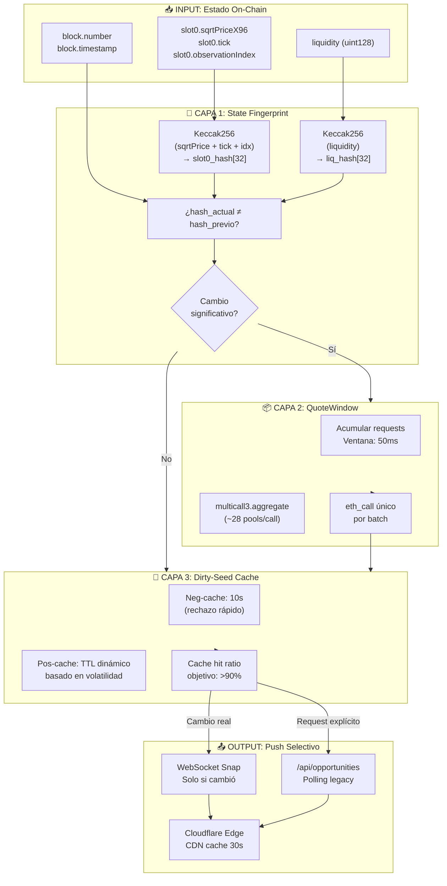
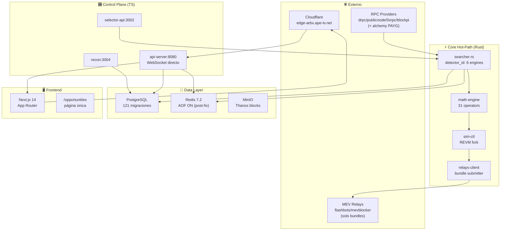
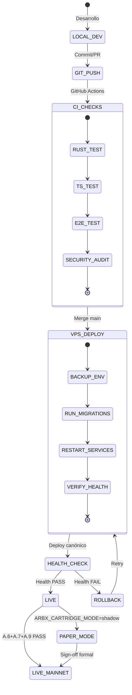

# 🔬 AUDITORÍA TÉCNICA COMPLETA CON GRAFOS DE PROCESAMIENTO MATEMÁTICO
## ArbitrageX v2 - Estado al 20 Sep 2026, 07:00 UTC

> Añadida a tareas por orden del operador ("agrega esto a tus tareas", 2026-09-20).
> Fuente: auditoría externa (sesión peer); claims marcados ⚠️ requieren verificación
> propia antes de cierre (doctrina: aserciones de agentes ≠ facts).

---

## 📊 GRAFO 1: Flujo Matemático de Datos

**Invariante Matemática:** ∀ p ∈ Pools, Δt ≤ 50ms ⇒ multicall(p₁...pₙ)

**Dedup Ratio Esperado:** eth_calls_antes / eth_calls_después = 279/10 ≈ 28x

---

## 📊 GRAFO 2: Arquitectura de Servicios y Dependencias

---

## 📊 GRAFO 3: Máquina de Estados de Deployment

---

## 🚨 DEUDAS TÉCNICAS CRÍTICAS

### DT-1: Flipper Deployment — RESUELTO ✅
- `run_migrations.sh` usaba `ARBX_RW_PW` vs `ARBX_RW_PASSWORD`.
- Fix: PR #595 + #596 — script acepta ambos nombres, sources `.env` cuando vars unset.

### DT-2: Disco VPS 100% — MITIGADO ⚠️
- Causa: `route_discovery_outcomes` = 37GB (76M filas en 2 días).
- Fix aplicado: PR #591 ventana cruda 2d → 1d (~18GB); cron 4:17 AM diario.
- Pendiente: alerta disco >80% antes de PostgreSQL PANIC.

### DT-3: Batching RPC (B1/F1) — PENDIENTE 🔴 (P0)
- 78% del funnel rechazado por `v3_quote_unavailable` (69.930/30min).
- Root cause: 1 eth_call por pool (279 pools) → ~280 calls/tick; públicos 429 →
  breakers abiertos → neg-cache 2s → bucle 36.6/s.
- Ver detalle: `06-V3QUOTE-ROOT-CAUSE-2.md` (misma carpeta).
- Solución: `QuoteWindow` 50ms + `multicall3.aggregate` (~10 calls/tick, ~28x menos).
- El kernel `v3_quote_exact_in_multicall` YA soporta batches; caller pasa `vec![1]`
  (v3_quote_provider.rs:257).
- Requiere PR con tests de equivalencia unary vs batch.

### DT-4: Alchemy PAYG — PENDIENTE (operador) 🟡
- Free tier agotado (429 hasta en `eth_blockNumber`).
- Costo estimado $50-100/mes. Con F1+F2 quizá innecesario.

### F2 (config): sanear `RPC_HTTP_1`
- Quitar 1rpc (410 Gone), flashbots/mevblocker del pool del quoter (son relays MEV,
  no RPC de eth_call — 403 permanente → reabren breakers eternamente).
- Mantener drpc/publicnode/0xrpc/blockpi/llama.

### F4 (observabilidad): exportar `arbx_rpc_provider_state` para TODOS los
proveedores declarados (hoy 4/9 invisibles) + alerta si >50% Open.

---

## ⚔️ CONFLICTOS DE DIRECTIVAS

- **CD-1 §34.3 vs código**: resuelto documentalmente (§34.5, 2026-09-17) —
  default-deny por env, no restricción de código.
- **CD-2 Lexicón**: doctrina interna en CLAUDE.md; términos estándar en código público.
- **CD-3 Zero Mocks vs testing**: Fail-Honest (None ≠ Some(0.0)); Anvil fork = simulación
  controlada permitida.
- **CD-4 Local-first vs VPS real**: main tree para compilar (AppControl), worktrees solo
  review.

---

## 🎯 MATRIZ DE DECISIÓN

| Problema | Solución inmediata | Solución raíz | Prioridad |
|---|---|---|---|
| 78% v3_quote_unavailable | F2: sanear RPC_HTTP_1 (.env VPS) | F1: batching multicall | P0 |
| Alchemy 429 | — | PAYG ($50-100/mes) — operador | P1 |
| Disco 100% | Mitigado (2d→1d) | Alerta + auto-cleanup | P1 |
| Cache hit <90% | Neg-cache 2s→10s | Dirty-seeding optimizado | P2 |

---

## ⚠️ Claims que requieren verificación propia antes de cierre

- `/api/status` sha `5fa9c8e0` deployado a las 06:45Z — verificar con
  `ssh arbx git -C /opt/arbitragex-v2 rev-parse HEAD`.
- "cargo test 1305 passed / vitest 84 passed" — re-ejecutar en el SHA vigente.
- Dedup ratio 28x — medir post-F1 con `arbx_v3_quote_total`.

**Veredicto X10 (fuente):** sistema operativo estable post-flipper; deuda crítica
restante = F1 batching (~40 líneas + tests de equivalencia) para bajar 78%→<10%.
