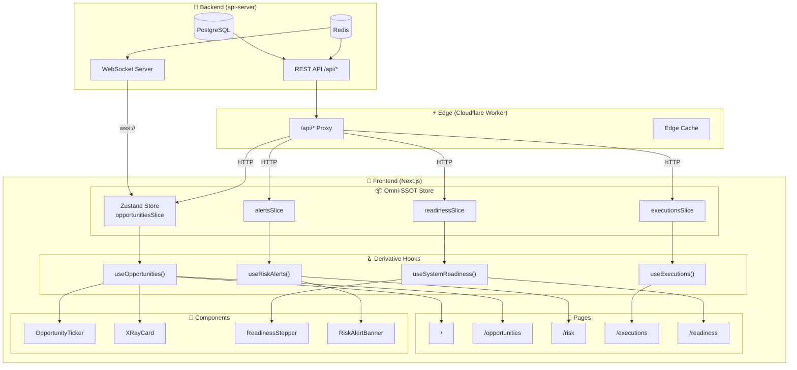
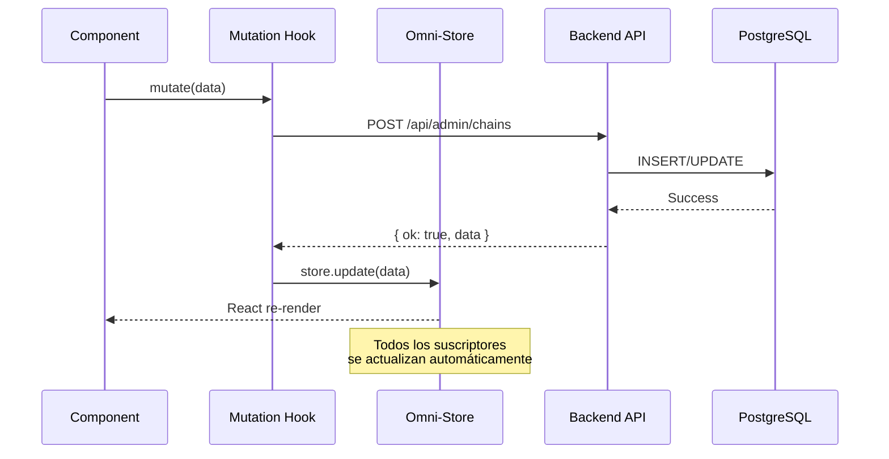
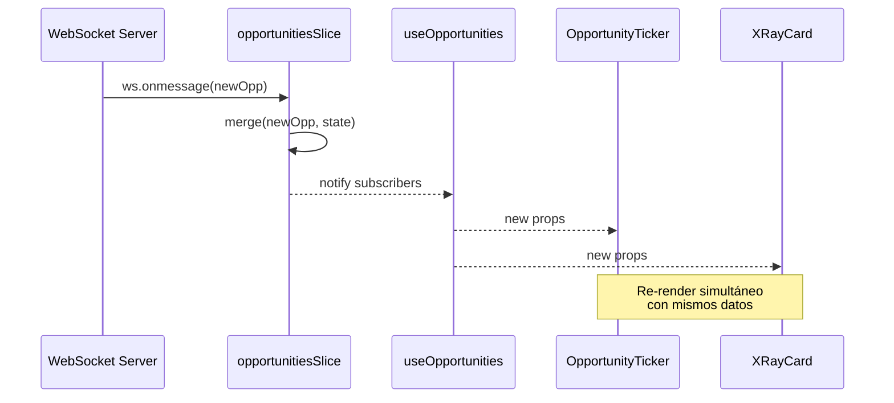

# FRONTEND OMNI-SSOT MAP
## Mapa de Fuente Única de Verdad (Single Source of Truth) - Frontend

**Versión:** 1.0.0  
**Fecha:** 2026-07-11  
**Doctrina:** OMEGA - Eficiencia Absoluta  
**Estado:** Especificación para Implementación

---

## 1. RESUMEN EJECUTIVO

### 1.1 Doctrina "Eficiencia Absoluta"

La arquitectura OMNI-SSOT elimina la duplicación de estado entre componentes mediante el principio de **Fuente Única de Verdad (SSOT)**. Cada entidad dinámica del sistema tiene EXACTAMENTE un dueño de verdad:

| Entidad | SSOT | Tipo |
|---------|------|------|
| Oportunidades Topológicas | Backend API + WebSocket | Server-Driven |
| Estado de Readiness | Backend `/api/readiness/steps` | Server-Driven |
| Configuración de Trading | Backend `/api/trading-config` | Server-Driven |
| Estado de Wallet | Web3 Provider + Backend | Hybrid |
| Preferencias de UI | localStorage | Client-Only |

### 1.2 Problema que Resuelve

El componente `OpportunityTicker` actual viola esta doctrina:

```typescript
// ❌ ANTIPATRÓN: Estado local duplicado
export function OpportunityTicker() {
  const [items, setItems] = useState<TickerItem[]>([]);  // DUPLICADO
  const [loading, setLoading] = useState(true);           // DUPLICADO
  
  useEffect(() => {
    fetchOpportunities();  // Cada instancia hace su propia llamada
  }, []);
}
```

**Consecuencias:**
- Múltiples requests idénticos al backend
- Estados inconsistentes entre componentes
- Cache por componente (ineficiente)
- Imposibilidad de sincronización real-time

### 1.3 Solución: Omni-Store Pattern

```typescript
// ✅ PATRÓN CORRECTO: SSOT Global
// 1. Backend = Única fuente de verdad
// 2. Omni-Store = Cache centralizada + reactiva
// 3. Hooks = Derivaciones tipadas
// 4. Componentes = Solo presentación
```

---

## 2. INVENTARIO DE ENTIDADES DINÁMICAS

### 2.1 Entidades Core (Business Critical)

| ID | Entidad | Endpoint | Frecuencia | WebSocket | Prioridad |
|----|---------|----------|------------|-----------|-----------|
| E1 | Opportunities | `/api/opportunities/live` | 30s | ✅ Sí | CRITICAL |
| E2 | System Readiness | `/api/readiness/steps` | 20s | ❌ No | CRITICAL |
| E3 | Risk Alerts | `/api/risk/alerts` | 60s | ✅ Sí | HIGH |
| E4 | Executions | `/api/executions/recent` | 30s | ✅ Sí | HIGH |
| E5 | Trading Config | `/api/trading-config` | On-demand | ❌ No | MEDIUM |
| E6 | Circuit Breakers | `/api/risk/circuit-breakers/status` | 30s | ❌ No | HIGH |
| E7 | Agent Teams | `/api/agents/status` | 60s | ❌ No | MEDIUM |
| E8 | Scanner Heartbeat | `/api/scanner/heartbeat` | 10s | ❌ No | HIGH |

### 2.2 Entidades Auxiliares

| ID | Entidad | Endpoint | Cache TTL | Mutaciones |
|----|---------|----------|-----------|------------|
| A1 | Chains | `/api/chains` | 5 min | Admin CRUD |
| A2 | DEX Registry | `/api/pools` | 5 min | Admin CRUD |
| A3 | RPCs | `/api/rpcs` | 1 min | Read-only |
| A4 | Audit Logs | `/admin/audit` | No cache | Append-only |
| A5 | Strategy Catalog | `/api/strategy-catalog` | 10 min | Read-only |

### 2.3 Estado de UI (Client-Only)

| ID | Estado | Persistencia | Scope |
|----|--------|--------------|-------|
| U1 | Theme (dark/light) | localStorage | Global |
| U2 | Sidebar collapsed | localStorage | Global |
| U3 | Admin token | httpOnly cookie | Session |
| U4 | Active modals | Memory | Component |
| U5 | Form drafts | localStorage | Per-form |

---

## 3. OMNI-DIAGRAMA MERMAID

### 3.1 Arquitectura de Flujo de Datos



### 3.2 Flujo de Mutación



### 3.3 WebSocket Real-Time Flow



---

## 4. SOP DE INTERCONEXIÓN AVANZADA

### 4.1 Pattern 1: SSOT Store con Zustand

```typescript
// stores/opportunitiesSlice.ts
import { create } from 'zustand';
import { subscribeWithSelector } from 'zustand/middleware';
import type { OpportunityRow } from '@/lib/schemas';

interface OpportunitiesState {
  // State
  items: OpportunityRow[];
  isLoading: boolean;
  error: string | null;
  lastUpdated: Date | null;
  
  // Actions
  setItems: (items: OpportunityRow[]) => void;
  setLoading: (loading: boolean) => void;
  setError: (error: string | null) => void;
  mergeOpportunity: (opp: OpportunityRow) => void;
  removeOpportunity: (id: string) => void;
}

export const useOpportunitiesStore = create<OpportunitiesState>()(
  subscribeWithSelector((set) => ({
    items: [],
    isLoading: false,
    error: null,
    lastUpdated: null,
    
    setItems: (items) => set({ items, lastUpdated: new Date(), error: null }),
    setLoading: (isLoading) => set({ isLoading }),
    setError: (error) => set({ error, isLoading: false }),
    
    mergeOpportunity: (opp) => set((state) => {
      const exists = state.items.find((o) => o.id === opp.id);
      if (exists) {
        return {
          items: state.items.map((o) => (o.id === opp.id ? opp : o)),
          lastUpdated: new Date(),
        };
      }
      return {
        items: [opp, ...state.items].slice(0, 100), // Max 100 items
        lastUpdated: new Date(),
      };
    }),
    
    removeOpportunity: (id) => set((state) => ({
      items: state.items.filter((o) => o.id !== id),
    })),
  }))
);

// Selectores optimizados
export const selectOpportunities = (state: OpportunitiesState) => state.items;
export const selectOpportunitiesCount = (state: OpportunitiesState) => state.items.length;
export const selectLatestOpportunity = (state: OpportunitiesState) => state.items[0] ?? null;
```

### 4.2 Pattern 2: Hook Derivado con Sincronización

```typescript
// hooks/useOpportunities.ts
import { useEffect, useCallback } from 'react';
import { useOpportunitiesStore } from '@/stores/opportunitiesSlice';
import { getOpportunitiesLive } from '@/lib/api-client';
import { getWsBaseUrl } from '@/lib/api-client';

const POLL_INTERVAL = 30_000; // 30s fallback
const WS_RECONNECT_DELAY = 5000;

export function useOpportunities() {
  const { items, isLoading, error, setItems, setLoading, setError, mergeOpportunity } = 
    useOpportenciesStore();

  // HTTP Polling (fallback)
  const fetchViaHttp = useCallback(async () => {
    setLoading(true);
    const result = await getOpportunitiesLive(50);
    if (result.ok) {
      setItems(result.data.items);
    } else {
      setError(result.error);
    }
  }, [setItems, setLoading, setError]);

  // WebSocket Real-time (primario)
  useEffect(() => {
    let ws: WebSocket | null = null;
    let reconnectTimer: NodeJS.Timeout;
    let isActive = true;

    const connect = () => {
      if (!isActive) return;
      
      const wsUrl = getWsBaseUrl();
      if (!wsUrl) return;

      ws = new WebSocket(`${wsUrl}/ws/opportunities`);

      ws.onopen = () => {
        console.log('[WS] Connected to opportunities stream');
      };

      ws.onmessage = (event) => {
        try {
          const data = JSON.parse(event.data);
          if (data.type === 'opportunity') {
            mergeOpportunity(data.payload);
          } else if (data.type === 'snapshot') {
            setItems(data.payload);
          }
        } catch (e) {
          console.warn('[WS] Invalid message:', e);
        }
      };

      ws.onerror = () => {
        setError('WebSocket connection error');
      };

      ws.onclose = () => {
        if (isActive) {
          reconnectTimer = setTimeout(connect, WS_RECONNECT_DELAY);
        }
      };
    };

    connect();

    // Fallback polling si WS falla
    const pollInterval = setInterval(() => {
      if (!ws || ws.readyState !== WebSocket.OPEN) {
        fetchViaHttp();
      }
    }, POLL_INTERVAL);

    return () => {
      isActive = false;
      clearTimeout(reconnectTimer);
      clearInterval(pollInterval);
      ws?.close();
    };
  }, [fetchViaHttp, mergeOpportunity, setItems]);

  return {
    opportunities: items,
    isLoading,
    error,
    refresh: fetchViaHttp,
  };
}
```

### 4.3 Pattern 3: Componente Reactivo (OpportunityTicker Fix)

```typescript
// components/OpportunityTicker.tsx
"use client";

import { useMemo } from "react";
import { useOpportunities } from "@/hooks/useOpportunities";
import type { OpportunityRow } from "@/lib/schemas";

interface TickerItem {
  pair: string;
  from: string;
  to: string;
  yield: number;
  ago: string;
}

function formatAgo(detectedAt: string): string {
  const detected = new Date(detectedAt).getTime();
  const now = Date.now();
  const diffSeconds = Math.floor((now - detected) / 1000);

  if (diffSeconds < 60) return `${diffSeconds}s`;
  if (diffSeconds < 3600) return `${Math.floor(diffSeconds / 60)}m`;
  return `${Math.floor(diffSeconds / 3600)}h`;
}

function opportunityToTickerItem(opp: OpportunityRow): TickerItem | null {
  const profit = opp.net_expected_profit_usd ?? opp.expected_profit_usd ?? null;
  if (profit === null) return null;

  const pair = opp.pair_symbol ?? `${opp.token_in.slice(0, 6)}…/${opp.token_out.slice(0, 6)}…`;
  const from = opp.dex_a ?? "Unknown";
  const to = opp.dex_b ?? opp.dex_a ?? "Unknown";
  const yieldPct = opp.roi_pct ?? (profit > 0 ? profit * 0.1 : profit * 0.1);

  return {
    pair,
    from,
    to,
    yield: yieldPct,
    ago: formatAgo(opp.detected_at),
  };
}

// ✅ COMPONENTE LIMPIO: Solo presentación, sin estado propio
export function OpportunityTicker() {
  const { opportunities, isLoading, error } = useOpportunities();

  // Derivación memoizada
  const tickerItems = useMemo(() => {
    return opportunities
      .map(opportunityToTickerItem)
      .filter((item): item is TickerItem => item !== null);
  }, [opportunities]);

  // Render condicional
  if (isLoading && tickerItems.length === 0) {
    return (
      <div className="ticker" aria-label="Live opportunity feed">
        <div className="ticker-track">
          <span className="ticker-item">Loading opportunities...</span>
        </div>
      </div>
    );
  }

  if (error && tickerItems.length === 0) {
    return (
      <div className="ticker" aria-label="Live opportunity feed">
        <div className="ticker-track">
          <span className="ticker-item">Observation: {error}</span>
        </div>
      </div>
    );
  }

  if (tickerItems.length === 0) {
    return (
      <div className="ticker" aria-label="Live opportunity feed">
        <div className="ticker-track">
          <span className="ticker-item">
            No topological convergence detected — waiting for market topology...
          </span>
        </div>
      </div>
    );
  }

  // Duplicar para loop infinito
  const displayItems = [...tickerItems, ...tickerItems];

  return (
    <div className="ticker" aria-label="Live opportunity feed">
      <div className="ticker-track">
        {displayItems.map((item, idx) => {
          const isPositive = item.yield >= 0;
          return (
            <span key={`${item.pair}-${idx}`} className="ticker-item">
              <b>{item.pair}</b>
              <span>·</span>
              <span>{item.from} → {item.to}</span>
              <span>·</span>
              <span className={isPositive ? "pos" : "neg"}>
                {isPositive ? "+" : ""}{item.yield.toFixed(2)}%
              </span>
              <span className={`arr ${isPositive ? "pos" : "neg"}`}>
                {isPositive ? "▲" : "▼"}
              </span>
              <span>·</span>
              <span className="ago">{item.ago}</span>
            </span>
          );
        })}
      </div>
    </div>
  );
}
```

### 4.4 Pattern 4: Mutaciones Optimistas

```typescript
// hooks/useTradingConfigMutation.ts
import { useState, useCallback } from 'react';
import { useTradingConfigStore } from '@/stores/tradingConfigSlice';
import { putTradingConfig } from '@/lib/api-client';
import type { TradingConfigConfigured } from '@/lib/schemas';

export function useTradingConfigMutation(chainId: number) {
  const [isMutating, setIsMutating] = useState(false);
  const [error, setError] = useState<string | null>(null);
  const { config, setConfig, rollback } = useTradingConfigStore();

  const mutate = useCallback(async (
    updates: Partial<TradingConfigConfigured>,
    adminToken: string,
    actor: string
  ) => {
    if (!config) return { ok: false, error: 'No config loaded' };

    setIsMutating(true);
    setError(null);

    // 1. Optimistic update
    const previousConfig = config;
    setConfig({ ...config, ...updates });

    // 2. API call
    const result = await putTradingConfig(chainId, updates, adminToken, actor);

    if (!result.ok) {
      // 3. Rollback on error
      rollback(previousConfig);
      setError(result.error);
    }

    setIsMutating(false);
    return result;
  }, [config, setConfig, rollback, chainId]);

  return { mutate, isMutating, error };
}
```

### 4.5 Pattern 5: Composición de Hooks

```typescript
// hooks/useDashboardData.ts
import { useOpportunities } from './useOpportunities';
import { useSystemReadiness } from './useSystemReadiness';
import { useRiskAlerts } from './useRiskAlerts';

export function useDashboardData() {
  const opportunities = useOpportunities();
  const readiness = useSystemReadiness();
  const alerts = useRiskAlerts();

  // Computed state
  const isHealthy = 
    !opportunities.error && 
    !readiness.error && 
    readiness.allReady;

  const hasCriticalAlerts = alerts.alerts.some(
    (a) => a.severity === 'critical'
  );

  return {
    opportunities,
    readiness,
    alerts,
    isHealthy,
    hasCriticalAlerts,
    isLoading: opportunities.isLoading || readiness.isLoading,
  };
}
```

---

## 5. PLAN DE DESPLIEGUE

### 5.1 Fase 1: Infraestructura (Week 1)

| Tarea | Archivo | Estado |
|-------|---------|--------|
| Instalar Zustand | `package.json` | Pendiente |
| Crear stores base | `stores/opportunitiesSlice.ts` | Pendiente |
| Crear stores base | `stores/readinessSlice.ts` | Pendiente |
| Crear stores base | `stores/alertsSlice.ts` | Pendiente |
| Crear stores base | `stores/executionsSlice.ts` | Pendiente |
| Crear stores base | `stores/index.ts` (exports) | Pendiente |

### 5.2 Fase 2: Hooks Refactor (Week 1-2)

| Hook | Archivo | Cambio Principal |
|------|---------|------------------|
| useOpportunities | `hooks/useOpportunities.ts` | Integrar con store |
| useSystemReadiness | `hooks/useSystemReadiness.ts` | Ya usa API, migrar a store |
| useRiskAlerts | `hooks/useRiskAlerts.ts` | Nuevo, con WS |
| useExecutions | `hooks/useExecutions.ts` | Nuevo, con WS |
| useTradingConfig | `hooks/useTradingConfig.ts` | Nuevo, con mutations |

### 5.3 Fase 3: Componentes (Week 2)

| Componente | Archivo | Acción |
|------------|---------|--------|
| OpportunityTicker | `components/OpportunityTicker.tsx` | Refactor a SSOT |
| XRayCard | `components/XRayCard.tsx` | Usar useOpportunities |
| ReadinessStepper | `components/ReadinessStepper.tsx` | Usar useSystemReadiness |
| RiskAlertBanner | `components/RiskAlertBanner.tsx` | Usar useRiskAlerts |
| OpportunityDetailDialog | `components/OpportunityDetailDialog.tsx` | Usar store |

### 5.4 Fase 4: Pages (Week 2-3)

| Page | Archivo | Acción |
|------|---------|--------|
| / | `app/page.tsx` | Usar hooks compuestos |
| /opportunities | `app/opportunities/page.tsx` | Usar useOpportunities |
| /risk | `app/risk/page.tsx` | Usar useRiskAlerts |
| /readiness | `app/readiness/page.tsx` | Usar useSystemReadiness |
| /executions | `app/executions/page.tsx` | Usar useExecutions |

### 5.5 Fase 5: Testing & Rollout (Week 3)

```bash
# 1. Unit tests
npm run test:unit -- stores/
npm run test:unit -- hooks/

# 2. Integration tests
npm run test:e2e -- opportunities.spec.ts

# 3. Type checking
npm run typecheck

# 4. Build verification
npm run build

# 5. Deploy to staging
git push origin feature/omni-ssot
```

---

## 6. MAPEO PÁGINA-POR-PÁGINA

### 6.1 Página: / (Home)

| Hook Utilizado | Mutaciones | WebSocket | Entidades |
|----------------|------------|-----------|-----------|
| useOpportunities | No | ✅ | E1 |
| useSystemReadiness | No | ❌ | E2 |

**Componentes:**
- OpportunityTicker (E1)
- StatCard (E1 derivado)
- XRayCard (E1)
- GateSection (E2)

**Flujo de Datos:**
```
Backend → opportunitiesSlice → useOpportunities → OpportunityTicker
Backend → readinessSlice → useSystemReadiness → GateSection
```

### 6.2 Página: /opportunities

| Hook Utilizado | Mutaciones | WebSocket | Entidades |
|----------------|------------|-----------|-----------|
| useOpportunities | No | ✅ | E1 |
| useTradingConfig | No | ❌ | E5 |

**Componentes:**
- OpportunitiesClient (E1)
- OpportunityDetailDialog (E1)
- DexPath (E1)

### 6.3 Página: /risk

| Hook Utilizado | Mutaciones | WebSocket | Entidades |
|----------------|------------|-----------|-----------|
| useRiskAlerts | No | ✅ | E3 |
| useCircuitBreakers | No | ❌ | E6 |

**Componentes:**
- RiskAlertBanner (E3)
- CircuitBreakerPanel (E6)

### 6.4 Página: /readiness

| Hook Utilizado | Mutaciones | WebSocket | Entidades |
|----------------|------------|-----------|-----------|
| useSystemReadiness | No | ❌ | E2 |
| useReadinessBlockers | No | ❌ | E2 |
| useAgentTeams | No | ❌ | E7 |

**Componentes:**
- ReadinessStepper (E2)
- BlockersPanel (E2)
- AgentTeamsPanel (E7)
- GoNoGoPanel (E2)

### 6.5 Página: /executions

| Hook Utilizado | Mutaciones | WebSocket | Entidades |
|----------------|------------|-----------|-----------|
| useExecutions | No | ✅ | E4 |
| useReconSummary | No | ❌ | E4 derivado |

**Componentes:**
- ExecutionTable (E4)
- ReconKpiGrid (E4)

### 6.6 Página: /admin/chains

| Hook Utilizado | Mutaciones | WebSocket | Entidades |
|----------------|------------|-----------|-----------|
| useAdminChains | ✅ CRUD | ❌ | A1 |

**Mutaciones:**
- createAdminChain (POST)
- updateAdminChain (PUT)
- deleteAdminChain (DELETE)
- probeAdminChain (POST)

### 6.7 Tabla Completa de Mapeo

| Página | Hooks | Mutaciones | WS | Entidades |
|--------|-------|------------|-----|-----------|
| / | useOpportunities, useSystemReadiness | - | ✅ | E1, E2 |
| /opportunities | useOpportunities, useTradingConfig | - | ✅ | E1, E5 |
| /risk | useRiskAlerts, useCircuitBreakers | - | ✅ | E3, E6 |
| /readiness | useSystemReadiness, useAgentTeams | - | ❌ | E2, E7 |
| /executions | useExecutions, useReconSummary | - | ✅ | E4 |
| /admin/chains | useAdminChains | CRUD | ❌ | A1 |
| /dex-registry | useDexRegistry | CRUD | ❌ | A2 |
| /strategies | useStrategyCatalog, useTradingConfig | PUT | ❌ | E5, A5 |
| /monitor | useScannerHeartbeat | - | ❌ | E8 |
| /killswitch | useKillswitch | POST | ❌ | E2 |
| /settings | useTradingConfig | PUT | ❌ | E5 |
| /audit-logs | useAuditLogs | - | ❌ | A4 |

---

## 7. APÉNDICE: CÓDIGO COMPLETO OpportunityTicker Fix

### 7.1 Archivo: stores/opportunitiesSlice.ts

```typescript
import { create } from 'zustand';
import { subscribeWithSelector } from 'zustand/middleware';
import type { OpportunityRow } from '@/lib/schemas';

interface OpportunitiesState {
  items: OpportunityRow[];
  isLoading: boolean;
  error: string | null;
  lastUpdated: Date | null;
  
  setItems: (items: OpportunityRow[]) => void;
  setLoading: (loading: boolean) => void;
  setError: (error: string | null) => void;
  mergeOpportunity: (opp: OpportunityRow) => void;
  removeOpportunity: (id: string) => void;
  clear: () => void;
}

const initialState = {
  items: [] as OpportunityRow[],
  isLoading: false,
  error: null,
  lastUpdated: null,
};

export const useOpportunitiesStore = create<OpportunitiesState>()(
  subscribeWithSelector((set) => ({
    ...initialState,
    
    setItems: (items) => set({ 
      items, 
      lastUpdated: new Date(), 
      error: null,
      isLoading: false,
    }),
    
    setLoading: (isLoading) => set({ isLoading }),
    
    setError: (error) => set({ error, isLoading: false }),
    
    mergeOpportunity: (opp) => set((state) => {
      const exists = state.items.find((o) => o.id === opp.id);
      const now = new Date();
      
      if (exists) {
        return {
          items: state.items.map((o) => (o.id === opp.id ? opp : o)),
          lastUpdated: now,
        };
      }
      
      return {
        items: [opp, ...state.items].slice(0, 100),
        lastUpdated: now,
      };
    }),
    
    removeOpportunity: (id) => set((state) => ({
      items: state.items.filter((o) => o.id !== id),
    })),
    
    clear: () => set(initialState),
  }))
);

// Selectores
export const selectOpportunities = (state: OpportunitiesState) => state.items;
export const selectOpportunitiesLoading = (state: OpportunitiesState) => state.isLoading;
export const selectOpportunitiesError = (state: OpportunitiesState) => state.error;
```

### 7.2 Archivo: hooks/useOpportunities.ts

```typescript
"use client";

import { useEffect, useCallback, useRef } from "react";
import { useOpportunitiesStore } from "@/stores/opportunitiesSlice";
import { getOpportunitiesLive, getWsBaseUrl } from "@/lib/api-client";

const POLL_INTERVAL = 30_000;
const WS_RECONNECT_DELAY = 5000;
const MAX_RECONNECT_ATTEMPTS = 5;

export function useOpportunities() {
  const store = useOpportunitiesStore();
  const wsRef = useRef<WebSocket | null>(null);
  const reconnectAttemptsRef = useRef(0);
  const reconnectTimerRef = useRef<NodeJS.Timeout | null>(null);

  // HTTP Fetch
  const fetchViaHttp = useCallback(async () => {
    // Solo set loading si no tenemos datos
    if (store.items.length === 0) {
      store.setLoading(true);
    }
    
    const result = await getOpportunitiesLive(50);
    
    if (result.ok) {
      store.setItems(result.data.items);
    } else {
      store.setError(result.error);
    }
  }, [store]);

  // WebSocket Connection
  useEffect(() => {
    let isActive = true;

    const connect = () => {
      if (!isActive) return;
      
      const wsUrl = getWsBaseUrl();
      if (!wsUrl || reconnectAttemptsRef.current >= MAX_RECONNECT_ATTEMPTS) {
        return;
      }

      try {
        wsRef.current = new WebSocket(`${wsUrl}/ws/opportunities`);

        wsRef.current.onopen = () => {
          reconnectAttemptsRef.current = 0;
        };

        wsRef.current.onmessage = (event) => {
          try {
            const data = JSON.parse(event.data);
            
            switch (data.type) {
              case 'opportunity':
                store.mergeOpportunity(data.payload);
                break;
              case 'snapshot':
                store.setItems(data.payload);
                break;
              case 'remove':
                store.removeOpportunity(data.payload.id);
                break;
            }
          } catch (e) {
            console.warn('[useOpportunities] Invalid message:', e);
          }
        };

        wsRef.current.onerror = () => {
          store.setError('WebSocket connection error');
        };

        wsRef.current.onclose = () => {
          if (isActive && reconnectAttemptsRef.current < MAX_RECONNECT_ATTEMPTS) {
            reconnectAttemptsRef.current++;
            reconnectTimerRef.current = setTimeout(connect, WS_RECONNECT_DELAY);
          }
        };
      } catch (e) {
        console.error('[useOpportunities] WS construction failed:', e);
      }
    };

    // Inicial: HTTP fetch
    fetchViaHttp();
    
    // Luego: WebSocket
    connect();

    // Fallback polling
    const pollInterval = setInterval(() => {
      if (!wsRef.current || wsRef.current.readyState !== WebSocket.OPEN) {
        fetchViaHttp();
      }
    }, POLL_INTERVAL);

    return () => {
      isActive = false;
      if (reconnectTimerRef.current) {
        clearTimeout(reconnectTimerRef.current);
      }
      clearInterval(pollInterval);
      wsRef.current?.close();
    };
  }, [fetchViaHttp, store]);

  return {
    opportunities: store.items,
    isLoading: store.isLoading,
    error: store.error,
    lastUpdated: store.lastUpdated,
    refresh: fetchViaHttp,
  };
}
```

### 7.3 Archivo: components/OpportunityTicker.tsx (Final)

```typescript
"use client";

import { useMemo } from "react";
import { useOpportunities } from "@/hooks/useOpportunities";
import type { OpportunityRow } from "@/lib/schemas";

interface TickerItem {
  pair: string;
  from: string;
  to: string;
  yield: number;
  ago: string;
}

function formatAgo(detectedAt: string): string {
  const detected = new Date(detectedAt).getTime();
  const now = Date.now();
  const diffSeconds = Math.floor((now - detected) / 1000);

  if (diffSeconds < 60) return `${diffSeconds}s`;
  if (diffSeconds < 3600) return `${Math.floor(diffSeconds / 60)}m`;
  return `${Math.floor(diffSeconds / 3600)}h`;
}

function opportunityToTickerItem(opp: OpportunityRow): TickerItem | null {
  const profit = opp.net_expected_profit_usd ?? opp.expected_profit_usd ?? null;
  if (profit === null) return null;

  const pair = opp.pair_symbol ?? `${opp.token_in.slice(0, 6)}…/${opp.token_out.slice(0, 6)}…`;
  const from = opp.dex_a ?? "Unknown";
  const to = opp.dex_b ?? opp.dex_a ?? "Unknown";
  const yieldPct = opp.roi_pct ?? (profit > 0 ? profit * 0.1 : profit * 0.1);

  return {
    pair,
    from,
    to,
    yield: yieldPct,
    ago: formatAgo(opp.detected_at),
  };
}

export function OpportunityTicker() {
  const { opportunities, isLoading, error } = useOpportunities();

  const tickerItems = useMemo(() => {
    return opportunities
      .map(opportunityToTickerItem)
      .filter((item): item is TickerItem => item !== null);
  }, [opportunities]);

  // Estados de carga/error
  if (isLoading && tickerItems.length === 0) {
    return (
      <div className="ticker" aria-label="Live opportunity feed">
        <div className="ticker-track">
          <span className="ticker-item">Loading opportunities...</span>
        </div>
      </div>
    );
  }

  if (error && tickerItems.length === 0) {
    return (
      <div className="ticker" aria-label="Live opportunity feed">
        <div className="ticker-track">
          <span className="ticker-item">Observation: {error}</span>
        </div>
      </div>
    );
  }

  if (tickerItems.length === 0) {
    return (
      <div className="ticker" aria-label="Live opportunity feed">
        <div className="ticker-track">
          <span className="ticker-item">
            No topological convergence detected — waiting for market topology...
          </span>
        </div>
      </div>
    );
  }

  const displayItems = [...tickerItems, ...tickerItems];

  return (
    <div className="ticker" aria-label="Live opportunity feed">
      <div className="ticker-track">
        {displayItems.map((item, idx) => {
          const isPositive = item.yield >= 0;
          return (
            <span key={`${item.pair}-${idx}`} className="ticker-item">
              <b>{item.pair}</b>
              <span>·</span>
              <span>{item.from} → {item.to}</span>
              <span>·</span>
              <span className={isPositive ? "pos" : "neg"}>
                {isPositive ? "+" : ""}{item.yield.toFixed(2)}%
              </span>
              <span className={`arr ${isPositive ? "pos" : "neg"}`}>
                {isPositive ? "▲" : "▼"}
              </span>
              <span>·</span>
              <span className="ago">{item.ago}</span>
            </span>
          );
        })}
      </div>
    </div>
  );
}
```

---

## 8. NOTAS DE IMPLEMENTACIÓN

### 8.1 Doctrinas Aplicadas

1. **RULE 00 (Zero Mocks):** El store NUNCA inventa datos. Si el backend falla, el error se propaga.

2. **R8 (Fail-Honest):** Estados de carga y error son explícitos. No hay "fake data" para hacer la UI lucir bien.

3. **R1 (Mounted Snapshot Pattern):** Los componentes usan `useOpportunities()` que maneja el montado internamente.

4. **SSOT:** Una sola fuente de verdad por entidad. No hay duplicación de estado.

### 8.2 Dependencias

```json
{
  "dependencies": {
    "zustand": "^4.5.0",
    "immer": "^10.0.0"
  }
}
```

### 8.3 Testing

```typescript
// stores/opportunitiesSlice.test.ts
import { renderHook, act } from '@testing-library/react';
import { useOpportunitiesStore } from './opportunitiesSlice';

describe('opportunitiesSlice', () => {
  beforeEach(() => {
    useOpportunitiesStore.getState().clear();
  });

  it('should set items', () => {
    const { result } = renderHook(() => useOpportunitiesStore());
    
    act(() => {
      result.current.setItems([{ id: '1', pair_symbol: 'WETH/USDC' }]);
    });
    
    expect(result.current.items).toHaveLength(1);
  });

  it('should merge opportunities', () => {
    const { result } = renderHook(() => useOpportunitiesStore());
    
    act(() => {
      result.current.setItems([{ id: '1', pair_symbol: 'WETH/USDC' }]);
    });
    
    act(() => {
      result.current.mergeOpportunity({ id: '2', pair_symbol: 'ARB/WETH' });
    });
    
    expect(result.current.items).toHaveLength(2);
  });
});
```

---

**Documento generado por IA OMEGA**  
**Doctrina: Eficiencia Absoluta a través de la Fuente Única de Verdad**
