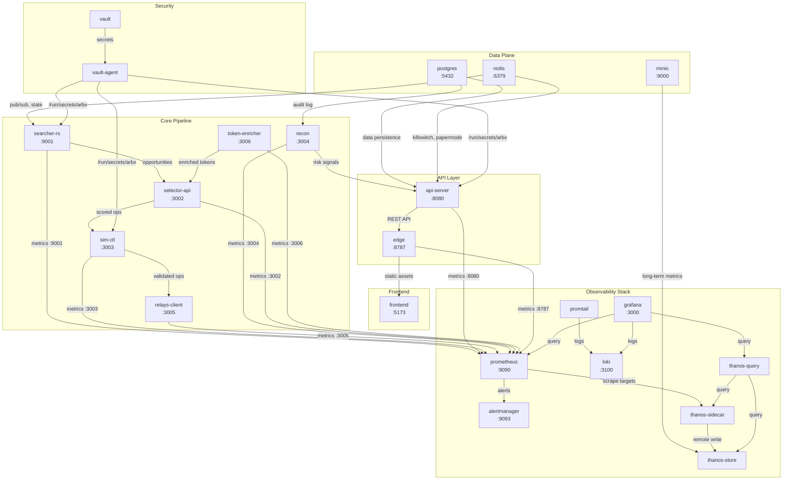
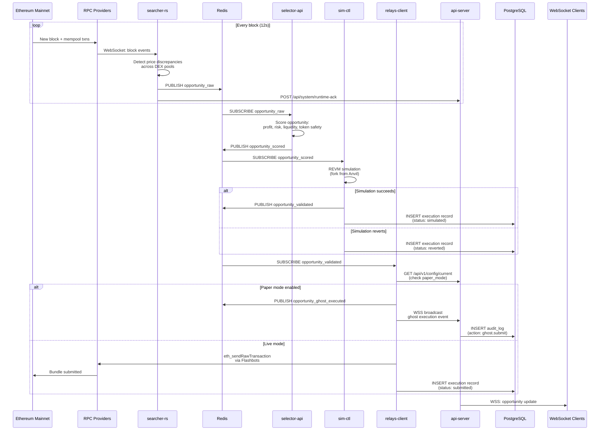
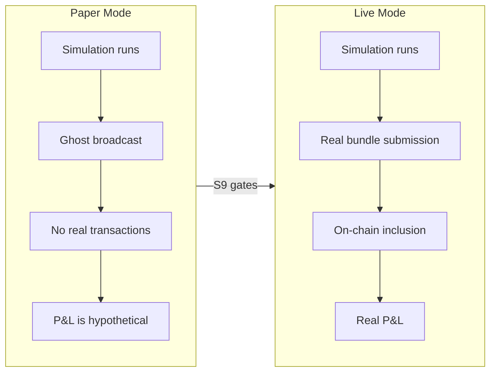
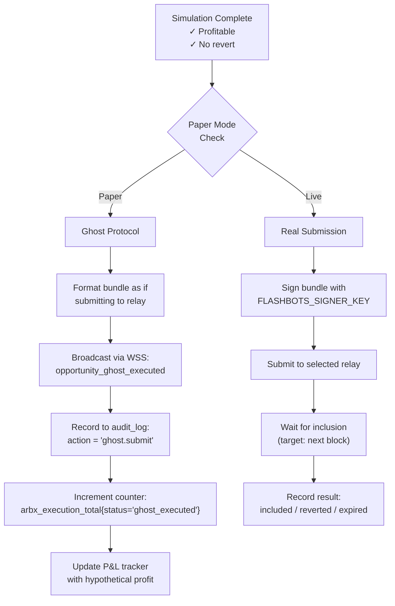
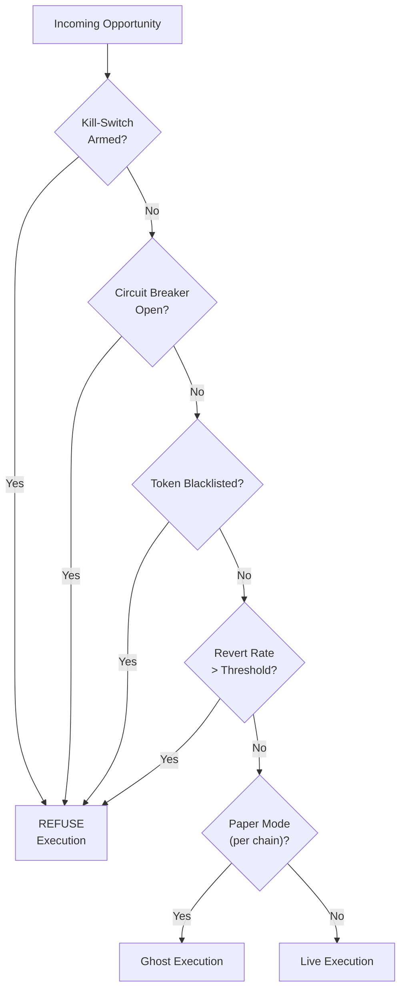

# Architecture Overview

> **Document Type**: Explanation (Diátaxis Framework)
>
> Explanation documents answer "why" questions — they provide background and context to help readers understand the system's design philosophy and architectural decisions. For step-by-step instructions, see the How-To guides. For precise technical details, see the Reference.

## Introduction

ArbitrageX v2 is a decentralized finance (DeFi) MEV arbitrage platform designed to detect, simulate, and execute atomic arbitrage opportunities across multiple decentralized exchanges (DEXs) on Ethereum mainnet and L2 chains. The platform operates on a single VPS (<VPS_IP>) using Docker Compose, comprising 21 containers organized into a four-layer pipeline.

This document explains the platform's architecture, the design principles behind it, and how the components work together to form a cohesive system.

## Design Philosophy

Three principles govern every architectural decision:

### 1. Fail-Closed Design

The platform defaults to the safest state. The kill-switch is armed by default in production. Paper mode is enabled until explicitly graduated. Circuit breakers open on anomaly. This philosophy treats "no action" as safer than "wrong action" in a domain where a single mistake can drain capital.

### 2. Paper-First Validation

No real capital is risked until the platform has demonstrated 30 consecutive days of >99.9% simulation success rate. The Ghost Protocol simulation layer (ADR-001) replaces real transaction submission with broadcast events, allowing full pipeline testing without financial exposure.

### 3. Observability by Default

Every component emits RED metrics (Rate, Errors, Duration). Every significant action is audit-logged. Every state change is observable in Grafana within 5 seconds. The platform is designed to be debuggable by a single operator without requiring deep domain expertise in every subsystem.

## Service Dependency Map (21 Containers)



### Container Roles

| # | Container | Role | Language | Critical Path |
|---|-----------|------|----------|--------------|
| 1 | `postgres` | Data persistence — audit logs, opportunities, executions | — | Yes |
| 2 | `redis` | Pub/sub, killswitch state, paper mode, caching | — | Yes |
| 3 | `searcher-rs` | Blockchain event ingestion, opportunity detection | Rust | Yes |
| 4 | `selector-api` | Token safety scoring, strategy selection | TypeScript | Yes |
| 5 | `sim-ctl` | REVM-based transaction simulation | TypeScript | Yes |
| 6 | `relays-client` | Flashbots/BloxRoute bundle submission | TypeScript | Yes |
| 7 | `recon` | Risk analysis, anomaly detection, auto-trip | TypeScript | No |
| 8 | `token-enricher` | Token metadata enrichment, price lookups | TypeScript | No |
| 9 | `api-server` | REST API, WebSocket gateway, audit logging | TypeScript | Yes |
| 10 | `edge` | Cloudflare Worker edge runtime, auth, rate limiting | TypeScript | Yes |
| 11 | `frontend` | QuantumX Control Plane — React/Next.js UI | TypeScript | No |
| 12 | `prometheus` | Metrics collection and storage | — | No |
| 13 | `grafana` | Dashboards and visualization | — | No |
| 14 | `alertmanager` | Alert routing to Slack/PagerDuty | — | No |
| 15 | `loki` | Log aggregation | — | No |
| 16 | `promtail` | Log shipping from Docker containers | — | No |
| 17 | `vault` | Secret storage and access control | — | Yes (at boot) |
| 18 | `vault-agent` | Secret template rendering | — | Yes (at boot) |
| 19 | `minio` | S3-compatible object storage for Thanos | — | No |
| 20 | `thanos-sidecar` | Prometheus sidecar for remote write | — | No |
| 21 | `thanos-query` + `thanos-store` | Long-term metrics query and storage | — | No |

## Data Flow: Blockchain to Execution

The core pipeline moves opportunities through four stages:



### Stage 1: Detection (searcher-rs)

The `searcher-rs` service is the only Rust component in the stack. It runs a WebSocket connection to one or more RPC providers and listens for new blocks and mempool transactions. When it detects a price discrepancy between DEX pools that exceeds the minimum profit threshold, it publishes a raw opportunity to Redis and sends a runtime acknowledgment to the API server.

Key design decisions:
- **Rust for the hot path**: The detection loop must process every block within seconds. Rust provides zero-cost abstractions and predictable memory management.
- **WebSocket, not polling**: WebSocket block streaming reduces detection latency by ~2-4 seconds compared to HTTP polling.
- **Multiple RPC providers**: At least two providers are configured for failover. The service rotates between them and falls back on connection failure.

### Stage 2: Selection (selector-api)

The `selector-api` subscribes to raw opportunities from Redis and applies a multi-factor scoring model:

| Factor | Weight | Description |
|--------|--------|-------------|
| Expected profit | 35% | Based on price delta minus estimated gas |
| Liquidity depth | 25% | Pool reserves must support the trade size |
| Token safety | 20% | GoPlus API scan for honeypots, blacklists, mint functions |
| Historical success | 15% | This strategy's track record in simulation |
| Execution speed | 5% | Time remaining before the opportunity closes |

Opportunities scoring above the threshold are published to Redis for simulation.

### Stage 3: Simulation (sim-ctl)

The `sim-ctl` service runs a local Anvil fork (from Foundry) of the current blockchain state. Each scored opportunity is simulated against this fork using REVM. The simulation verifies:

- Exact gas consumption
- Expected token output amounts
- Revert conditions (slippage, deadblocks, pool drained)
- State changes and side effects

Simulation results are persisted to PostgreSQL with full trace data for later analysis.

### Stage 4: Execution (relays-client)

The `relays-client` manages connections to MEV relays (Flashbots, BloxRoute, Eden). Before submitting any bundle, it queries the API server for the current paper mode configuration.

- **Paper mode**: The bundle is not submitted. Instead, a "ghost execution" event is broadcast via WebSocket and recorded in the audit log.
- **Live mode**: The bundle is submitted to the selected relay with appropriate priority fees and revert protection.

## Paper Mode vs. Live Mode



### Paper Mode

| Aspect | Behavior |
|--------|----------|
| Capital at risk | Zero |
| Transaction submission | Ghost broadcast only |
| P&L tracking | Hypothetical (simulated) |
| Kill-switch behavior | Still armed/disarmed normally |
| Operator dashboard | All opportunities marked "SIMULATED" |
| Graduation criteria | 30 days >99.9% simulation success (S9) |

### Live Mode

| Aspect | Behavior |
|--------|----------|
| Capital at risk | Real ETH for gas, real tokens for swaps |
| Transaction submission | Flashbots/BloxRoute bundle submission |
| P&L tracking | Real on-chain results |
| Kill-switch behavior | Critical — armed state prevents real losses |
| Operator dashboard | All opportunities marked "LIVE" |
| Enablement | Per-chain, operator approval required |

### Per-Chain Granularity

Paper mode is configured per chain ID via Redis:

```
arbx:papermode:1    = {"enabled": true}   # Ethereum mainnet: paper
arbx:papermode:137  = {"enabled": true}   # Polygon: paper
arbx:papermode:42161 = {"enabled": false} # Arbitrum: live
```

The config endpoint aggregates: if **any** chain is in paper mode, the top-level `paper_mode` flag is `true` (safe-side default).

## Ghost Protocol Explained

Ghost Protocol is the name for the paper-mode execution interception mechanism. It sits at the boundary between simulation and real submission:



The key insight: Ghost Protocol exercises every code path of real submission except the final `eth_sendRawTransaction` call. The bundle is formatted, signed, and validated against relay APIs, but the actual network call is replaced with a no-op that records what would have happened.

This provides confidence that the live transition will work, because the code paths are identical up to the network boundary.

## Fail-Closed Design Philosophy

The platform follows a defense-in-depth approach where every layer can independently halt execution:



Each gate:

| Gate | Default | Auto-Recovery | Human Override |
|------|---------|---------------|----------------|
| Kill-switch | Armed (prod) | No | Admin token required |
| Circuit breaker | Closed | Time-based (exponential backoff) | Admin token required |
| Token blacklist | Empty list | No | Admin token required |
| Revert rate threshold | 5% | When rate drops below threshold | Kill-switch disarm required |
| Paper mode | Enabled | S9 milestone gates | Admin token required |

This layered approach means that multiple independent failures must align for an unsafe execution to occur — a defense-in-depth strategy appropriate for high-risk financial operations.

## Doctrinal Maturity

The platform tracks doctrinal maturity through a 17-item readiness checklist. Each item is verified dynamically by the `/api/v1/readiness` endpoint.

| Category | Items | Status (as of 2026-05-17) |
|----------|-------|--------------------------|
| Database | 3 (DB connectivity, migrations, pool health) | 3/3 |
| Redis | 2 (connectivity, pub/sub) | 2/2 |
| RPC | 2 (primary provider, failover) | 2/2 |
| Core Pipeline | 4 (searcher, selector, sim, relays) | 4/4 |
| Paper Mode | 2 (per-chain config, legacy fallback) | 2/2 |
| Kill-switch | 1 (Redis key accessible) | 1/1 |
| Monitoring | 2 (Prometheus scrape, Grafana accessible) | 2/2 |
| Simulation | 1 (Anvil fork responsive) | 1/1 |
| **Total** | **17** | **17/17 = 100%** |

The current system maturity is **88%** as some advanced readiness items (multi-chain validation, stress test completion) are still pending. The target is **100%** before S9 graduation.

## Related

- ADR-001: Paper Mode Architecture
- ADR-002: Kill-Switch Fail-Closed Design
- ADR-003: Vault Secrets Management
- ADR-004: Grafana RED Observability
- `docs/how-to/deploy-to-vps.md`
- `docs/reference/api-endpoints.md`
