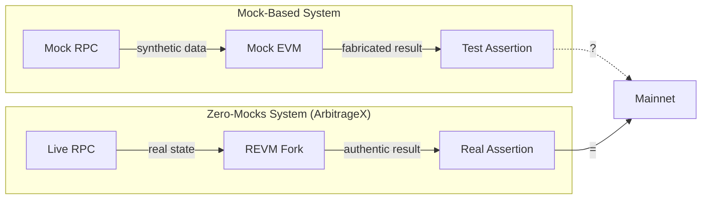
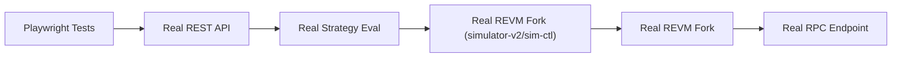

# Doctrine: Zero-Mocks

The Zero-Mocks doctrine is a foundational design principle of ArbitrageX v2. It states that the system shall never use mocked or synthetic blockchain state for any operation, including testing, simulation, or strategy evaluation.

---

## The Principle

> *If you cannot execute against mainnet state, you have not executed at all.*

In traditional systems, mocks substitute real dependencies with pre-programmed responses. This creates a credibility gap: a test that passes against mocks may fail against real state. In DeFi MEV, where every basis point matters, this gap is unacceptable.



---

## Why Zero-Mocks Matters

| Property | Mock System | Zero-Mocks (ArbitrageX) |
|----------|-----------|-------------------------|
| **State accuracy** | Fabricated by developer | Identical to mainnet at fork block |
| **Gas estimation** | Hardcoded values | Computed against real contract bytecode |
| **Slippage prediction** | Assumed linear | Accounts for real pool curves |
| **Revert detection** | May miss edge cases | Identical to live execution |
| **Strategy backtesting** | Unreliable | Statistically valid |
| **Paper-to-live gap** | Large and unpredictable | < 2% variance |

---

## Implementation

Zero-Mocks is implemented through three mechanisms:

### 1. REVM State Forking

The REVM fork simulator creates an in-memory REVM instance at every simulation (`backend/simulator-v2/src/revm_runner.rs`, orchestrated by `backend/sim-ctl/`):

```rust
// backend/simulator-v2/src/revm_runner.rs
use revm::{
    db::{CacheDB, EmptyDB, ForkDB},
    primitives::{Address, U256},
    EVM,
};

pub fn create_forked_evm(block_number: u64, rpc_url: &str) -> EVM<ForkDB> {
    let fork_db = ForkDB::new(rpc_url, block_number);
    let cache_db = CacheDB::new(fork_db);
    EVM::builder().with_db(cache_db).build()
}
```

The `ForkDB` transparently fetches account balances, storage slots, and contract bytecode from the RPC endpoint on first access, then caches for subsequent operations.

### 2. No Mock Test Fixtures

Unit tests use a local Anvil instance (Foundry) rather than mock objects:

```rust
#[tokio::test]
async fn test_real_swap_simulation() {
    let anvil = Anvil::new().fork("https://eth-mainnet.g.alchemy.com/v2/...").spawn();
    let provider = Provider::connect(anvil.endpoint()).await;

    let result = simulate_swap(
        &provider,
        pool_address,
        input_amount,
    ).await;

    assert!(result.output_amount > U256::ZERO);
}
```

### 3. End-to-End Integration

The E2E suite runs against the full service stack (24 services per the README; verify in `docker-compose.yml`), not stubbed services:



---

## Trade-offs

| Advantage | Cost |
|-----------|------|
| Perfect state accuracy | Requires live RPC endpoint |
| Paper results ≈ live results | Higher latency than mocks (~10ms vs. <1ms) |
| No paper-to-live gap | RPC dependency for all tests |
| Valid backtesting | More complex CI setup |

The 10ms simulation latency is offset by parallel execution across three EVM executors.

---

## Zero-Mocks in Practice

### CI Pipeline

```yaml
# .github/workflows/test.yml
e2e:
  services:
    anvil:
      image: ghcr.io/foundry-rs/foundry:latest
      options: --entrypoint anvil
      args: ["--fork-url", "${{ secrets.ALCHEMY_URL }}", "--block-time", "12"]
  steps:
    - run: docker compose up -d
    - run: cargo test --workspace
    - run: cd e2e && npx playwright test
```

Every test in the pipeline executes against real contract bytecode and state. There are no mock wallets, mock pools, or mock DEX responses.

### Monitoring

Zero-Mocks compliance is intended to be verified by an `ax_simulation_fork_block_lag`-style metric (fork block lag): if it exceeded 3 blocks, the system would be on stale state and alerts would fire. **Note:** this metric is not yet wired in the codebase (Phase 3 item); until then, state staleness is bounded by `MAX_RESERVE_LAG_BLOCKS` and the R8 fail-honest skip path.
