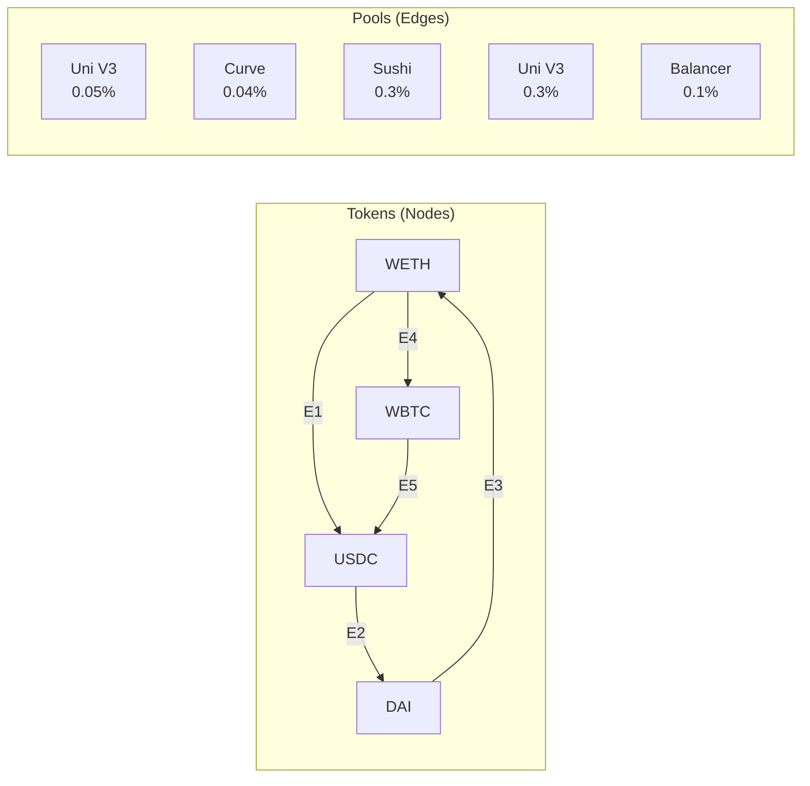
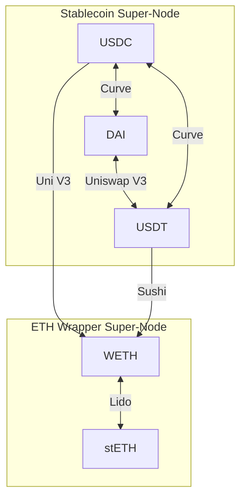

# Topological Yield

Topological Yield is the strategy routing model used by ArbitrageX v2 to discover and evaluate multi-hop arbitrage paths. It represents the DeFi liquidity landscape as a directed acyclic graph (DAG) with DEX pools as edges and token reserves as super-nodes.

---

## The DAG Model

In the Topological Yield model, the DeFi ecosystem is a graph:

| Graph Element | DeFi Equivalent |
|--------------|----------------|
| **Node** | Token contract (WETH, USDC, DAI, etc.) |
| **Edge** | Liquidity pool (DEX pair) |
| **Edge Weight** | Swap output amount for given input |
| **Path** | Multi-hop arbitrage route |
| **Cycle** | Arbitrage opportunity (start and end at same token) |



A triangular arbitrage cycle: **WETH → USDC → DAI → WETH**.

---

## Super-Nodes

A **super-node** is a logical grouping of pools that share a common token pair or protocol family. Super-nodes reduce graph complexity and enable efficient pathfinding.

| Super-Node Type | Contains | Example |
|----------------|----------|---------|
| **Stablecoin Hub** | USDC, USDT, DAI pools | All Curve stable pools |
| **ETH Wrapper Hub** | WETH, stETH, rETH pools | All LSD liquidity |
| **Protocol Cluster** | All pools on a single DEX | All Uniswap V3 pools |



---

## Cycle Detection

The Topological Yield engine detects profitable cycles using a bounded DFS over the live token graph (Phase 1); a Modified Moore–Bellman–Ford (MMBF) line-graph pass is roadmap Phase 2. The canonical execution flow lives in `backend/searcher-rs`:

1. **Discovery** — `route_discovery/unique_route_finder.rs` runs a bounded DFS over the live token graph (cycles of 2–3 hops), canonicalizing each route.
2. **Evaluation** — `workers/triangular_worker.rs` applies the `spot_product` pre-filter (S = γ³·∏(R_out/R_in)), then computes `cycle_profit` via sequential V2 `v2_amount_out` across the 3 hops.
3. **Sizing** — golden-section search over `[1 wei, x_max]` finds the profit-maximizing input x* (cap-bounded by operator capital).

| Parameter | Value | Description |
|-----------|-------|-------------|
| `max_depth` | 3 | Maximum cycle hops (2–3) per bounded DFS |
| `max_routes_per_tick` | 500 | Anti-explosion cap on routes per tick |
| `max_pools_per_pair` | 8 | Branching cap between two tokens |
| `tick_interval` | 12000 ms | Discovery/evaluation tick (~1 block) |
| `MAX_RESERVE_LAG_BLOCKS` | 5 | Max acceptable reserve staleness (R8 fail-honest) |

---

## Why DAG and Not Full Graph?

The DeFi pool graph is technically cyclic (arbitrage is a cycle). However, the Topological Yield engine treats it as a **temporarily directed acyclic graph** at each block:

```
1. At each new block, snapshot all pool states
2. Assign directionality based on price ratios
3. Run cycle detection on the directed snapshot
4. Discard the DAG after evaluation
```

This approach ensures that:
- Cycles are detected against a consistent state snapshot
- No stale pool data creates false opportunities
- The evaluation is deterministic for a given block

---

## Yield Calculation

For each detected cycle, the Topological Yield is:

```
𝒴 = 𝒜_gross − γ_gas − δ_slip
```

where `𝒜_gross` is the gross no-arbitrage violation, `γ_gas` the gas cost, and `δ_slip` the slippage (Decoherencia de Estado). The 3-hop fee compounding is γ³_fee = (1 − fee)³ (≈ 0.991 for V2's 30 bps); the optimal trade size is found by golden-section search, not a fixed input.

Only cycles with positive net Topological Yield are forwarded through the prioritization spine to the Redis stream `arbx:opps:detected` and simulated via sim-ctl (REVM fork, capital $0). ("Ghost Protocol" is the doctrinal name for this stealth-routing/simulation stage, not a separate code module.)
