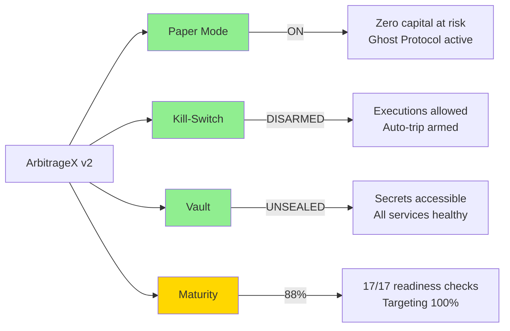
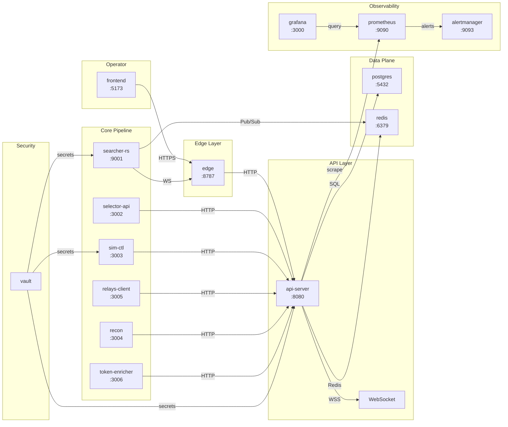

# ArbitrageX v2 Documentation

> **Platform**: DeFi MEV Arbitrage — QuantumX Control Plane
> **Version**: 2.0
> **Doctrinal Maturity**: 88% → 100% (target)
> **Paper Mode**: **ENABLED** (zero capital at risk)
> **Kill-Switch**: **ARMED** (fail-closed)
> **Deployment**: <VPS_IP> (Docker Compose, 21 containers)

---

## Quick Start

New operator? Start here:

1. **Understand the architecture** → [OMEGA Pipeline Architecture](omega/pipeline-architecture.md)
2. **Deploy the platform** → [OMEGA Deployment Guide](omega/deployment-guide.md)
3. **Learn the runbook** → [OMEGA Runbook](omega/runbook.md)
4. **Learn the kill-switch** → [Kill-Switch Runbook](runbooks/kill-switch-activation.md)
5. **Unseal Vault** → [Vault Unseal Runbook](runbooks/vault-unseal.md)
6. **Look up an API endpoint** → [OMEGA API Reference](omega/api-reference.md)

## Project Overview

ArbitrageX v2 is a DeFi MEV arbitrage platform that detects, simulates, and executes atomic arbitrage opportunities across decentralized exchanges. The platform is currently in **paper mode**, meaning all execution is simulated with no real capital at risk.

### Key Statistics

| Metric | Value |
|--------|-------|
| **Containers** | 21 |
| **Services** | 8 application + 7 observability + 2 security + 1 frontend + 3 data |
| **Languages** | Rust (hot path), TypeScript (services), Solidity (contracts) |
| **Databases** | PostgreSQL 15 + Redis 7.2 |
| **Observability** | Prometheus + Grafana + Loki + Thanos + Alertmanager |
| **Secrets** | HashiCorp Vault (3-of-5 Shamir unseal) |
| **Milestone** | S9 (live trading graduation) |

### System State



## Documentation Structure (Diátaxis Framework)

This documentation follows the [Diátaxis framework](https://diataxis.fr/), which organizes documentation into four types based on the reader's needs:

| Type | Purpose | Documents |
|------|---------|-----------|
| **Tutorials** | Learning-oriented. Step-by-step lessons for beginners. | *Planned: operator-onboarding, first-deployment* |
| **How-To Guides** | Task-oriented. Step-by-step instructions to achieve a goal. | [Deploy to VPS](how-to/deploy-to-vps.md) |
| **Explanation** | Understanding-oriented. Background and context. | [Architecture Overview](explanation/architecture-overview.md), [OMEGA Pipeline Architecture](omega/pipeline-architecture.md) |
| **Reference** | Information-oriented. Precise technical details. | [API Endpoints](reference/api-endpoints.md), [OMEGA API Reference](omega/api-reference.md) |

```
docs/
├── index.md                          # This page — navigation hub
├── adr/                              # Architecture Decision Records
│   ├── 001-paper-mode-architecture.md
│   ├── 002-kill-switch-fail-closed.md
│   ├── 003-vault-secrets-management.md
│   └── 004-grafana-red-observability.md
├── omega/                            # OMEGA Pipeline Documentation (Task 9)
│   ├── pipeline-architecture.md      # System architecture and data flow
│   ├── runbook.md                    # Operational procedures
│   ├── deployment-guide.md           # VPS deployment steps
│   └── api-reference.md              # Edge endpoints and WebSocket events
├── explanation/                      # Why? — Background and context
│   └── architecture-overview.md
├── how-to/                           # How do I...? — Task-oriented guides
│   └── deploy-to-vps.md
├── reference/                        # What is...? — Precise technical details
│   └── api-endpoints.md
├── redis-schema/                     # Data schemas
│   └── hot-path-v2.md                # Redis stream schemas
├── runbooks/                         # Operational procedures
│   ├── kill-switch-activation.md
│   ├── vault-unseal.md
│   ├── killswitch-activated.md       # Legacy
│   ├── vault-sealed.md               # Legacy
│   ├── db-restore.md
│   ├── redis-governance.md
│   ├── relay-degraded.md
│   ├── rotate-secrets.md
│   └── rpc-down.md
├── operations/                       # Deployment and ops guides
├── governance/                       # Policies and rules
├── superpowers/                      # Technical specs and plans
└── ... (existing documentation)
```

## Architecture Decision Records (ADRs)

ADRs capture the context, decision, and consequences of major architectural choices:

| ADR | Title | Status | Key Takeaway |
|-----|-------|--------|-------------|
| [ADR-001](adr/001-paper-mode-architecture.md) | Paper Mode Architecture | **Accepted** | Ghost Protocol simulates all execution; zero capital at risk until S9 |
| [ADR-002](adr/002-kill-switch-fail-closed.md) | Kill-Switch Fail-Closed | **Accepted** | Global kill-switch defaults to ARMED; 3-layer resolution; every toggle audited |
| [ADR-003](adr/003-vault-secrets-management.md) | Vault Secrets Management | **Accepted** | HashiCorp Vault with 3-of-5 Shamir unseal; all secrets externalized |
| [ADR-004](adr/004-grafana-red-observability.md) | Grafana RED Observability | **Accepted** | RED metrics for every service; 5s refresh; business panels for arbitrage domain |

## Runbooks

Runbooks provide step-by-step procedures for operational scenarios:

| Runbook | When to Use | ETA |
|---------|------------|-----|
| [Kill-Switch Activation](runbooks/kill-switch-activation.md) | When arming or disarming the kill-switch | 2 min |
| [Vault Unseal](runbooks/vault-unseal.md) | After Vault restart, host reboot, or seal event | 15 min |
| [Vault Sealed (legacy)](runbooks/vault-sealed.md) | Reference for Vault seal scenarios | — |
| [Kill-Switch Activated (legacy)](runbooks/killswitch-activated.md) | Reference for kill-switch scenarios | — |
| [DB Restore](runbooks/db-restore.md) | Database corruption or data loss | 30 min |
| [Rotate Secrets](runbooks/rotate-secrets.md) | Suspected credential compromise | 15 min |
| [RPC Down](runbooks/rpc-down.md) | RPC provider outage | 5 min |
| [Relay Degraded](runbooks/relay-degraded.md) | Flashbots/BloxRoute service issues | 10 min |
| [Redis Governance](runbooks/redis-governance.md) | Redis data corruption or failover | 10 min |

## Service Architecture



## Container Quick Reference

| Container | Port | Health | Description |
|-----------|------|--------|-------------|
| `postgres` | 5432 | `pg_isready` | PostgreSQL 15 — data persistence |
| `redis` | 6379 | `redis-cli PING` | Redis 7.2 — pub/sub, state, cache |
| `searcher-rs` | 9001 | `/health` | Rust hot-path — opportunity detection |
| `selector-api` | 3002 | `/health` | Token safety scoring, strategy selection |
| `sim-ctl` | 3003 | `/health` | REVM simulation engine |
| `relays-client` | 3005 | `/health` | Flashbots/BloxRoute submission |
| `recon` | 3004 | `/health` | Risk analysis, anomaly detection |
| `token-enricher` | 3006 | `/health` | Token metadata enrichment |
| `api-server` | 8080 | `/health` | REST API, WebSocket, audit logging |
| `edge` | 8787 | `/api/health` | Cloudflare Worker edge runtime |
| `frontend` | 5173 | — | React/Next.js control plane |
| `prometheus` | 9090 | — | Metrics collection |
| `grafana` | 3000 | `/api/health` | Dashboards and visualization |
| `alertmanager` | 9093 | — | Alert routing |
| `loki` | 3100 | — | Log aggregation |
| `promtail` | — | — | Log shipping |
| `vault` | 8200 | `vault status` | Secret storage |
| `minio` | 9000 | — | S3-compatible object storage |
| `thanos-sidecar` | — | — | Prometheus remote write |
| `thanos-query` | — | — | Long-term metrics query |
| `thanos-store` | — | — | Long-term metrics storage |

## API Quick Reference

| Endpoint | Auth | Purpose |
|----------|------|---------|
| `GET /health` | None | API server health check |
| `GET /api/health` | None | Edge health check (alias) |
| `GET /status` | None | Full system status + kill-switch state |
| `GET /metrics` | None | Prometheus metrics |
| `GET /api/v1/readiness` | None | 17-item readiness checklist |
| `POST /admin/killswitch` | Admin token | Toggle global kill-switch |
| `GET /admin/config` | Admin token | Current configuration (redacted) |
| `GET /api/v1/config/current` | None | Public config with per-chain paper mode |
| `GET /api/v1/scanner/heartbeat` | None | Opportunity detection heartbeat |
| `GET /api/v1/executions/recent` | None | Recent execution history |
| `GET /api/v1/risk/alerts` | None | Active risk alerts |
| `GET /api/v1/recon/summary` | None | 24h reconciliation summary |
| `GET /api/v1/relays` | None | Relay configuration and status |
| `GET /admin/audit` | Admin token | Query audit log |

## Getting Help

| Resource | Path |
|----------|------|
| **Architecture overview** | [explanation/architecture-overview.md](explanation/architecture-overview.md) |
| **API reference** | [reference/api-endpoints.md](reference/api-endpoints.md) |
| **Deploy guide** | [how-to/deploy-to-vps.md](how-to/deploy-to-vps.md) |
| **Kill-switch runbook** | [runbooks/kill-switch-activation.md](runbooks/kill-switch-activation.md) |
| **Vault runbook** | [runbooks/vault-unseal.md](runbooks/vault-unseal.md) |
| **Existing docs** | `docs/` directory (see README at repo root) |

## Contributing to Documentation

All documentation is written in Markdown and stored in `docs/`. When adding new documents:

1. Follow the Diátaxis framework — categorize as Tutorial, How-To, Explanation, or Reference
2. Use Mermaid diagrams for visual explanations
3. Include code blocks with language tags
4. Use tables for structured data
5. Cross-reference related documents
6. Never include TODOs or placeholders — every document must be complete

---

*Last updated: 2026-05-17. Maintained by the ArbitrageX Architecture Team.*
