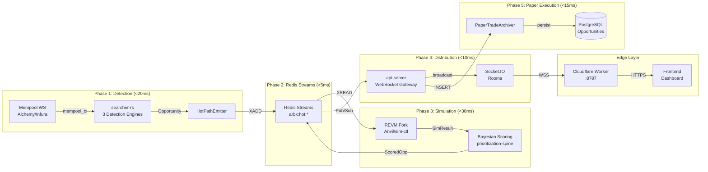
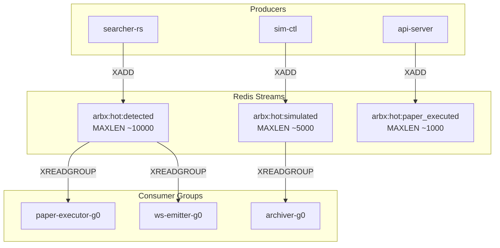
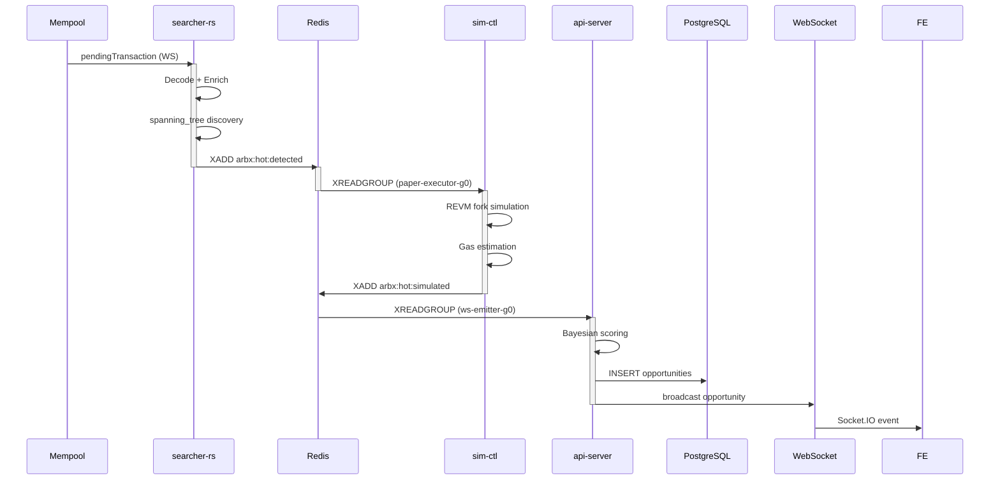
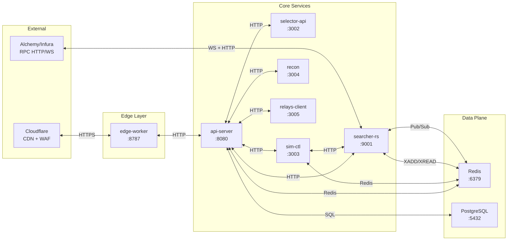
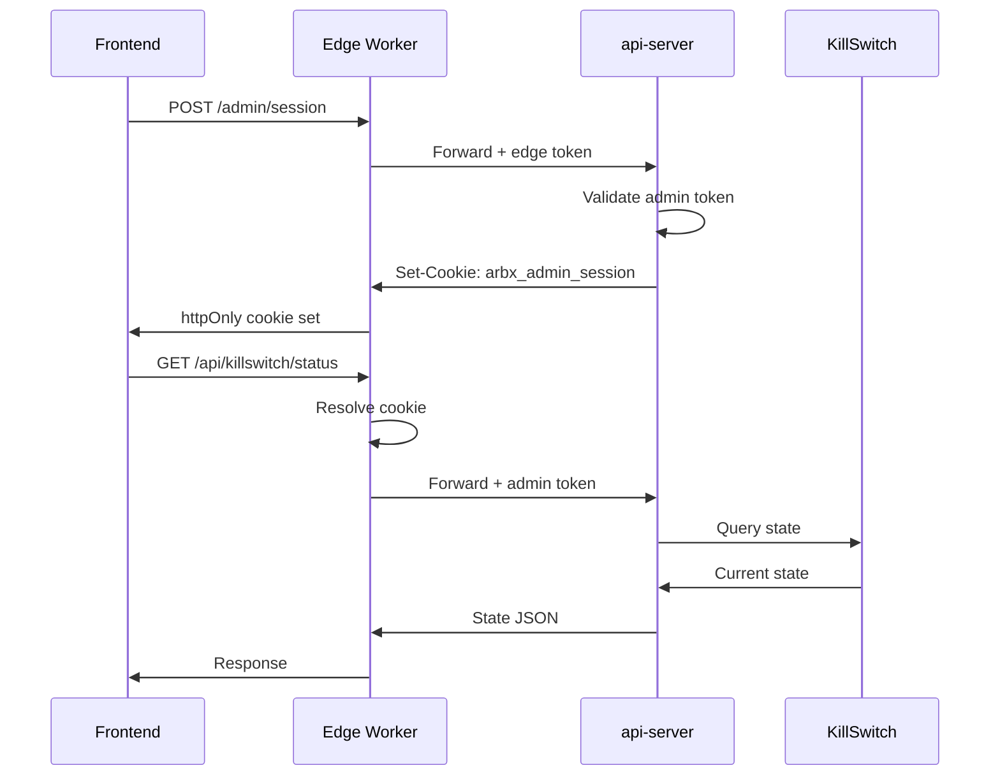

# OMEGA Pipeline Architecture

**Last Updated:** 2026-07-11
**Version:** 2.0
**Status:** Production (Paper Mode)

## Overview

The OMEGA Pipeline is a sub-100ms end-to-end latency system for detecting, simulating, and executing Holonomic Loop Resolutions (multi-DEX atomic circular trades) across EVM-compatible networks. The pipeline follows the C-S-E architecture (Collector-Strategy-Executor) with rigorous fail-honest semantics throughout.

## System Architecture

### High-Level Data Flow



### Component Breakdown

#### 1. searcher-rs (Collector Layer)

**Purpose:** Ultra-low-latency mempool monitoring and opportunity detection.

**Engines:**
| Engine | Function | Latency Target |
|--------|----------|----------------|
| `spanning_tree` | Graph-based path discovery across liquidity manifolds | <10ms |
| `cross_chain` | Cross-domain delta reconciliation (L1/L2) | <15ms |
| `liquidation` | Lending protocol position monitoring | <20ms |

**Key Modules:**
- `hot_path_emitter.rs` - Redis stream emission (<5ms budget)
- `cartridge_boot.rs` - Dynamic strategy cartridge loading
- `orchestrator.rs` - Opportunity lifecycle management
- `scoring_pipeline.rs` - Pre-simulation filtering

**Fail-Honest Behavior:**
- Redis connection failure → ERROR log + retry with backoff
- RPC latency >500ms → Circuit breaker triggers gate closure
- No opportunities detected → Empty stream (never synthetic data)

#### 2. Redis Streams (Hot Path v2)

**Stream Topology:**



**Stream Schemas:**

| Stream | Fields | Producer | Consumer |
|--------|--------|----------|----------|
| `arbx:hot:detected` | id, chain_id, strategy_kind, token_path[], amounts[], detected_at_ms | searcher-rs | paper-executor-g0, ws-emitter-g0 |
| `arbx:hot:simulated` | id, status, net_profit_wei, gas_used, timestamp_ms | sim-ctl | archiver-g0 |
| `arbx:hot:paper_executed` | id, execution_time_ms, paper_pnl_usd, status | api-server | analytics-g0 |

#### 3. api-server (Strategy Layer)

**Purpose:** WebSocket gateway, paper trade archival, and control plane.

**Key Components:**
- `websocket.ts` - Socket.IO room management with authentication
- `paper/` - Paper trade archival and history API
- `routes/opportunities-live.ts` - Live opportunity streaming
- `readiness/` - 17-item readiness verification

**WebSocket Rooms:**
| Room | Event | Purpose |
|------|-------|---------|
| `convergence` | `convergence_signal` | Real-time pipeline metrics |
| `opportunities` | `opportunity` | New opportunity alerts |
| `telemetry` | `telemetry` | Cartridge telemetry feed |
| `route_discovery` | `route_discovery_telemetry` | Route discovery analytics |
| `runtime_ack` | `runtime_ack` | Configuration change acknowledgments |

#### 4. edge (Cloudflare Worker)

**Purpose:** Public-facing edge layer with KV-backed rate limiting and caching.

**Latency-Optimized Routes (<30ms target):**
- `GET /api/v1/health` - Pass-through health check
- `GET /api/v1/metrics/entropy` - Real-time entropy metrics
- `GET /status` - System status with 2s KV cache
- `GET /api/opportunities/live` - Live opportunities with 2s KV cache

**Security Features:**
- KV-backed cross-isolate rate limiting (120 req/min/IP)
- ASN-based threat filtering
- 401 lockout after 10 consecutive failures (15min window)
- httpOnly cookie session management

#### 5. Frontend (Next.js)

**Purpose:** Operator control plane and real-time dashboard.

**Key Features:**
- WebSocket client with automatic reconnection
- Pipeline Funnel widget (heartbeat visualization)
- Kill-switch control with confirmation dialogs
- Paper trade history and analytics

## Latency Budget

### End-to-End Breakdown

| Phase | Component | Target | Max | Measurement Point |
|-------|-----------|--------|-----|-------------------|
| Mempool Reception | searcher-rs WS | 5ms | 10ms | `mempool_received_at` |
| Detection | spanning_tree engine | 15ms | 25ms | `detected_at_ms` |
| Stream Emit | HotPathEmitter | 2ms | 5ms | Redis `XADD` latency |
| Redis Write | `arbx:hot:detected` | 1ms | 3ms | Redis `SLOWLOG` |
| Simulation | sim-ctl REVM | 25ms | 40ms | `sim_completed_at` |
| Scoring | Bayesian allocator | 5ms | 10ms | `scored_at_ms` |
| WebSocket Emit | api-server | 2ms | 5ms | `ws_broadcast_at` |
| Edge Proxy | Cloudflare Worker | 5ms | 10ms | `cf_colo` header |
| **TOTAL** | **End-to-End** | **<60ms** | **<100ms** | `pipeline_latency_ms` |

### Latency Monitoring

```promql
# Pipeline p99 latency
histogram_quantile(0.99, 
  rate(arbx_pipeline_latency_ms_bucket[5m])
)

# Stream backlog by consumer group
redis_stream_length{stream="arbx:hot:detected"}

# Consumer group pending count
redis_stream_pending{stream="arbx:hot:detected", group="paper-executor-g0"}
```

## Data Flow Detailed

### Opportunity Lifecycle



### Fail-Honest Behavior Explained

The OMEGA Pipeline implements **Rule R8 (Fail-Honest)** throughout:

1. **No Synthetic Data:** If a detection fails, no opportunity is emitted. The stream entry contains `rejection_reason`, never fabricated data.

2. **None vs Zero:**
   - `None` = Not computed (simulation pending)
   - `Some(0.0)` = Computed and exactly zero (valid result)

3. **Observation Pattern:** When data is missing, the system emits an observation with the exact reason:
   - `impact_zero` - No state divergence detected
   - `discovery_failed` - Pool discovery returned empty
   - `discovery_no_pool_found` - Known tokens but no connecting pool
   - `missing_reserves` - RPC returned empty reserves
   - `unknown_token_price` - No price oracle for token pair
   - `no_base_candidates` - No viable base tokens for path
   - `watchlist_empty` - No tokens in configured watchlist

4. **Redis Failure Mode:** If Redis is unavailable:
   - searcher-rs → ERROR log + memory queue (bounded)
   - api-server → 503 response (never cached stale data)
   - edge → Pass-through to api-server (no KV cache)

## Component Interactions

### Inter-Service Communication



### Authentication Flow



## External Dependencies

| Service | Purpose | Version | Critical Path |
|---------|---------|---------|---------------|
| Redis | Streams, Pub/Sub, Cache | 7.2 | Yes |
| PostgreSQL | Persistence, Analytics | 15 | Yes |
| Alchemy | RPC + Mempool WS | Latest | Yes |
| Cloudflare | Edge, KV, D1 | Workers | Yes |
| Prometheus | Metrics | v2.55 | No |
| Grafana | Visualization | v11.4 | No |
| Vault | Secrets | 1.18.1 | Boot only |

## Related Documentation

- [Runbook](./runbook.md) - Operational procedures and troubleshooting
- [Deployment Guide](./deployment-guide.md) - Environment setup and deployment
- [API Reference](./api-reference.md) - Endpoints and WebSocket events
- [Redis Schema](../redis-schema/hot-path-v2.md) - Detailed stream schemas
- [ADR-001](../adr/001-paper-mode-architecture.md) - Paper mode architecture decision
- [ADR-002](../adr/002-kill-switch-fail-closed.md) - Kill-switch design

---

*Document maintained by OMEGA Architecture Team. For updates, follow the documentation change process in `docs/governance/DATA-MATRIX.md`.*
